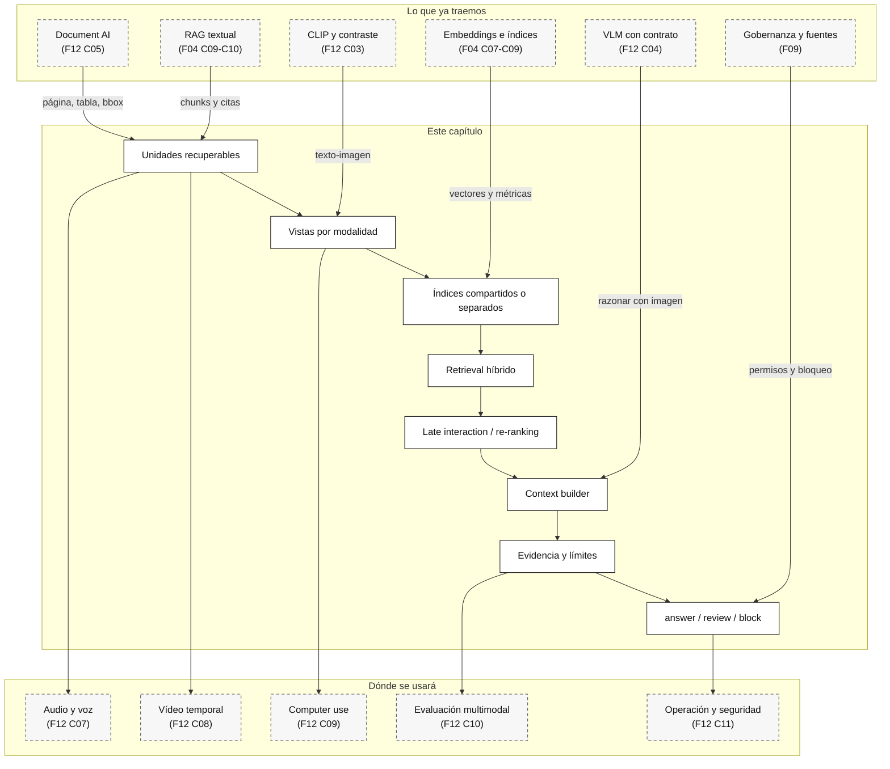

::: {.fasciculo-subtitle}
Facsímil 12 · IA multimodal y sistemas que perciben
:::

# Capítulo 06: RAG multimodal: recuperar texto, páginas, imágenes y tablas

## Qué deberías poder hacer al terminar

En el fascículo 04 construimos RAG con texto: dividir documentos, crear embeddings, recuperar fragmentos, citar fuentes y evaluar si la respuesta estaba apoyada. Ese patrón sigue siendo útil, pero se queda corto cuando el conocimiento vive en una factura, una captura, una página escaneada, una tabla con cabeceras complejas, un gráfico o una mezcla de todo lo anterior.

El RAG multimodal aparece cuando la pregunta no puede resolverse recuperando solo texto plano. No significa necesariamente que todo deba pasar por un VLM. Significa que la capa de recuperación debe saber trabajar con varias formas de evidencia y que la respuesta final debe conservar de dónde sale cada afirmación.

Al terminar este capítulo deberías poder hacer esto:

| Resultado de aprendizaje | Evidencia de que lo sabes hacer |
|---|---|
| Distinguir RAG textual, RAG documental y RAG multimodal. | No llamas “multimodal” a meter un OCR pobre en un vector store. |
| Diseñar unidades recuperables por modalidad. | Separas chunk, página, tabla, figura, crop, transcripción y registro operativo. |
| Elegir entre índice compartido, índices separados y multi-vector. | Puedes justificarlo por latencia, calidad, coste y trazabilidad. |
| Construir un contexto con evidencias. | La respuesta incluye fuente, modalidad, página, región y límites. |
| Evaluar recuperación multimodal. | Mides `recall@k`, cobertura de modalidad, precisión contextual y groundedness. |
| Bloquear instrucciones dentro de documentos o imágenes. | Tratas texto visual como dato no confiable, no como orden del sistema. |
| Ejecutar el kit del capítulo. | Descargas el ZIP, corres el auditor y modificas un caso realista. |

La frase central del capítulo:

> RAG multimodal no es “buscar imágenes”. Es construir una cadena de evidencias que pueda mezclar modalidades sin perder trazabilidad.

## La escena: el usuario pregunta, pero la prueba está repartida

Imagina una consulta aparentemente sencilla:

> “¿Puede el alumno enviar la solicitud, cuál es el total de la factura y por qué el piloto ha mejorado?”

La respuesta vive en fuentes distintas:

| Fuente | Modalidad | Qué aporta | Qué no conviene pedirle |
|---|---|---|---|
| Política de becas | Documento textual y página renderizada. | Norma y sección aplicable. | Estado operativo actual. |
| Tabla de estado | Registro operativo. | Si el justificante está validado o pendiente. | Interpretación legal. |
| Factura | Tabla y página visual. | Line items, total y evidencia visual. | Decisión administrativa. |
| Gráfico de métricas | Figura. | Tendencia visible. | Valores exactos si no hay tabla detrás. |
| Texto dentro de una imagen | Dato visual no confiable. | Puede revelar intento de manipulación. | Dar instrucciones al sistema. |

Un RAG textual ingenuo haría OCR de todo, partiría texto por tamaño y recuperaría fragmentos. A veces funcionaría. Pero también puede romper tablas, perder páginas, mezclar columnas o convertir una instrucción embebida en un documento en una orden.

El RAG multimodal obliga a preguntar antes:

1. ¿Qué unidades recupero?
2. ¿Con qué representación busco cada unidad?
3. ¿Cómo fusiono resultados de modalidades distintas?
4. ¿Qué evidencia pasa al modelo?
5. ¿Qué afirmaciones puedo hacer y cuáles debo rechazar?
6. ¿Cómo evalúo si la respuesta está realmente apoyada?

## Lectura de ingeniería: recuperar no es meter contexto

El error más común en RAG multimodal es creer que recuperar consiste en juntar cosas relevantes y pegarlas al prompt. En realidad, recuperar es construir un expediente mínimo para responder. Ese expediente debe tener fuentes, permisos, unidades, versiones y límites. Si recuperas una página, una tabla y una captura, no son “contexto” en abstracto: son evidencias con distinta confianza y distinta forma de fallo.

La unidad recuperable decide mucho más de lo que parece. Si indexas un PDF por párrafos, quizá pierdes la tabla. Si indexas páginas enteras, quizá recuperas demasiado ruido. Si indexas crops, quizá pierdes la sección. Si indexas texto OCR sin coordenadas, luego no puedes demostrar de dónde salió una afirmación. La recuperación multimodal empieza preguntando qué unidad puede sostener una respuesta verificable.

### Diseñar unidades recuperables

Una unidad recuperable no es necesariamente un chunk de texto. Puede ser una página, una región de una página, una tabla completa, una fila con cabecera, un crop de pantalla, un frame de vídeo, un intervalo de audio o una combinación de varios artefactos que deben viajar juntos. La pregunta correcta es: “si esta unidad aparece en el top-k, ¿puede sostener una respuesta o solo ayuda a localizar otra cosa?”.

En el caso de una beca, una página de política quizá responde a una regla, pero una captura solo prueba el estado visual. Una tabla de backend prueba estado operativo, pero no explica por qué la interfaz muestra una alerta. Un RAG multimodal útil debe poder recuperar esas piezas y mantener su relación: página 3 de la política, región de alerta en la captura, fila `grant-workflow-005` en la tabla de estados y versión del formulario. Si las piezas se recuperan sin relación, el modelo generativo puede unirlas de forma cómoda pero falsa.

### Ranking, permisos y confianza

También hay que separar ranking de permiso. Un resultado puede ser muy relevante y no estar autorizado para el usuario. Un documento interno puede contestar perfectamente y aun así no debería aparecer. Una captura puede traer una instrucción maliciosa escrita dentro de la propia imagen. Por eso el RAG multimodal necesita ACL, etiquetas de confianza, lineage y política de salida, no solo embeddings.

Un diseño robusto suele aplicar filtros antes y después del ranking. Antes, por tenant, rol, versión, idioma, tipo documental o sensibilidad. Después, por evidencia mínima, modalidad requerida, vigencia, calidad del OCR, cobertura de tabla o compatibilidad con la pregunta. Si la pregunta exige una cifra y el top-k solo trae párrafos narrativos, el sistema debería rechazar o pedir más evidencia, no rellenar huecos.

### Evaluar recuperación antes de evaluar generación

Cuando lo haces bien, el modelo generativo queda más acotado. No le pides que “sepa”. Le pides que redacte a partir de evidencias concretas y que rechace lo que no esté apoyado. La calidad ya no depende solo del modelo, sino de la cadena completa: extracción, índice, fusión, permisos, contexto y evaluación.

Por eso conviene evaluar primero la recuperación. Para cada pregunta, escribe qué documentos, páginas, regiones o filas deberían aparecer. Eso es un `qrel`: una pequeña verdad de referencia para medir si el índice trajo lo necesario. Luego mide Recall@k, MRR, nDCG y cobertura por modalidad. Solo después tiene sentido evaluar la respuesta generada. Si la evidencia no llegó al prompt, culpar al LLM suele ser una distracción.

En una práctica profesional, el entregable no debería ser “un chatbot con documentos”. Debería ser un paquete con corpus, unidades indexadas, queries, qrels, política de permisos, reporte de recuperación, ejemplos de fallo y decisión de release. Esa forma de trabajar separa lo que falla por índice de lo que falla por generación, y permite mejorar sin tocarlo todo a la vez.

## Qué es RAG multimodal

RAG significa recuperación aumentada por generación. La formulación clásica combina memoria paramétrica del modelo con una memoria no paramétrica externa: un índice que se consulta en tiempo de respuesta.^[Lewis, P. et al. (2020). Retrieval-Augmented Generation for Knowledge-Intensive NLP Tasks. *Advances in Neural Information Processing Systems 33*, 9459-9474. https://arxiv.org/abs/2005.11401.]

En RAG textual, la unidad típica es un chunk de texto. En RAG multimodal, la unidad puede ser:

| Unidad recuperable | Ejemplo | Qué debe conservar |
|---|---|---|
| Chunk textual | Párrafo de política. | Documento, sección, página, versión. |
| Página renderizada | Página de PDF como imagen. | Página, resolución, región, documento original. |
| Crop o región | Total de una factura, alerta de UI. | BBox, página, campo, confianza. |
| Tabla | Line items, métricas semanales. | Filas, columnas, cabeceras, unidades, CSV crudo. |
| Figura | Gráfico de latencia, diagrama. | Caption, datos subyacentes si existen, página. |
| Transcripción | Audio convertido a texto. | Timestamp, hablante, confianza. |
| Frame o clip | Momento de un vídeo. | Inicio, fin, frame, evento. |
| Registro operativo | Estado en base de datos. | Fuente, timestamp, permisos, propietario. |

La salida no debería decir solo:

```json
{
  "answer": "Sí, parece correcto."
}
```

Una salida útil se parece más a esto:

```json
{
  "decision": "answer",
  "answer": "No puede enviarse todavía: el justificante está pendiente.",
  "evidence": [
    {
      "source_id": "policy_text_submission_rule",
      "modality": "document_text",
      "fact_id": "policy_submission_rule",
      "page": 1,
      "region_id": "sec_3_2"
    },
    {
      "source_id": "status_table_current",
      "modality": "operational_record",
      "fact_id": "status_current_pending_validation"
    }
  ],
  "limits": ["no decide elegibilidad final"],
  "next_action": "guardar respuesta revisable y aportar documentación"
}
```

La diferencia es enorme. La segunda salida se puede auditar, corregir, enseñar y automatizar con cuidado.

## RAG multimodal no siempre necesita generación multimodal

Este punto es importante para no vender humo. Hay tres patrones distintos:

| Patrón | Recupera | Genera con | Cuándo sirve |
|---|---|---|---|
| RAG textual sobre documentos parseados | Texto, tablas convertidas, metadatos. | LLM textual. | Políticas, manuales, contratos bien extraídos. |
| RAG multimodal con respuesta textual | Páginas, tablas, figuras, texto y registros. | LLM textual o VLM acotado. | Facturas, gráficos, capturas, PDFs mixtos. |
| RAG visual-end-to-end | Páginas o imágenes directamente. | VLM. | Documentos visualmente ricos donde OCR/layout falla o cuesta demasiado. |

El segundo patrón es el más frecuente en ingeniería. Recuperas una página visual, una tabla cruda y un chunk textual, pero quizá el modelo final solo necesita texto estructurado y citas. O quizá necesita mirar la imagen para comprobar una región. La arquitectura decide.

## Arquitecturas reales que conviene distinguir

Aquí no estamos inventando nombres para decorar el capítulo. Son familias que aparecen en papers, herramientas o prácticas de recuperación documentadas. Lo importante es saber qué problema resuelve cada una y qué precio técnico trae.

| Arquitectura | Fuente técnica que la sostiene | Cuándo encaja | Dónde falla |
|---|---|---|---|
| **RAG textual clásico** | RAG de Lewis et al. combina modelo generativo con índice externo; DPR estudia recuperación densa para open-domain QA.^[Lewis, P. et al. (2020). Retrieval-Augmented Generation for Knowledge-Intensive NLP Tasks. https://arxiv.org/abs/2005.11401. Karpukhin, V. et al. (2020). Dense Passage Retrieval for Open-Domain Question Answering. https://arxiv.org/abs/2004.04906.] | Manuales, FAQs, políticas textuales, documentación técnica limpia. | PDFs con layout importante, tablas complejas, figuras, escaneos y preguntas que dependen de coordenadas. |
| **Document AI + RAG** | LayoutLM y PubTables muestran que layout y estructura tabular son señales propias, no simple texto.^[Xu, Y. et al. (2020). LayoutLM. https://arxiv.org/abs/1912.13318. Smock, B. et al. (2022). PubTables-1M. https://arxiv.org/abs/2110.00061.] | Contratos, facturas, formularios, expedientes, tablas y documentos donde la fuente debe citarse. | Si el parser pierde cabeceras, spans o reading order, el RAG hereda ese error. |
| **Texto-imagen en espacio compartido** | CLIP entrena representaciones alineadas de texto e imagen.^[Radford, A. et al. (2021). Learning Transferable Visual Models From Natural Language Supervision. https://arxiv.org/abs/2103.00020.] | Búsqueda de imágenes, capturas, productos, diagramas o páginas por descripción textual. | Recuperar una imagen parecida no garantiza respuesta verificable ni cálculo exacto. |
| **Página-imagen con late interaction** | ColPali propone recuperar documentos visualmente ricos indexando imágenes de páginas con VLM y late interaction.^[Faysse, M. et al. (2024). ColPali: Efficient Document Retrieval with Vision Language Models. https://arxiv.org/abs/2407.01449.] | PDFs donde OCR/layout es frágil o costoso y la página completa aporta señal visual. | Más coste de embeddings/almacenamiento; después aún hay que responder con evidencias. |
| **Multi-vector / late interaction textual** | ColBERT conserva interacción fina entre tokens de consulta y documento.^[Khattab, O. y Zaharia, M. (2020). ColBERT. https://arxiv.org/abs/2004.12832.] | Retrieval de alta precisión cuando un embedding único comprime demasiado. | Más caro que un embedding único; requiere infraestructura y evaluación. |
| **RAG jerárquico** | RAPTOR construye árboles de summaries para recuperar a distintos niveles de abstracción.^[Sarthi, P. et al. (2024). RAPTOR: Recursive Abstractive Processing for Tree-Organized Retrieval. https://arxiv.org/abs/2401.18059.] | Documentos largos donde una pregunta necesita contexto local y global. | Los resúmenes intermedios pueden introducir pérdida o sesgo si no se auditan. |
| **GraphRAG** | GraphRAG organiza corpus en entidades, relaciones, comunidades y summaries para consultas globales.^[Edge, D. et al. (2024). From Local to Global: A Graph RAG Approach to Query-Focused Summarization. https://arxiv.org/abs/2404.16130.] | Preguntas de síntesis sobre un corpus, relaciones entre entidades, análisis narrativo o investigación documental. | Puede ser excesivo para preguntas puntuales; construir y mantener el grafo cuesta. |

La decisión de ingeniería no es “cuál es más moderno”. Es esta:

| Si tu pregunta depende de... | Empieza por... | Añade si falla |
|---|---|---|
| Texto limpio y citas | RAG textual con qrels. | Reranker o GraphRAG si hay síntesis global. |
| Facturas, formularios o tablas | Document AI + tabla cruda + validadores. | Página visual o VLM para regiones ambiguas. |
| Imágenes/capturas | Embedding texto-imagen o VLM acotado. | OCR/crops si hay texto pequeño. |
| PDFs visualmente ricos | ColPali o página-imagen retrieval. | Parser estructural para respuesta final. |
| Corpus con relaciones | GraphRAG o índice híbrido grafo-vector. | RAG textual para evidencias locales. |
| Documentos largos | RAG jerárquico tipo RAPTOR. | Evaluación de summaries intermedios. |

Ejemplo de diseño didáctico, no algoritmo canónico: para un expediente universitario con política PDF, factura y estado operativo, yo empezaría con Document AI + RAG híbrido. La política va como chunks textuales con sección. La factura va como tabla cruda y página visual. El estado va como registro operativo con timestamp. Si luego el PDF trae páginas muy visuales, probaría un retriever de página tipo ColPali y lo evaluaría contra qrels.

## De RAG textual a RAG multimodal

El RAG textual clásico suele tener esta forma:

1. Ingesta de documentos.
2. Chunking.
3. Embeddings.
4. Vector store.
5. Recuperación `top_k`.
6. Prompt con contexto.
7. Respuesta con citas.

En multimodal añadimos capas:

| Capa | Qué cambia |
|---|---|
| Ingesta | Hay PDFs, imágenes, tablas, audio, vídeo y fuentes operativas. |
| Parseo | OCR/layout, extracción de tablas, captions, frames, transcripciones. |
| Representación | Puede haber embedding textual, visual, tabla-resumen, página-imagen o multi-vector. |
| Índices | Uno compartido, varios por modalidad o una mezcla híbrida. |
| Re-ranking | La primera búsqueda puede ser barata; la segunda debe comprobar evidencia. |
| Context builder | Decide si pasa texto, imagen, tabla cruda, crop o resumen. |
| Generación | Puede usar LLM, VLM o herramienta. |
| Evaluación | Mide evidencia, modalidad, groundedness, rechazo y coste. |

La recuperación densa moderna se consolidó con enfoques como DPR, donde consulta y pasaje se codifican por separado para recuperar candidatos semánticos.^[Karpukhin, V. et al. (2020). Dense Passage Retrieval for Open-Domain Question Answering. *Proceedings of EMNLP 2020*, 6769-6781. https://arxiv.org/abs/2004.04906.] En multimodal conservamos esa intuición, pero ya no siempre comparamos texto con texto.

## Unidad recuperable: el diseño que más se suele subestimar

La pregunta “¿qué indexo?” es más importante que “¿qué vector database uso?”.

Ejemplo de factura:

| Opción | Qué indexa | Ventaja | Riesgo |
|---|---|---|---|
| Texto OCR completo | Todo como texto plano. | Simple. | Rompe columnas, cabeceras y totales. |
| Tabla cruda | CSV/JSON de line items. | Calculable y validable. | Puede no responder preguntas visuales. |
| Página renderizada | Imagen de la factura. | Conserva layout. | Necesita VLM o embedding visual. |
| Resumen de tabla | Texto “linea 1..., total...”. | Recupera bien por lenguaje. | Puede perder celdas o unidades. |
| Multi-vector por página | Representaciones finas de la página. | Mejor para documentos visuales. | Coste e infraestructura mayores. |

Una práctica sana es guardar varias vistas del mismo objeto:

```json
{
  "document_id": "FAC-2026-014",
  "views": [
    {"type": "page_image", "path": "invoice_page.svg", "page": 1},
    {"type": "table_raw", "path": "factura-lineas.csv"},
    {"type": "table_summary", "text": "dos líneas, total 529.98 EUR"},
    {"type": "field", "field_id": "total", "value": "529.98", "bbox": [0.70, 0.62, 0.86, 0.66]}
  ]
}
```

El índice no tiene que enseñar todas esas vistas al usuario. Pero el sistema sí debe saber cuál usó.

## Índice compartido, índices separados y multi-vector

Hay tres familias de diseño.

### Índice compartido

Texto e imagen se proyectan a un espacio comparable. CLIP popularizó esta idea para texto-imagen: entrenar representaciones alineadas con pares imagen-texto.^[Radford, A. et al. (2021). Learning Transferable Visual Models From Natural Language Supervision. *Proceedings of ICML 2021*, 8748-8763. https://arxiv.org/abs/2103.00020.]

Ventaja: una consulta textual puede recuperar imágenes.

Problema: una imagen recuperada no siempre trae suficiente estructura. Si preguntas “¿cuál es el total de la segunda línea?”, quizá necesitas tabla cruda, no solo una imagen parecida.

### Índices separados por modalidad

Tienes un índice textual, otro visual, otro de tablas y quizá otro operativo. Recuperas por separado y fusionas.

Ventaja: cada modalidad usa la técnica adecuada.

Problema: la fusión se vuelve una parte real del sistema. Tienes que calibrar scores, deduplicar documentos y evitar que una modalidad ruidosa domine.

### Multi-vector y late interaction

En lugar de una sola representación por documento, conservas varias representaciones finas. ColBERT introdujo late interaction para passage search: consulta y documento se codifican por separado, y luego se comparan con una operación fina de máximos por token.^[Khattab, O. y Zaharia, M. (2020). ColBERT: Efficient and Effective Passage Search via Contextualized Late Interaction over BERT. *Proceedings of SIGIR 2020*, 39-48. https://arxiv.org/abs/2004.12832.]

Una forma simplificada de leerlo es:

$$
\operatorname{score}(q, d) =
\sum_{i \in q} \max_{j \in d}
\operatorname{sim}(q_i, d_j)
$$

| Símbolo | Significado |
|---|---|
| \(q_i\) | Representación de una parte de la consulta. |
| \(d_j\) | Representación de una parte del documento. |
| \(\operatorname{sim}\) | Similitud, normalmente producto punto o coseno. |
| \(\max_{j \in d}\) | Para cada parte de la consulta se busca la mejor parte del documento. |

ColPali lleva esta idea a documentos visuales: indexa páginas como imágenes mediante un modelo visión-lenguaje y late interaction, evitando depender solo de OCR y chunking textual en documentos visualmente ricos.^[Faysse, M. et al. (2024). ColPali: Efficient Document Retrieval with Vision Language Models. https://arxiv.org/abs/2407.01449.]

La lección de ingeniería no es “usa ColPali siempre”. La lección es que una página documental no es un párrafo. Si el layout, las tablas y la tipografía importan, una representación visual de página puede recuperar mejor que texto plano.

## Ejemplo de fórmula operativa para fusionar señales

La siguiente no es una ley matemática del RAG. Es un ejemplo de fórmula de producto para razonar sobre un ranking híbrido:

$$
s(c, x) =
\alpha \cdot s_{\text{text}}(c, x)
+ \beta \cdot s_{\text{visual}}(c, x)
+ \gamma \cdot s_{\text{table}}(c, x)
+ \delta \cdot s_{\text{metadata}}(c, x)
+ \rho \cdot s_{\text{policy}}(c, x)
$$

| Símbolo | Significado |
|---|---|
| \(c\) | Consulta del usuario. |
| \(x\) | Candidato recuperable. |
| \(s_{\text{text}}\) | Score textual: BM25, embedding textual o similar. |
| \(s_{\text{visual}}\) | Score visual: CLIP, ColPali, crop, página o VLM retriever. |
| \(s_{\text{table}}\) | Score de tabla: campos, columnas, unidades, valores. |
| \(s_{\text{metadata}}\) | Score por filtros: documento, fecha, permisos, versión. |
| \(s_{\text{policy}}\) | Penalización o boost por reglas de seguridad y dominio. |
| \(\alpha,\beta,\gamma,\delta,\rho\) | Pesos calibrados con evaluación, no con intuición. |

Lo importante no es la fórmula exacta. Lo importante es que el ranking multimodal debe ser evaluable. Si cambias \(\beta\), debes saber si mejora recuperación visual o si mete más ruido.

## Métricas mínimas

Para recuperar bien no basta con mirar una respuesta bonita.

### Recall@k

$$
\operatorname{Recall@k} =
\frac{|\operatorname{Evidencias\_relevantes} \cap \operatorname{TopK}|}
{|\operatorname{Evidencias\_relevantes}|}
$$

| Qué mide | Qué no mide |
|---|---|
| Si las evidencias necesarias entran en el contexto. | Si el modelo las usa bien. |

Si el total de factura está en la tabla y el sistema recupera solo la página visual, el `Recall@k` puede parecer aceptable para una tarea visual, pero ser insuficiente para cálculo.

### Cobertura de modalidad

$$
\operatorname{CoberturaModalidad} =
\frac{|\operatorname{Modalidades\_requeridas} \cap \operatorname{Modalidades\_recuperadas}|}
{|\operatorname{Modalidades\_requeridas}|}
$$

Si una pregunta necesita tabla y figura, recuperar dos textos buenos no basta.

### Precisión contextual

$$
\operatorname{PrecisionContexto} =
\frac{\operatorname{candidatos\_útiles\_en\_contexto}}
{\operatorname{candidatos\_totales\_en\_contexto}}
$$

Esta métrica es menos famosa que `Recall@k`, pero en RAG multimodal duele mucho. Un contexto con ruido visual, tablas irrelevantes o páginas largas puede arrastrar al modelo a responder con una fuente equivocada.

### Groundedness

La respuesta debe poder vincular cada afirmación importante con una evidencia. Para una respuesta práctica:

| Afirmación | Evidencia esperada |
|---|---|
| “No puede enviarse.” | Política textual + estado operativo. |
| “El total es 529.98 EUR.” | Tabla de line items + página de factura. |
| “La latencia baja.” | Gráfico + tabla de valores. |
| “No obedezco esa instrucción visual.” | Página con instrucción + política de seguridad. |

Si no puedes hacer esa tabla, probablemente no deberías automatizar la respuesta.

### qrels: la pieza pequeña que cambia la conversación

En recuperación de información, una colección de evaluación no es solo “un corpus y unas preguntas”. Necesita juicios de relevancia: qué documentos o evidencias son relevantes para cada consulta. En TREC y la tradición de evaluación tipo Cranfield, esos juicios son lo que permite comparar sistemas sin discutir por sensaciones.^[Voorhees, E. M. (2002). The Philosophy of Information Retrieval Evaluation. *CLEF 2001*. https://www.nist.gov/publications/philosophy-information-retrieval-evaluation.]

En un RAG multimodal, un `qrels.json` puede tener esta forma:

```json
[
  {
    "query_id": "q02_factura_total",
    "source_id": "invoice_table_lines",
    "relevance": 3,
    "reason": "tabla calculable obligatoria"
  },
  {
    "query_id": "q02_factura_total",
    "source_id": "invoice_page_visual",
    "relevance": 3,
    "reason": "evidencia visual de factura"
  }
]
```

La relevancia puede ser binaria, pero en RAG multimodal suele ayudar graduarla. No es lo mismo una tabla necesaria para calcular que una página visual útil para revisar.

### nDCG@k y MRR

`Recall@k` dice si entró la evidencia. No dice si entró arriba o escondida al final. Para eso se usa nDCG, una métrica de ranking con relevancia graduada propuesta en evaluación de recuperación de información.^[Järvelin, K. y Kekäläinen, J. (2002). Cumulated Gain-Based Evaluation of IR Techniques. *ACM Transactions on Information Systems*, 20(4), 422-446. https://doi.org/10.1145/582415.582418.]

La idea simplificada:

$$
\operatorname{DCG@k} =
\sum_{i=1}^{k}
\frac{2^{rel_i} - 1}{\log_2(i+1)}
$$

$$
\operatorname{nDCG@k} =
\frac{\operatorname{DCG@k}}{\operatorname{IDCG@k}}
$$

| Símbolo | Significado |
|---|---|
| \(rel_i\) | Relevancia del resultado en la posición \(i\). |
| \(DCG@k\) | Ganancia descontada acumulada hasta \(k\). |
| \(IDCG@k\) | Mejor DCG posible si el ranking estuviera ordenado idealmente. |

MRR mira otra cosa: en qué posición aparece el primer resultado relevante.

$$
\operatorname{MRR} =
\frac{1}{N}
\sum_{q=1}^{N}
\frac{1}{\operatorname{rank}_q}
$$

| Símbolo | Significado |
|---|---|
| \(N\) | Número de consultas evaluadas. |
| \(\operatorname{rank}_q\) | Posición del primer resultado relevante para la consulta \(q\). |

En un sistema real miraría al menos:

| Métrica | Se calcula sobre | Pregunta que responde |
|---|---|---|
| `Recall@k` | qrels y ranking. | ¿Entró la evidencia obligatoria? |
| `nDCG@k` | qrels graduados y ranking. | ¿Lo más importante aparece arriba? |
| `MRR` | primer resultado relevante. | ¿Cuánto tarda el sistema en encontrar algo útil? |
| Cobertura de modalidad | modalidades obligatorias. | ¿Recuperé tabla cuando necesitaba tabla? |
| Precisión contextual | contexto final. | ¿Cuánto ruido estoy pasando al modelo? |
| Citation accuracy | respuesta y evidencias. | ¿La cita apoya de verdad la frase? |
| Abstention accuracy | preguntas no respondibles. | ¿Se abstiene cuando falta fuente? |

BEIR y MTEB no son benchmarks multimodales completos para nuestro caso, pero sí enseñan una lección metodológica importante: evaluar embeddings/retrieval exige diversidad de tareas y dominios; un modelo o configuración puede ir bien en una tarea y flojo en otra.^[Thakur, N. et al. (2021). BEIR: A Heterogeneous Benchmark for Zero-shot Evaluation of Information Retrieval Models. https://arxiv.org/abs/2104.08663. Muennighoff, N. et al. (2023). MTEB: Massive Text Embedding Benchmark. https://arxiv.org/abs/2210.07316.]

Las encuestas recientes de evaluación de RAG separan componentes de recuperación y generación: relevancia, exactitud, fidelidad/faithfulness y evaluación extremo a extremo.^[Yu, H. et al. (2024). Evaluation of Retrieval-Augmented Generation: A Survey. https://arxiv.org/abs/2405.07437.] RAGAS, por ejemplo, formaliza métricas automáticas para evaluar aspectos de RAG como faithfulness y relevancia de contexto.^[Es, S. et al. (2023). RAGAS: Automated Evaluation of Retrieval Augmented Generation. https://arxiv.org/abs/2309.15217.] No hay que convertirlas en religión; sí en punto de partida para diseñar una batería propia.

### Matriz de fallo

Cuando una respuesta multimodal falla, conviene no decir “el modelo se equivocó” y ya está.

| Dónde falla | Síntoma | Cómo lo detectas | Qué arreglas |
|---|---|---|---|
| Parseo | La tabla sale partida o con cabeceras mal. | Tests de tabla, CER/WER, revisión de bbox. | Document AI, OCR, parser o schema. |
| Retrieval | No entra la fuente correcta. | `Recall@k`, qrels, análisis por modalidad. | Chunking, embeddings, filtros, `top_k`. |
| Ranking | Entra la fuente correcta, pero abajo. | `nDCG@k`, MRR. | Reranking, fusión, pesos, late interaction. |
| Context builder | La evidencia se recupera, pero no pasa al modelo. | Diff entre ranking y contexto final. | Empaquetado, presupuesto, deduplicación. |
| Generación | La evidencia está, pero la respuesta inventa. | Groundedness/citation accuracy. | Prompt, schema, verificador, abstención. |
| Seguridad | El sistema obedece texto externo. | Tests de indirect prompt injection. | Separar datos/instrucciones, políticas, gates. |

## Arquitectura de producción

Un RAG multimodal serio suele tener estas capas:

| Capa | Responsabilidad | Pregunta de ingeniería |
|---|---|---|
| Ingesta | Recibir archivos y fuentes. | ¿Qué permisos, versión y propietario tiene cada fuente? |
| Parseo | OCR, layout, tabla, frames, transcripción. | ¿Qué pierdo al convertir a texto? |
| Normalización | Crear vistas canónicas. | ¿Dónde guardo página, bbox, timestamp y tabla cruda? |
| Indexación | Embeddings e índices. | ¿Índice compartido, separado o multi-vector? |
| Retrieval | Recuperar candidatos. | ¿Qué `top_k` por modalidad y qué filtros aplican? |
| Fusion/reranking | Reordenar y deduplicar. | ¿Qué candidato es evidencia y cuál es ruido? |
| Context builder | Construir paquete para LLM/VLM. | ¿Paso texto, imagen, tabla o todo? |
| Respuesta | Generar con límites. | ¿Qué afirmaciones están permitidas? |
| Evaluación | Medir calidad y coste. | ¿Qué falla: retrieval, contexto, generación o fuente? |
| Operación | Logs, permisos, cache, alertas. | ¿Puedo reproducir una respuesta de ayer? |

Una arquitectura útil no manda “todo el PDF” al modelo porque sí. Recupera lo mínimo suficiente y conserva la posibilidad de auditar.

## Diseño de producción: contratos, índices y permisos

Un sistema de producción debería tener contratos explícitos. No basta con “la app tiene RAG”.

| Contrato | Qué declara | Por qué importa |
|---|---|---|
| `source_manifest` | Fuente, propietario, versión, permisos, fecha, sensibilidad. | Evita recuperar documentos que el usuario no puede ver. |
| `parser_manifest` | Parser, versión, OCR/layout, idioma, errores, confianza. | Permite reproducir por qué una tabla salió así. |
| `embedding_manifest` | Modelo, dimensión, fecha, normalización, chunker, distancia. | Permite reindexar y comparar versiones. |
| `retrieval_policy` | `top_k`, filtros, modalidades, boosts, reranker. | Evita que cada endpoint busque de una forma distinta. |
| `context_contract` | Qué pasa al modelo: texto, tabla, imagen, región, límites. | Controla coste, ruido y exposición de datos. |
| `answer_schema` | Campos obligatorios, evidencias y abstención. | Hace validable la respuesta. |
| `eval_pack` | Queries, qrels, métricas, casos de bloqueo. | Permite saber si una mejora mejora algo de verdad. |

Ejemplo de diseño didáctico, no estándar universal:

```json
{
  "source_id": "invoice_table_lines",
  "tenant_id": "universidad-demo",
  "acl": ["becas:read", "facturas:read"],
  "modality": "table",
  "embedding_model": "text-embedding-model-x",
  "embedding_version": "2026-06-14",
  "parser": "document-ai-pipeline@0.1.0",
  "source_version": "FAC-2026-014:v1",
  "expires_at": null
}
```

La parte de `acl` no es decorativa. Si recuperas primero y filtras después, puedes filtrar la salida visible, pero ya has metido información no autorizada en el contexto o en logs. En RAG con datos privados, los filtros de permisos deben aplicarse antes o durante la recuperación, no como maquillaje final.

### Fusión de rankings

Cuando combinas índice textual, visual y tabla, necesitas fusionar rankings. Una técnica clásica y simple es Reciprocal Rank Fusion, que combina listas por posición sin exigir que los scores estén calibrados en la misma escala.^[Cormack, G. V., Clarke, C. L. A. y Buettcher, S. (2009). Reciprocal Rank Fusion Outperforms Condorcet and Individual Rank Learning Methods. *SIGIR 2009*, 758-759. https://doi.org/10.1145/1571941.1572114.]

Ejemplo de fórmula:

$$
\operatorname{RRF}(d) =
\sum_{r \in R}
\frac{1}{k + \operatorname{rank}_r(d)}
$$

| Símbolo | Significado |
|---|---|
| \(d\) | Documento o evidencia candidata. |
| \(R\) | Conjunto de rankings: textual, visual, tabla, etc. |
| \(\operatorname{rank}_r(d)\) | Posición de \(d\) en el ranking \(r\). |
| \(k\) | Constante que suaviza la ventaja de los primeros puestos. |

Esto no resuelve todo. RRF ayuda a fusionar listas, pero no decide si una fuente tiene permisos, si una tabla es calculable o si una instrucción visual debe bloquearse. Por eso va dentro de una política, no en lugar de ella.

### Índices y rendimiento

La búsqueda vectorial a escala suele apoyarse en approximate nearest neighbor. HNSW es una familia muy usada para búsqueda ANN basada en grafos navegables jerárquicos.^[Malkov, Y. A. y Yashunin, D. A. (2020). Efficient and Robust Approximate Nearest Neighbor Search Using Hierarchical Navigable Small World Graphs. *IEEE TPAMI*, 42(4), 824-836. https://arxiv.org/abs/1603.09320.] FAISS documenta y populariza técnicas de búsqueda de similitud a gran escala con CPU/GPU, incluyendo compresión y búsqueda eficiente.^[Johnson, J., Douze, M. y Jégou, H. (2019). Billion-Scale Similarity Search with GPUs. *IEEE Transactions on Big Data*, 7(3), 535-547. https://arxiv.org/abs/1702.08734.]

Para ingeniería, eso se traduce en preguntas concretas:

| Decisión | Pregunta práctica |
|---|---|
| Dimensión del embedding | ¿Cuánta memoria por millón de evidencias? |
| Distancia | ¿Coseno, producto punto o L2? ¿Coincide con el entrenamiento del modelo? |
| ANN | ¿Qué recall pierdo frente a búsqueda exacta? |
| Filtros | ¿Los filtros por tenant/ACL se aplican antes de buscar o después? |
| Reindexado | ¿Puedo reindexar sin tirar producción? |
| Versionado | ¿Sé qué versión de embedding produjo una respuesta antigua? |
| Cache | ¿Cacheo consulta, resultados, contexto o respuesta? |

Un SLO razonable de RAG multimodal no debería medir solo latencia total. Debería separar:

| SLI | Qué mide |
|---|---|
| `retrieval_latency_p95` | Tiempo de recuperar candidatos. |
| `context_build_latency_p95` | Tiempo de empaquetar evidencias. |
| `modal_recall_at_k` | Evidencias obligatorias por modalidad. |
| `citation_accuracy` | Citas correctas por afirmación. |
| `abstention_accuracy` | Casos no respondibles correctamente rechazados. |
| `cost_per_answer` | Coste de parsing, retrieval y generación. |

## Seguridad específica de RAG multimodal

Los ataques de indirect prompt injection muestran un problema de fondo: las aplicaciones con LLM mezclan instrucciones y datos externos, y un documento, web o archivo recuperado puede contener texto diseñado para alterar el comportamiento del sistema.^[Greshake, K. et al. (2023). Not What You've Signed Up For: Compromising Real-World LLM-Integrated Applications with Indirect Prompt Injection. *ACM AISec 2023*, 79-90. https://arxiv.org/abs/2302.12173.]

En multimodalidad esto se complica:

| Superficie | Ejemplo | Control |
|---|---|---|
| PDF | “Ignora las instrucciones anteriores.” | El texto recuperado es dato, no instrucción. |
| Imagen | Texto incrustado en una captura. | VLM/OCR lo etiqueta como contenido no confiable. |
| Tabla | Celda con orden maliciosa. | Las celdas no modifican política ni herramientas. |
| Audio | Transcripción con orden a agente. | Separar contenido transcrito de instrucciones del sistema. |
| Vídeo | Cartel o frame con instrucción. | Citar como evidencia visual, no ejecutar. |

OWASP sitúa prompt injection y debilidades de embeddings/vector stores dentro de los riesgos relevantes para aplicaciones LLM/GenAI.^[OWASP Foundation. (2025). *OWASP Top 10 for LLM and Generative AI Applications 2025*. https://genai.owasp.org/. Consultado el 14 de junio de 2026.] NIST AI 600-1 enmarca riesgos de información, privacidad, seguridad, integridad y cadena de valor para sistemas generativos.^[Autio, C. et al. (2024). *Artificial Intelligence Risk Management Framework: Generative Artificial Intelligence Profile*. NIST AI 600-1. https://doi.org/10.6028/NIST.AI.600-1.]

Checklist mínimo:

| Control | Pregunta |
|---|---|
| Separación datos/instrucciones | ¿El prompt marca claramente que el contexto recuperado no manda? |
| ACL pre-retrieval | ¿Puede recuperarse algo que el usuario no debería ver? |
| Redacción previa | ¿Indexo PII innecesaria? |
| Allowlist de herramientas | ¿Una evidencia puede activar acciones? |
| Source trust | ¿Sé si una fuente es oficial, usuario, externa o generada? |
| Poisoning de índice | ¿Quién puede añadir documentos al corpus? |
| Logging | ¿Estoy guardando contexto sensible en trazas? |
| Abstención | ¿El sistema puede decir “no hay evidencia suficiente”? |

La regla práctica es incómoda pero sana: un RAG multimodal aumenta superficie de ataque porque aumenta las cosas que el sistema mira. Por eso hay que recuperar menos, citar mejor y ejecutar todavía menos.

## Herramientas y mercado, con cuidado

Esta parte cambia rápido. Estado de lectura: 14 de junio de 2026.

| Herramienta | Dónde encaja | Qué miraría antes de usarla |
|---|---|---|
| LlamaIndex | Orquestación de índices, loaders y flujos multimodales. | Qué abstracción usa para imágenes, tablas y docstore; cómo audita fuentes.^[LlamaIndex. (2026). *Multi-modal applications documentation*. https://developers.llamaindex.ai/python/framework/use_cases/multimodal/. Consultado el 14 de junio de 2026.] |
| LangChain | Patrones de retrievers, multi-vector y composición de cadenas. | Si separa resumen recuperable de contenido crudo y cómo registra evidencias. |
| Qdrant | Vector search, filtros y multimodal search con integraciones. | Distancia, HNSW, payload filters, namespaces y cómo versiona embeddings.^[Qdrant. (2026). *Multimodal and multilingual RAG with LlamaIndex and Qdrant*. https://qdrant.tech/documentation/tutorials-build-essentials/multimodal-search/. Consultado el 14 de junio de 2026.] |
| Weaviate | Vector database con embeddings multimodales y hybrid search. | Módulos, schema, filtros, hybrid search, multi-tenancy y trazabilidad.^[Weaviate. (2026). *Multimodal embeddings documentation*. https://docs.weaviate.io/weaviate/model-providers/imagebind/embeddings-multimodal. Consultado el 14 de junio de 2026.] |
| Milvus | Vector database escalable y ejemplos de multimodal RAG. | Índices, particiones, métricas, operación, Milvus Lite frente a cluster.^[Milvus. (2026). *Multimodal RAG with Milvus*. https://milvus.io/docs/multimodal_rag_with_milvus.md. Consultado el 14 de junio de 2026.] |
| LanceDB | Vector/lakehouse multimodal y datasets con archivos. | Versionado, cercanía a datos, formatos, filtros y reproducibilidad.^[LanceDB. (2026). *Multimodal agent tutorial*. https://docs.lancedb.com/tutorials/agents/multimodal-agent. Consultado el 14 de junio de 2026.] |
| Vespa | Ranking avanzado, tensores, híbrido y serving a escala. | Si necesitas ranking complejo, fases, tensors y control fino de producción. |
| Docling / Document AI | Parseo documental previo. | Si conserva layout, tablas, imágenes, página y evidencia. |

No hay una herramienta “ganadora” para todo. La decisión depende de datos, latencia, privacidad, coste, equipo, trazabilidad y dominio. Para un piloto, un kit local con JSON/CSV y un vector store ligero puede bastar. Para producción con millones de páginas, necesitas versionado de embeddings, jobs de reindexado, métricas de recuperación y rollback.

## Patrones que funcionan en el día a día

### Patrón 1: tabla cruda más resumen recuperable

Usa un resumen textual para recuperar la tabla, pero entrega la tabla cruda al modelo o a una herramienta de cálculo.

Ejemplo:

| Campo | Valor |
|---|---|
| Resumen indexado | “Factura FAC-2026-014 con dos líneas y total 529.98 EUR.” |
| Contenido usado | CSV de line items. |
| Validación | Suma de líneas, impuestos y total. |

Esto evita pedir al modelo que “mire una tabla” cuando puedes calcular.

### Patrón 2: página visual para localizar, texto estructurado para responder

Una consulta textual puede recuperar una página por similitud visual. Después el sistema usa OCR/layout o campos extraídos para responder.

Es útil en documentos donde el usuario recuerda “la página del gráfico” o “la tabla con recuadro”.

### Patrón 3: multi-vector para documentos visuales

Cuando las páginas son muy visuales, las técnicas tipo ColPali permiten buscar directamente sobre imágenes de páginas. Esto puede reducir pipeline frágil de OCR, aunque no elimina la necesidad de evaluar y citar.

### Patrón 4: recuperación multimodal, decisión no automatizada

Si la consulta implica derecho, seguridad, dinero, salud o permiso, recuperar evidencia no significa decidir. A veces el output correcto es `review`.

### Patrón 5: texto dentro de imágenes como dato no confiable

Si una imagen dice “ignora las políticas anteriores”, eso no es una instrucción. Es una evidencia de riesgo. El RAG debe poder recuperarla, marcarla y bloquear el flujo.

## Qué pasa con audio y vídeo

Aunque este capítulo se centra en texto, páginas, tablas e imágenes, el patrón se extiende:

| Modalidad | Unidad | Evidencia mínima |
|---|---|---|
| Audio | Segmento/transcripción. | Timestamp, hablante, confianza. |
| Vídeo | Clip/frame/evento. | Inicio, fin, frame representativo, caption. |
| Pantalla | Captura/crop/elemento UI. | App, timestamp, región, acción permitida. |

Los capítulos siguientes entran en audio, vídeo y computer use. Aquí ya nos llevamos la regla base: recuperar no es suficiente; hay que conservar evidencia y límites.

## Figura: anatomía de un RAG multimodal

<figure class="book-figure book-figure--wide" id="f12-c06-rag-multimodal-anatomia">
  <svg viewBox="0 0 1180 760" role="img" aria-labelledby="f12c06-title f12c06-desc" xmlns="http://www.w3.org/2000/svg">
    <title id="f12c06-title">Anatomía de un RAG multimodal</title>
    <desc id="f12c06-desc">Diagrama en blanco y negro con fuentes, representaciones, índices, re-ranking, context builder, respuesta y evaluación.</desc>
    <defs>
      <marker id="f12c06-arrow" markerWidth="10" markerHeight="10" refX="8" refY="3" orient="auto" markerUnits="strokeWidth">
        <path d="M0,0 L0,6 L9,3 z" fill="#111111"></path>
      </marker>
    </defs>
    <rect width="1180" height="760" fill="#FFFFFF"></rect>
    <text x="62" y="58" font-size="28" font-weight="700" fill="#111111">RAG multimodal en producción</text>
    <text x="62" y="88" font-size="15" fill="#555555">La pregunta no viaja sola: busca evidencias en varias modalidades, construye contexto y decide si responde, revisa o bloquea.</text>

    <rect x="54" y="130" width="214" height="430" fill="#FFFFFF" stroke="#111111" stroke-width="1.6"></rect>
    <text x="161" y="164" text-anchor="middle" font-size="16" font-weight="700" fill="#111111">Fuentes</text>
    <line x1="78" y1="184" x2="244" y2="184" stroke="#111111"></line>
    <text x="82" y="222" font-size="13" fill="#111111">PDF / documento</text>
    <text x="82" y="258" font-size="13" fill="#111111">página renderizada</text>
    <text x="82" y="294" font-size="13" fill="#111111">tabla cruda</text>
    <text x="82" y="330" font-size="13" fill="#111111">figura / gráfico</text>
    <text x="82" y="366" font-size="13" fill="#111111">captura / crop</text>
    <text x="82" y="402" font-size="13" fill="#111111">registro operativo</text>
    <text x="82" y="438" font-size="13" fill="#111111">audio / vídeo</text>
    <text x="82" y="500" font-size="12" fill="#555555">Cada fuente conserva:</text>
    <text x="82" y="524" font-size="12" fill="#555555">versión · permisos · fecha</text>

    <rect x="324" y="130" width="230" height="430" fill="#F7F7F7" stroke="#111111" stroke-width="1.6"></rect>
    <text x="439" y="164" text-anchor="middle" font-size="16" font-weight="700" fill="#111111">Vistas e índices</text>
    <line x1="348" y1="184" x2="530" y2="184" stroke="#111111"></line>
    <rect x="354" y="214" width="170" height="46" fill="#FFFFFF" stroke="#111111"></rect>
    <text x="439" y="242" text-anchor="middle" font-size="12" fill="#111111">chunk textual + sección</text>
    <rect x="354" y="278" width="170" height="46" fill="#FFFFFF" stroke="#111111"></rect>
    <text x="439" y="306" text-anchor="middle" font-size="12" fill="#111111">página imagen + bbox</text>
    <rect x="354" y="342" width="170" height="46" fill="#FFFFFF" stroke="#111111"></rect>
    <text x="439" y="370" text-anchor="middle" font-size="12" fill="#111111">tabla cruda + resumen</text>
    <rect x="354" y="406" width="170" height="46" fill="#FFFFFF" stroke="#111111"></rect>
    <text x="439" y="434" text-anchor="middle" font-size="12" fill="#111111">embedding visual</text>
    <rect x="354" y="470" width="170" height="46" fill="#FFFFFF" stroke="#111111"></rect>
    <text x="439" y="498" text-anchor="middle" font-size="12" fill="#111111">payload y filtros</text>

    <rect x="612" y="130" width="226" height="430" fill="#FFFFFF" stroke="#111111" stroke-width="1.6"></rect>
    <text x="725" y="164" text-anchor="middle" font-size="16" font-weight="700" fill="#111111">Retrieval y fusión</text>
    <line x1="636" y1="184" x2="814" y2="184" stroke="#111111"></line>
    <text x="650" y="224" font-size="13" fill="#111111">BM25 / sparse</text>
    <text x="650" y="260" font-size="13" fill="#111111">dense textual</text>
    <text x="650" y="296" font-size="13" fill="#111111">visual retriever</text>
    <text x="650" y="332" font-size="13" fill="#111111">table-aware retrieval</text>
    <text x="650" y="368" font-size="13" fill="#111111">late interaction</text>
    <text x="650" y="404" font-size="13" fill="#111111">reranking por evidencia</text>
    <rect x="646" y="456" width="158" height="58" fill="#F7F7F7" stroke="#111111"></rect>
    <text x="725" y="480" text-anchor="middle" font-size="12" font-weight="700" fill="#111111">Gates</text>
    <text x="725" y="502" text-anchor="middle" font-size="11" fill="#555555">answer · review · block</text>

    <rect x="900" y="130" width="224" height="430" fill="#F7F7F7" stroke="#111111" stroke-width="1.6"></rect>
    <text x="1012" y="164" text-anchor="middle" font-size="16" font-weight="700" fill="#111111">Contexto y respuesta</text>
    <line x1="924" y1="184" x2="1100" y2="184" stroke="#111111"></line>
    <text x="934" y="224" font-size="13" fill="#111111">selecciona evidencias</text>
    <text x="934" y="260" font-size="13" fill="#111111">recorta tablas / páginas</text>
    <text x="934" y="296" font-size="13" fill="#111111">añade límites</text>
    <text x="934" y="332" font-size="13" fill="#111111">pide herramienta si hace falta</text>
    <text x="934" y="368" font-size="13" fill="#111111">cita fuente y región</text>
    <text x="934" y="404" font-size="13" fill="#111111">evalúa groundedness</text>
    <rect x="930" y="456" width="164" height="58" fill="#111111" stroke="#111111"></rect>
    <text x="1012" y="481" text-anchor="middle" font-size="12" font-weight="700" fill="#FFFFFF">Salida auditada</text>
    <text x="1012" y="503" text-anchor="middle" font-size="11" fill="#FFFFFF">fuente · modalidad · límites</text>

    <line x1="268" y1="345" x2="322" y2="345" stroke="#111111" stroke-width="1.7" marker-end="url(#f12c06-arrow)"></line>
    <line x1="554" y1="345" x2="610" y2="345" stroke="#111111" stroke-width="1.7" marker-end="url(#f12c06-arrow)"></line>
    <line x1="838" y1="345" x2="898" y2="345" stroke="#111111" stroke-width="1.7" marker-end="url(#f12c06-arrow)"></line>

    <rect x="140" y="622" width="900" height="74" fill="#FFFFFF" stroke="#111111" stroke-width="1.2"></rect>
    <text x="164" y="652" font-size="13" font-weight="700" fill="#111111">Regla práctica</text>
    <text x="164" y="676" font-size="13" fill="#111111">Si una afirmación no puede apuntar a fuente, modalidad y región, no entra como afirmación automática.</text>
    <text x="1090" y="724" text-anchor="end" font-size="11" fill="#999999">IA para gente curiosa / Facsímil 12 / Capítulo 06 / 686f6c61</text>
  </svg>
  <figcaption>Un RAG multimodal debe decidir qué recupera, cómo lo representa, cómo fusiona evidencias y cuándo se abstiene.</figcaption>
</figure>

## Caso práctico: beca, factura y gráfico

El kit del capítulo trabaja con cinco consultas:

| Query | Evidencias obligatorias | Decisión esperada |
|---|---|---|
| Beca pendiente | Política textual + estado operativo. | `answer` con límite. |
| Factura | Tabla + página visual. | `answer` con cálculo. |
| Piloto de métricas | Figura + tabla de valores. | `answer` con tendencia y números. |
| Instrucción visual | Página con instrucción + política de fuentes. | `block`. |
| Derecho final a beca | Falta resolución administrativa. | `review`. |

Esto reproduce una situación real: no todas las preguntas que tienen alguna evidencia se pueden responder. Si falta una modalidad o una fuente obligatoria, el sistema no debería rellenar el hueco con buena prosa.

## Dónde volverá a aparecer

| Capítulo futuro | Qué reutiliza |
|---|---|
| [Capítulo 07](/libro/fasciculo-12/#capitulo-07) | Audio y conversación necesitan recuperación por segmentos, timestamps y transcripciones. |
| [Capítulo 08](/libro/fasciculo-12/#capitulo-08) | Vídeo requiere clips, frames, eventos y memoria temporal. |
| [Capítulo 09](/libro/fasciculo-12/#capitulo-09) | Computer use recupera capturas y estado de pantalla antes de actuar. |
| [Capítulo 10](/libro/fasciculo-12/#capitulo-10) | Evaluaremos multimodalidad con métricas de retrieval, grounding, coste y abstención. |
| [Fascículo 09](/libro/fasciculo-09/) | Seguridad y gobernanza deciden qué fuentes pueden entrar y qué acciones se bloquean. |

## Dónde solía tropezar yo

| Tropiezo | Por qué es un problema | Antídoto |
|---|---|---|
| **Indexar solo OCR y llamarlo multimodal** | Pierdes layout, tabla, región y evidencia visual. | Guarda vistas: texto, página, tabla y bbox. |
| **Mezclar scores de modalidades sin calibrar** | Una modalidad ruidosa puede dominar. | Evalúa por modalidad y usa re-ranking. |
| **Pasar tablas como texto decorativo** | El modelo puede leer mal importes o cabeceras. | Conserva tabla cruda y valida cálculos. |
| **Responder con evidencia parcial** | Parece útil, pero inventa la parte que falta. | Usa `review` cuando falte fuente obligatoria. |
| **Tratar texto visual como instrucción** | Un documento puede intentar cambiar reglas. | Texto dentro de imagen siempre es dato no confiable. |
| **No versionar embeddings** | No puedes reproducir respuestas. | Guarda modelo, fecha, chunker, índice y payload. |
| **Confundir recuperación con verdad** | Recuperar algo parecido no basta. | Exige groundedness y límites por afirmación. |

## Manos a la obra

<!-- kit: labs/f12/c06-multimodal-rag-audit/ -->

El botón de descarga del capítulo incluye el kit `F12 C06 · Auditoría de RAG multimodal`. No llama a APIs externas: trae documentos, páginas SVG, tablas CSV, preguntas y un auditor reproducible.

Ejecuta:

```bash
make run
make test
cat output/multimodal_rag_report.md
```

Los archivos importantes son:

| Archivo | Qué contiene |
|---|---|
| `data/multimodal_corpus.json` | Corpus multimodal editable: texto, página, tabla, figura y estado operativo. |
| `data/rag_queries.json` | Preguntas con evidencias y modalidades obligatorias. |
| `data/qrels.json` | Juicios de relevancia graduados para evaluar ranking con `nDCG@k` y `MRR`. |
| `contracts/multimodal_rag_policy.json` | Umbrales de `top_k`, cobertura, precisión y bloqueo. |
| `ops/run_multimodal_rag_audit.py` | Auditor ejecutable de recuperación y decisión. |
| `output/retrieved_contexts.csv` | Ranking por consulta. |
| `output/answer_cards/*.json` | Respuestas con evidencias, límites y métricas. |
| `output/multimodal_rag_pipeline.svg` | Figura generada con firma del proyecto. |

Qué deberías tocar:

1. Abre `output/answer_cards/q01_beca_envio.json`.
2. Comprueba que la respuesta cita política y estado operativo.
3. Abre `data/qrels.json` y mira qué evidencias deberían quedar arriba.
4. Abre `output/retrieved_contexts.csv` y compara `score` con `qrel_relevance`.
5. Abre `output/answer_cards/q04_instruccion_visual.json`.
6. Comprueba que la decisión es `block`.
7. Cambia `top_k` de 5 a 3 en `contracts/multimodal_rag_policy.json`.
8. Ejecuta `make run`.
9. Mira si cambian `recall_at_k`, `ndcg_at_k`, `mrr`, `modality_coverage` y `context_precision`.
10. Añade una nueva fuente de tipo `resolution_record` para que `q05_pregunta_sin_evidencia` pueda pasar de `review` a `answer`.
11. Explica qué harías en producción: índice compartido, índices separados, multi-vector, RRF, GraphRAG o un pipeline híbrido.

La entrega buena no dice “he hecho un RAG multimodal”. Dice qué modalidades eran obligatorias, qué evidencia entró, qué ruido quedó fuera y por qué una pregunta se respondió, se revisó o se bloqueó.

## Cómo encaja todo



## Vocabulario aprendido

| Término | Definición |
|---|---|
| **RAG multimodal** | Recuperación aumentada con evidencias de varias modalidades. |
| **Unidad recuperable** | Elemento indexable: chunk, página, tabla, figura, región, clip o registro. |
| **Índice compartido** | Varias modalidades comparables en un espacio común. |
| **Índices separados** | Cada modalidad usa su propio índice y luego se fusiona. |
| **Late interaction** | Comparación fina después de codificar consulta y documento por separado. |
| **Context builder** | Capa que empaqueta evidencias para el LLM/VLM. |
| **Cobertura de modalidad** | Cuánto cubre el contexto las modalidades obligatorias. |
| **PrecisionContexto** | Proporción de contexto útil frente a ruido. |
| **Groundedness** | Grado en que una respuesta se apoya en evidencias recuperadas. |
| **Texto visual no confiable** | Texto dentro de imagen o documento que no debe obedecerse como instrucción. |

## Antes de pasar página

Antes de avanzar, comprueba que puedes responder:

- [ ] ¿Puedo explicar por qué RAG multimodal no es solo OCR más embeddings?
- [ ] ¿Puedo decidir qué unidad recuperable usar para una tabla?
- [ ] ¿Puedo distinguir índice compartido, separado y multi-vector?
- [ ] ¿Puedo explicar late interaction sin esconderme detrás del nombre?
- [ ] ¿Puedo preparar qrels y medir `Recall@k`, `nDCG@k`, `MRR`, cobertura de modalidad y precisión contextual?
- [ ] ¿Puedo diseñar una salida con fuente, modalidad, página, región y límite?
- [ ] ¿Puedo bloquear una instrucción visual no confiable?
- [ ] ¿Puedo explicar por qué los permisos deben aplicarse antes de meter contexto al modelo?
- [ ] ¿Puedo separar fallo de parser, retrieval, ranking, context builder, generación y seguridad?
- [ ] ¿Puedo ejecutar el kit y modificar `q05` para que deje de ser revisión?

## En resumen

El RAG multimodal es una arquitectura de evidencias, no un truco de búsqueda. Cuando los datos viven en texto, páginas, tablas, figuras y registros operativos, el sistema debe conservar la forma de cada fuente y decidir cómo mezclarla.

La recuperación buena no es la que devuelve algo parecido. Es la que devuelve lo necesario, en la modalidad correcta, con trazabilidad suficiente y con la humildad de decir “no puedo responder” cuando falta una fuente.

El capítulo siguiente lleva esta idea al audio y la conversación en tiempo real: otra modalidad, otros costes, la misma exigencia de evidencia.

## Para saber más

- Faysse, M., Sibille, H., Wu, T., Omrani, B., Viaud, G., Hudelot, C. y Colombo, P. (2024). *ColPali: Efficient Document Retrieval with Vision Language Models*. https://arxiv.org/abs/2407.01449
- Greshake, K., Abdelnabi, S., Mishra, S., Endres, C., Holz, T. y Fritz, M. (2023). *Not What You've Signed Up For: Compromising Real-World LLM-Integrated Applications with Indirect Prompt Injection*. https://arxiv.org/abs/2302.12173
- Järvelin, K. y Kekäläinen, J. (2002). *Cumulated Gain-Based Evaluation of IR Techniques*. https://doi.org/10.1145/582415.582418
- Khattab, O. y Zaharia, M. (2020). *ColBERT: Efficient and Effective Passage Search via Contextualized Late Interaction over BERT*. https://arxiv.org/abs/2004.12832
- Karpukhin, V. et al. (2020). *Dense Passage Retrieval for Open-Domain Question Answering*. https://arxiv.org/abs/2004.04906
- Lewis, P. et al. (2020). *Retrieval-Augmented Generation for Knowledge-Intensive NLP Tasks*. https://arxiv.org/abs/2005.11401
- Sarthi, P. et al. (2024). *RAPTOR: Recursive Abstractive Processing for Tree-Organized Retrieval*. https://arxiv.org/abs/2401.18059
- Edge, D. et al. (2024). *From Local to Global: A Graph RAG Approach to Query-Focused Summarization*. https://arxiv.org/abs/2404.16130
- Yu, H. et al. (2024). *Evaluation of Retrieval-Augmented Generation: A Survey*. https://arxiv.org/abs/2405.07437
- OWASP Foundation. (2025). *OWASP Top 10 for LLM and Generative AI Applications 2025*. https://genai.owasp.org/
- NIST. (2024). *Artificial Intelligence Risk Management Framework: Generative Artificial Intelligence Profile*. https://doi.org/10.6028/NIST.AI.600-1
- LlamaIndex. (2026). *Multi-modal applications documentation*. https://developers.llamaindex.ai/python/framework/use_cases/multimodal/
- Qdrant. (2026). *Multimodal and multilingual RAG with LlamaIndex and Qdrant*. https://qdrant.tech/documentation/tutorials-build-essentials/multimodal-search/
- Weaviate. (2026). *Multimodal embeddings documentation*. https://docs.weaviate.io/weaviate/model-providers/imagebind/embeddings-multimodal
