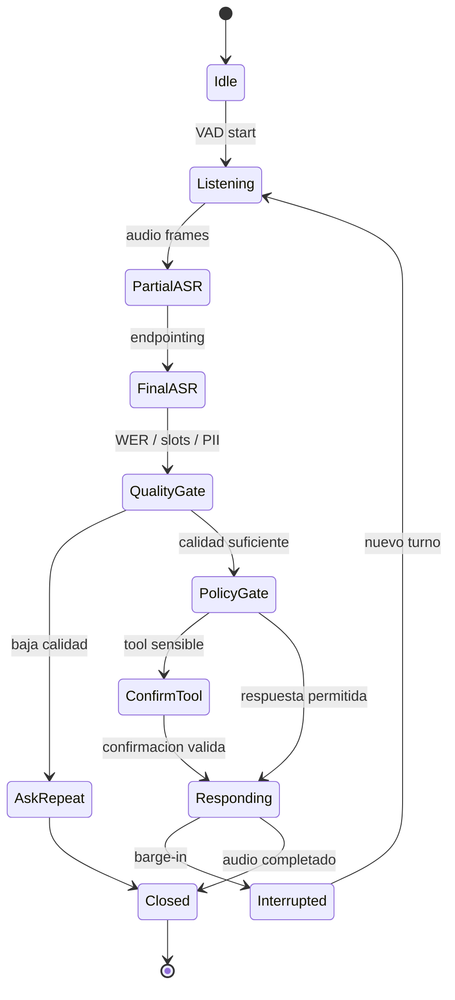
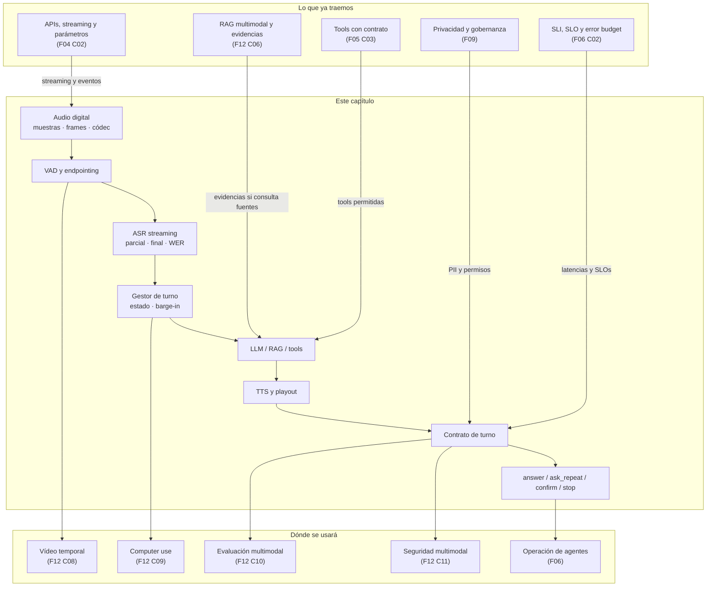

::: {.fasciculo-subtitle}
Facsímil 12 · IA multimodal y sistemas que perciben
:::

# Capítulo 07: Audio, voz y conversación en tiempo real

## Qué deberías poder hacer al terminar

La voz parece mágica porque se parece a hablar con otra persona. Pero por dentro no es magia: es señal, red, transcripción, detección de turno, razonamiento, herramientas, síntesis, reproducción, permisos, logs y evaluación. Si una de esas piezas falla, el agente no “habla raro”; interrumpe mal, ejecuta una acción que no debía, guarda datos personales en claro o deja al usuario esperando en silencio.

En las slides del workshop aparece la idea general: pipeline clásico `STT + LLM + TTS` frente a sistemas speech-to-speech o APIs realtime. Aquí vamos más despacio. El objetivo no es que sepas nombrar una API. El objetivo es que puedas mirar una arquitectura de voz y hacer preguntas de ingeniería.

Al terminar este capítulo deberías poder hacer esto:

| Resultado de aprendizaje | Evidencia de que lo sabes hacer |
|---|---|
| Explicar qué es audio digital. | Distingues muestra, frecuencia, frame, códec y latencia. |
| Separar ASR, LLM, tools y TTS. | No confundes transcripción con intención ni intención con permiso. |
| Diseñar un contrato de turno. | Guardas transcripción, timestamps, decisión, evidencias, límites y métricas. |
| Medir un agente de voz. | Calculas WER, latencia de primera voz, endpointing y barge-in. |
| Elegir transporte y arquitectura. | Sabes cuándo usar WebRTC, WebSocket, proveedor realtime o pipeline propio. |
| Proteger acciones y datos. | No ejecutas tools peligrosas ni guardas PII solo porque venía en audio. |
| Ejecutar el kit del capítulo. | Descargas el ZIP, corres `make run`, miras las tarjetas de turno y cambias una política. |

La frase central del capítulo:

> Un agente de voz no es “un chatbot con micrófono”. Es un sistema de tiempo real donde la incertidumbre de audio afecta permisos, latencia, privacidad y experiencia.

## La escena: una llamada de soporte que parece sencilla

Imagina una oficina universitaria. Una persona llama y dice:

> “Quiero saber si puedo enviar la beca aunque el justificante siga pendiente.”

Eso parece una pregunta normal. Ahora añade realidad:

| Problema | Qué ocurre | Qué no debe hacer el sistema |
|---|---|---|
| Ruido | El ASR oye “color” donde el usuario dijo “correo”. | Cambiar datos personales por una transcripción dudosa. |
| Pausa | El usuario respira y el sistema cree que terminó. | Cortar el turno demasiado pronto. |
| Interrupción | El agente empieza a hablar y el usuario dice “espera”. | Seguir soltando audio como un IVR antiguo. |
| Tool peligrosa | El usuario dice “cancela mi matrícula si no está pagada”. | Ejecutar una acción irreversible sin confirmación. |
| Datos sensibles | El usuario dicta DNI, teléfono o número de tarjeta. | Guardar trazas con datos en claro. |

La voz amplifica los fallos porque el usuario no está mirando un JSON. Si tarda, se nota. Si interrumpe y no paras, se enfada. Si entiende mal una palabra, puede cambiar una decisión. Si una tool actúa mal, el problema ya no es “la respuesta fue mala”; el sistema hizo algo.

## Lectura de ingeniería: una conversación es un sistema distribuido en miniatura

Un agente de voz parece una única experiencia, pero por debajo combina componentes con ritmos distintos. El micrófono captura frames, el VAD decide si alguien habla, el ASR produce hipótesis, el LLM decide intención, las tools consultan sistemas, el TTS sintetiza audio y el reproductor lo emite. Cada etapa añade latencia y cada etapa puede fallar. Por eso la voz exige pensar como en sistemas distribuidos: eventos, estados, timeouts, reintentos y degradación.

La transcripción tampoco es una verdad. Es una observación probabilística. Si el usuario dicta un número de expediente, una fecha o un apellido, un pequeño error puede cambiar el resultado. En una conversación casual quizá se corrige hablando. En una acción administrativa, financiera o sanitaria, necesitas confirmaciones, lectura de vuelta, slots con confianza y reglas que bloqueen acciones cuando la evidencia oral no es suficiente.

### El contrato de turno

En texto, un turno suele ser un mensaje. En voz, un turno es una negociación. El sistema debe decidir cuándo empieza la voz, cuándo termina, si hubo interrupción, si el audio fue suficiente, qué transcripción es estable, qué parte era ruido, qué parte era una corrección y qué estado conversacional queda. Si ese contrato no existe, el agente puede responder demasiado pronto, pisar al usuario, ejecutar una tool incompleta o repetir información ya corregida.

Un contrato de turno útil incluye `utterance_id`, timestamps, transcript parcial y final, confianza por slot, intención candidata, slots críticos, acción propuesta, confirmación requerida y motivo de bloqueo. Para una demo, esto parece excesivo. Para producción, es lo que permite explicar por qué no se ejecutó una transferencia, por qué se pidió repetir un dato o por qué se escaló a humano.

### Latencia como requisito, no como molestia

La experiencia de usuario y la seguridad se tocan. Un sistema que tarda demasiado invita a interrumpir. Un sistema que no entiende barge-in genera frustración. Un sistema que ejecuta tools por una transcripción dudosa es peligroso. Por eso medir solo WER es insuficiente. Hay que medir latencia de primer audio, latencia de turno completo, cortes prematuros, interrupciones, acciones canceladas y tasa de revisión humana.

También hay que diseñar degradación. Si el ASR baja de confianza, quizá el sistema debe pedir repetición. Si una tool tarda demasiado, quizá debe responder con estado parcial. Si el TTS falla, quizá debe mostrar texto. Si la red se corta, quizá debe cerrar sin ejecutar acciones. Una conversación operable no es la que nunca falla; es la que falla de manera comprensible y segura.

### Voz, privacidad y acciones

La voz trae información que el usuario no siempre sabe que entrega: acento, entorno, ruido de fondo, otras personas, tono emocional y datos biométricos potenciales. Si además la conversación llama tools, el riesgo crece. Un transcript puede ser suficiente para el caso de uso; conservar audio bruto durante meses puede no estar justificado. Un embedding de voz puede ser sensible aunque la respuesta final no lo parezca.

La práctica correcta no pregunta “¿habla natural?”. Pregunta: qué estado conserva cada turno, qué evidencia justifica cada tool, qué se guarda redactado, qué se descarta y qué ocurre cuando el audio no permite decidir. Esa es la diferencia entre una demo simpática y un sistema de voz operable. Un alumno debería poder entregar un log de sesión donde se vean eventos, latencias, slots, confirmaciones y bloqueos. Si solo entrega una transcripción bonita, todavía falta ingeniería.

## Audio desde cero: lo mínimo que hay que saber

El sonido es una señal continua. Un ordenador no guarda continuidad infinita; guarda muestras. Si la frecuencia de muestreo es \(f_s\), una señal continua \(x(t)\) se convierte en una secuencia discreta:

$$
x[n] = x\left(\frac{n}{f_s}\right)
$$

| Símbolo | Significado |
|---|---|
| \(x(t)\) | Señal continua en el tiempo. |
| \(x[n]\) | Muestra discreta número \(n\). |
| \(f_s\) | Frecuencia de muestreo, por ejemplo 16 kHz o 48 kHz. |
| \(n/f_s\) | Instante temporal de la muestra. |

En voz telefónica y ASR es común trabajar con 16 kHz mono porque la voz humana útil para reconocimiento cabe bien ahí. En WebRTC y audio moderno puedes encontrar 48 kHz, Opus, cancelación de eco, supresión de ruido y control de ganancia. Para ingeniería no basta con decir “audio”: hay que saber qué formato entra.

| Concepto | Qué significa | Por qué importa |
|---|---|---|
| Sample rate | Muestras por segundo. | Afecta calidad, coste, compatibilidad y resampling. |
| Bit depth | Precisión de cada muestra. | PCM 16-bit es habitual en pipelines simples. |
| Frame | Trozo pequeño de audio, por ejemplo 20 ms. | ASR/VAD/streaming trabajan por frames. |
| Códec | Forma de comprimir/transmitir audio. | Opus está pensado para voz interactiva y baja latencia.^[IETF. (2012). *RFC 6716: Definition of the Opus Audio Codec*. https://datatracker.ietf.org/doc/html/rfc6716. Consultado el 14 de junio de 2026.] |
| Jitter | Variación en llegada de paquetes. | En conversación se nota como cortes, esperas o audio irregular. |
| Resampling | Convertir de una frecuencia a otra. | Puede meter coste y artefactos si se hace mal. |

Un error muy común: tratar audio como si fuese un archivo que subes y ya está. En tiempo real, el audio llega por trozos. Cada trozo debe viajar, decodificarse, filtrarse, entrar en VAD, alimentar ASR y mantener una conversación viva.

## Pipeline clásico: STT + LLM + TTS

La arquitectura más fácil de entender es esta:

1. Capturas audio del usuario.
2. Transcribes con ASR.
3. Pasas texto al LLM.
4. El LLM decide o llama a herramientas.
5. Generas texto de respuesta.
6. Sintetizas voz con TTS.
7. Reproduces audio.

Funciona. De hecho, en muchos productos sigue siendo la opción más controlable. Pero suma latencias:

| Etapa | Qué añade | Qué puede fallar |
|---|---|---|
| Captura | Permisos, micrófono, navegador, formato. | No hay audio, eco, ganancia mala. |
| VAD/endpointing | Saber cuándo empieza y termina el turno. | Cortar pronto o esperar demasiado. |
| ASR | Convertir voz a texto. | Errores por ruido, acento, nombres propios. |
| LLM | Razonar, recuperar, llamar tools. | Alucinar, llamar herramienta incorrecta. |
| TTS | Convertir texto a voz. | Latencia, pronunciación, tono, prosodia. |
| Playout | Reproducir audio al usuario. | Jitter, buffer, interrupciones. |

Ejemplo de fórmula operativa, no ley universal:

$$
L_{\text{voz}} =
L_{\text{captura}} +
L_{\text{vad}} +
L_{\text{asr}} +
L_{\text{razonamiento}} +
L_{\text{tts\_first}} +
L_{\text{playout}}
$$

| Término | Lectura práctica |
|---|---|
| \(L_{\text{captura}}\) | Tiempo hasta tener audio útil. |
| \(L_{\text{vad}}\) | Tiempo que tardas en decidir que el usuario terminó. |
| \(L_{\text{asr}}\) | Tiempo hasta transcripción parcial/final. |
| \(L_{\text{razonamiento}}\) | LLM, RAG, tools, políticas y validaciones. |
| \(L_{\text{tts\_first}}\) | Tiempo hasta el primer trozo de audio de respuesta. |
| \(L_{\text{playout}}\) | Buffer y reproducción en cliente. |

El número que suele doler al usuario no es solo “latencia total”. Es cuánto tarda en oír algo después de terminar de hablar. Si el sistema responde perfecto pero con una pausa incómoda, la experiencia se rompe.

## Pipeline nativo speech-to-speech

Las APIs realtime modernas permiten enviar audio y recibir audio de forma bidireccional, a veces con transcripción, eventos, tool calls y gestión de turnos en la misma sesión. La documentación de OpenAI describe sesiones Realtime donde el cliente se conecta a `/v1/realtime`, envía audio o texto y escucha respuestas, llamadas a herramientas y eventos de sesión; para agentes de voz en navegador recomienda partir de WebRTC y Agents SDK.^[OpenAI. (2026). *Realtime and audio guide*. https://developers.openai.com/api/docs/guides/realtime. Consultado el 14 de junio de 2026.] Gemini Live se presenta como API en preview para interacciones de baja latencia con voz y visión, procesando streams continuos de audio, imagen y texto.^[Google AI for Developers. (2026). *Gemini Live API overview*. https://ai.google.dev/gemini-api/docs/live-api. Consultado el 14 de junio de 2026.]

La tentación es decir: “entonces uso nativo y me olvido”. No. Cambia el sitio donde vives la complejidad.

| Arquitectura | Ventaja | Riesgo |
|---|---|---|
| STT + LLM + TTS | Mucho control, piezas sustituibles, eval por etapa. | Más latencia y más integración. |
| Speech-to-speech nativo | Menos fricción conversacional, interrupciones más naturales. | Menos observabilidad por etapa si no instrumentas bien. |
| Híbrido | Puedes usar nativo para conversación y tools/contratos propios para decisiones. | Requiere diseñar bien eventos, trazas y límites. |

En un producto serio, yo no preguntaría “¿cuál suena mejor en demo?”. Preguntaría:

| Pregunta | Por qué importa |
|---|---|
| ¿Tengo transcripción parcial y final? | Para mostrar, auditar y detectar errores. |
| ¿Puedo cancelar generación y TTS al interrumpir? | Para barge-in real. |
| ¿Dónde quedan tool calls y sus argumentos? | Para permisos, revisión y trazabilidad. |
| ¿Puedo redactar PII antes de logs? | Para privacidad y cumplimiento. |
| ¿Qué latencias p50/p95 tengo por región? | Para SLO real, no sensación. |
| ¿Puedo reproducir una conversación? | Para depurar incidentes. |

## Eventos de una sesión realtime

Una sesión de voz no debería modelarse como una petición HTTP gigante. Es una conversación de eventos. OpenAI documenta flujos de conversación Realtime con generación de audio/texto, entrada de imagen, function calling y estado de sesión; también separa el modo conversación del modo transcripción cuando no esperas respuesta del modelo.^[OpenAI. (2026). *Realtime conversations*. https://developers.openai.com/api/docs/guides/realtime-conversations. Consultado el 14 de junio de 2026.] La referencia de eventos de servidor incluye parámetros de VAD como `interrupt_response`, que permite cancelar una respuesta en curso cuando empieza voz del usuario, e `idle_timeout_ms` para timeouts en modo `server_vad`.^[OpenAI. (2026). *Realtime server events reference*. https://developers.openai.com/api/reference/resources/realtime/server-events/. Consultado el 14 de junio de 2026.]

Una forma práctica de pensarlo:

| Tipo de evento | Ejemplo | Qué haría ingeniería |
|---|---|---|
| Audio entrante | Frame de PCM/Opus desde cliente. | Validar formato, timestamp y pérdida. |
| VAD | Empieza habla, termina habla, timeout de silencio. | Abrir/cerrar turno sin ejecutar todavía. |
| ASR parcial | “quiero cambiar el color...” | Mostrar como provisional, no usar para tool. |
| ASR final | “quiero cambiar el correo...” | Pasar por gates de calidad y slots críticos. |
| Respuesta del modelo | Texto/audio delta. | Medir primer delta y primera voz. |
| Tool call | `cambiar_datos_personales(...)`. | Validar política, permiso y confirmación. |
| Cancelación | Usuario interrumpe. | Parar TTS y marcar generación anterior como obsoleta. |
| Trazas | Turno cerrado con métricas. | Guardar lo mínimo necesario y redactado. |

Esto cambia cómo programas. En una app de texto puedes esperar a tener una respuesta completa. En voz, hay decisiones antes, durante y después de la respuesta. La interfaz “natural” solo se sostiene si el backend sabe vivir con estados intermedios.

Ejemplo de máquina de estados para un turno:



El detalle importante: `PartialASR` no debería disparar acciones. Puede servir para UI, captions o prefetch, pero no para cambiar estado. La frontera de seguridad está en `QualityGate` y `PolicyGate`.

## ASR: convertir voz en texto no es entender

ASR significa Automatic Speech Recognition. Convierte audio en texto. No decide intención, no concede permisos y no sabe si una acción es peligrosa. Solo produce una hipótesis textual con más o menos confianza.

Algunas familias relevantes:

| Familia | Idea técnica | Qué aporta |
|---|---|---|
| RNN-T | Transducción secuencia a secuencia sin alineación previa rígida.^[Graves, A. (2012). *Sequence Transduction with Recurrent Neural Networks*. https://arxiv.org/abs/1211.3711.] | Muy importante para ASR streaming: predice mientras entra audio. |
| wav2vec 2.0 | Preentrena representaciones de audio con aprendizaje autosupervisado y luego ajusta con transcripciones.^[Baevski, A., Zhou, H., Mohamed, A. y Auli, M. (2020). *wav2vec 2.0: A Framework for Self-Supervised Learning of Speech Representations*. NeurIPS. https://arxiv.org/abs/2006.11477.] | Reduce dependencia de grandes corpus etiquetados. |
| Conformer | Combina convoluciones para patrones locales y Transformer para contexto global.^[Gulati, A. et al. (2020). *Conformer: Convolution-augmented Transformer for Speech Recognition*. https://arxiv.org/abs/2005.08100.] | Arquitectura fuerte en ASR moderno. |
| Whisper | Entrenado con 680.000 horas de audio multilingüe y multitarea débilmente supervisado.^[Radford, A. et al. (2023). *Robust Speech Recognition via Large-Scale Weak Supervision*. Proceedings of ICML 2023, 28492-28518. https://proceedings.mlr.press/v202/radford23a.html.] | Robustez y generalización, muy útil como referencia práctica. |

La salida de ASR debería tratarse como hipótesis:

```json
{
  "transcript": "necesito cambiar el correo de contacto",
  "is_final": true,
  "start_ms": 0,
  "end_ms": 2480,
  "confidence": 0.84,
  "language": "es",
  "speaker": "user",
  "audio_quality": "noisy"
}
```

El problema es que muchas APIs y demos te devuelven texto y tú, sin darte cuenta, lo tratas como verdad. Para preguntas inocuas puede valer. Para herramientas, datos personales o decisiones administrativas, no.

## WER: medir transcripción sin engañarse

La métrica clásica de ASR es WER, Word Error Rate. NIST SCTK/SCLITE documenta la evaluación comparando una hipótesis de reconocimiento con una referencia mediante alineación y conteo de errores.^[NIST. (2026). *SCTK / sclite documentation*. https://github.com/usnistgov/SCTK/blob/master/doc/sclite.htm. Consultado el 14 de junio de 2026.]

$$
\operatorname{WER} =
\frac{S + D + I}{N}
$$

| Símbolo | Significado |
|---|---|
| \(S\) | Sustituciones: el ASR cambió una palabra por otra. |
| \(D\) | Deleciones: faltan palabras de la referencia. |
| \(I\) | Inserciones: aparecen palabras de más. |
| \(N\) | Número de palabras de la referencia. |

Ejemplo pequeño:

| Referencia | Hipótesis | Error |
|---|---|---|
| “cambiar el **correo**” | “cambiar el **color**” | Sustitución. |
| “mi expediente **de beca**” | “mi expediente” | Deleción. |
| “estado de matrícula” | “estado de **mi** matrícula” | Inserción. |

WER no lo explica todo. Una WER de 5% puede ser aceptable en una charla, pero fatal si el 5% cae justo en “no”, “cancelar”, “cien” o “mil”. Por eso en sistemas de voz con tools interesa medir por intención, slots críticos y acciones peligrosas, no solo por promedio.

## Métricas más allá de WER

Si el capítulo se quedara en WER, estaría incompleto para ingeniería de IA. WER mide palabras. Tu producto falla por decisiones.

Ejemplo de métrica operativa para slots críticos:

$$
\operatorname{SlotErrorRate} =
\frac{\operatorname{slots\_criticos\_erroneos}}
{\operatorname{slots\_criticos\_totales}}
$$

| Slot crítico | Por qué importa |
|---|---|
| Negación | “No envíes” frente a “envíes”. |
| Acción | “Cancelar matrícula” frente a “consultar matrícula”. |
| Importe | “cien” frente a “mil”. |
| Identificador | DNI, expediente, pedido, ticket. |
| Fecha | “hoy” frente a “jueves”. |
| Entidad | “correo” frente a “color” en el ejemplo del kit. |

En un agente de voz con tools yo miraría esta matriz:

| Métrica | Qué mide | Cuándo duele |
|---|---|---|
| WER | Error por palabra respecto a referencia. | Calidad general de transcripción. |
| CER | Error por carácter. | Nombres, códigos, matrículas, DNI, idiomas con tokenización difícil. |
| Slot error rate | Campos críticos mal reconocidos. | Tools, formularios, pagos, reservas, acciones. |
| Intent accuracy | Si la intención se clasificó bien. | Routing y selección de herramienta. |
| Partial stability | Cuánto cambian los parciales antes del final. | UI en vivo, captions, prefetch y ansiedad del usuario. |
| Endpoint delay | Tiempo desde fin de habla hasta ASR final o cierre de turno. | Sensación de pausa torpe. |
| False cut rate | Turnos cerrados antes de que el usuario termine. | Frases largas, dudas, usuarios no expertos. |
| Barge-in stop latency | Tiempo en detener salida al interrumpir. | Conversación natural. |
| DER | Error de diarización: quién habló y cuándo. | Reuniones, llamadas con varios hablantes. |

La diarización no siempre aparece en un agente de voz sencillo, pero entra rápido cuando hay llamadas, reuniones, operadores o conversaciones con terceros. Pyannote.audio es un toolkit abierto para diarización con bloques entrenables para VAD, cambio de hablante, solapamiento y embeddings de hablante.^[Bredin, H. et al. (2019). *pyannote.audio: neural building blocks for speaker diarization*. https://arxiv.org/abs/1911.01255.] La métrica DER suele descomponerse en falsa alarma, habla perdida y confusión de hablante:

$$
\operatorname{DER} =
\frac{\operatorname{false\ alarm} + \operatorname{missed\ detection} + \operatorname{confusion}}
{\operatorname{total}}
$$

No hace falta meter diarización en todos los productos. Hace falta saber cuándo la necesitas. Si el sistema atribuye “sí, autorizo” a la persona equivocada, tienes un problema de ingeniería y de responsabilidad.

## Dataset de evaluación de voz

No evalúes un agente de voz solo con tus tres frases favoritas en la oficina. Los corpus públicos ayudan a comparar ASR y entrenar intuición, pero tu release necesita un set propio de dominio.

| Dataset o set | Qué aporta | Qué no resuelve |
|---|---|---|
| LibriSpeech | Corpus de unas 1000 horas de lectura en inglés a 16 kHz, derivado de audiolibros, usado durante años en ASR.^[Panayotov, V., Chen, G., Povey, D. y Khudanpur, S. (2015). *LibriSpeech: An ASR Corpus Based on Public Domain Audio Books*. ICASSP. https://www.openslr.org/12.] | No representa llamadas con ruido, acentos locales, nombres de tu dominio ni tools. |
| Common Voice | Corpus multilingüe de voz recogida y validada por crowdsourcing.^[Ardila, R. et al. (2020). *Common Voice: A Massively-Multilingual Speech Corpus*. LREC. https://aclanthology.org/2020.lrec-1.520/] | Puede no cubrir tus términos técnicos ni tu canal de audio. |
| Set interno de dominio | Frases reales o sintéticas revisadas: becas, pagos, incidencias, permisos. | Debe documentarse, versionarse y proteger datos. |
| Set adverso práctico | Ruido, interrupciones, negaciones, importes, PII, tools peligrosas. | No sustituye tráfico real monitorizado. |

Una matriz mínima para tu propio set:

| Dimensión | Ejemplos que deberías incluir |
|---|---|
| Canal | Micrófono portátil, móvil, auriculares, telefonía. |
| Ruido | Oficina, calle, eco, teclado, otra voz de fondo. |
| Idioma/acento | Español de varias regiones, mezcla con inglés técnico si ocurre. |
| Tarea | Consulta, formulario, tool de lectura, tool de escritura. |
| Riesgo | PII, negación, importes, cancelación, permisos. |
| Experiencia | Pausas largas, interrupciones, correcciones del usuario. |

La práctica del capítulo incluye `output/voice_eval_matrix.csv` precisamente para esto: comparar WER, slots críticos, estabilidad de parciales y decisión final. Si el sistema oye “color” donde debía oír “correo”, WER ya avisa, pero el slot crítico deja claro por qué no se debe ejecutar nada.

## VAD y endpointing: cuándo termina un turno

VAD detecta actividad de voz. Endpointing decide que el usuario terminó de hablar. Parece menor, pero es la diferencia entre conversación natural y sistema torpe.

Ejemplo de regla operativa, no algoritmo universal:

$$
\operatorname{cerrar\_turno} =
(\operatorname{energia} < \theta)
\land
(\operatorname{silencio\_continuo} > 500\,ms)
$$

| Pieza | Qué controla |
|---|---|
| \(\operatorname{energia}\) | Si el frame parece habla o silencio. |
| \(\theta\) | Umbral de energía. Si es alto, pierdes habla baja. Si es bajo, metes ruido. |
| Silencio continuo | Cuánto esperas antes de cerrar. |

Si cierras con 200 ms de silencio, cortas frases normales. Si esperas 1500 ms, el sistema parece lento. El valor correcto depende de idioma, canal, ruido, usuario y tipo de tarea. Un agente de soporte puede tolerar más espera; un asistente de cocina manos libres quizá necesita responder antes.

## Turn manager: la pieza que muchas demos esconden

El gestor de turno decide qué pasa con cada evento:

| Evento | Decisión sana |
|---|---|
| Llega audio parcial. | Actualizar hipótesis, no ejecutar. |
| VAD detecta silencio breve. | Esperar si la frase parece incompleta. |
| ASR final llega con baja confianza. | Pedir repetición o confirmación. |
| El usuario interrumpe al TTS. | Cortar audio anterior y cancelar generación si procede. |
| El LLM propone tool destructiva. | Exigir confirmación y permiso. |
| Aparece PII. | Redactar antes de logs y minimizar contexto. |

Un contrato de turno útil puede tener esta forma:

```json
{
  "turn_id": "call-2026-06-14-0007:t12",
  "audio": {
    "sample_rate_hz": 16000,
    "codec": "opus",
    "speech_start_ms": 0,
    "speech_end_ms": 2460,
    "mean_energy": 0.075
  },
  "asr": {
    "transcript": "quiero saber si puedo enviar la beca aunque el justificante siga pendiente",
    "wer_estimate": 0.08,
    "is_final": true
  },
  "decision": "answer",
  "tool_policy": {
    "tool_name": null,
    "requires_confirmation": false
  },
  "metrics": {
    "endpoint_delay_ms": 400,
    "first_audio_latency_ms": 1190
  },
  "evidence": ["policy_submission_rule", "status_pending_receipt"],
  "limits": ["no decide elegibilidad final"]
}
```

Esto no es burocracia. Es el objeto que te permite depurar, evaluar y explicar por qué el sistema respondió, pidió repetición o bloqueó.

## Barge-in: interrumpir no es un detalle de UX

Barge-in significa que el usuario puede interrumpir mientras el agente habla. En conversación humana pasa todo el tiempo. En producto, si el agente no para, se siente como una máquina recitando.

Un barge-in correcto tiene varias capas:

1. El cliente detecta voz del usuario mientras el TTS está reproduciendo.
2. Se detiene el audio de salida.
3. Se cancela o marca como obsoleta la generación anterior.
4. Se abre un nuevo turno.
5. La traza conserva que hubo interrupción.

Ejemplo realista:

| Momento | Evento |
|---:|---|
| 600 ms | El agente empieza a hablar. |
| 1160 ms | El usuario dice “espera”. |
| 1290 ms | El cliente corta TTS. |
| 2260 ms | ASR finaliza la nueva intención. |
| 2970 ms | El usuario oye la nueva respuesta. |

La métrica que miraría:

$$
L_{\text{barge-in}} =
t_{\text{tts\_stop}} - t_{\text{user\_interrupt}}
$$

Si esa latencia es alta, la interrupción existe en teoría pero no en experiencia.

## TTS: hablar no es leer texto

TTS convierte texto en audio. La familia moderna suele separar:

| Capa | Qué hace |
|---|---|
| Normalización de texto | Convierte fechas, números, siglas y símbolos en una forma pronunciable. |
| Representación lingüística | Caracteres, subpalabras, fonemas, acentos, idioma. |
| Modelo acústico | Produce espectrogramas o representaciones acústicas. |
| Vocoder | Convierte esa representación en onda sonora. |
| Streaming | Entrega audio por fragmentos antes de tener toda la frase. |

WaveNet mostró generación autoregresiva de audio crudo con gran calidad perceptual para TTS.^[van den Oord, A. et al. (2016). *WaveNet: A Generative Model for Raw Audio*. https://arxiv.org/abs/1609.03499.] Tacotron 2 combinó una red secuencia-a-secuencia que predice espectrogramas mel con un vocoder WaveNet.^[Shen, J. et al. (2018). *Natural TTS Synthesis by Conditioning WaveNet on Mel Spectrogram Predictions*. ICASSP. https://arxiv.org/abs/1712.05884.] FastSpeech atacó el problema de velocidad y control con generación paralela de espectrogramas.^[Ren, Y. et al. (2019). *FastSpeech: Fast, Robust and Controllable Text to Speech*. NeurIPS. https://arxiv.org/abs/1905.09263.] HiFi-GAN mostró vocoders eficientes y de alta fidelidad basados en GANs.^[Kong, J., Kim, J. y Bae, J. (2020). *HiFi-GAN: Generative Adversarial Networks for Efficient and High Fidelity Speech Synthesis*. NeurIPS. https://arxiv.org/abs/2010.05646.]

La ingeniería diaria no suele consistir en implementar Tacotron o HiFi-GAN desde cero. Consiste en saber qué duele:

| Dolor | Ejemplo | Control |
|---|---|---|
| Números mal leídos | “1.250” como uno punto dos cinco cero. | Normalización por idioma y dominio. |
| Nombres propios | Apellidos, campus, productos. | Diccionario/pronunciación custom si el proveedor lo permite. |
| Latencia | Voz empieza tarde. | TTS streaming, frases cortas, prefetch. |
| Tono inadecuado | Suena alegre en una incidencia grave. | Estilo, SSML o selección de voz. |
| Barge-in | El audio no se puede cancelar. | Playout controlado y eventos de cancelación. |

## WebRTC, WebSocket, RTP y Opus

En navegador, WebRTC es la opción natural para audio bidireccional de baja latencia. RFC 8825 da el marco de protocolos realtime para aplicaciones desplegadas en navegadores.^[Alvestrand, H. (2021). *RFC 8825: Overview: Real-Time Protocols for Browser-Based Applications*. https://datatracker.ietf.org/doc/html/rfc8825. Consultado el 14 de junio de 2026.] RTP define transporte extremo a extremo para datos de tiempo real como audio y vídeo, aunque no garantiza por sí solo calidad de servicio.^[Schulzrinne, H., Casner, S., Frederick, R. y Jacobson, V. (2003). *RFC 3550: RTP: A Transport Protocol for Real-Time Applications*. https://datatracker.ietf.org/doc/html/rfc3550. Consultado el 14 de junio de 2026.] W3C mantiene la API WebRTC para navegadores.^[W3C. (2026). *WebRTC: Real-Time Communication in Browsers*. https://www.w3.org/TR/webrtc/. Consultado el 14 de junio de 2026.]

| Opción | Úsala cuando | Vigila |
|---|---|---|
| WebRTC | Navegador/móvil, audio bidireccional, baja latencia, cancelación y NAT traversal. | Señalización, ICE, TURN, permisos, observabilidad. |
| WebSocket audio | Server-to-server, prototipos controlados, streaming simple. | Jitter, cancelación, codec, backpressure. |
| HTTP batch | Transcripción de archivos o notas asíncronas. | No sirve para conversación natural. |
| SIP/telefonía | Call centers y telefonía tradicional. | Integración con centralita, grabación, normativa y latencia. |

OpenAI documenta Realtime por WebRTC para escenarios de audio en tiempo real; Azure OpenAI también documenta Realtime vía WebRTC, SIP o WebSocket para enviar audio y recibir audio en tiempo real.^[Microsoft. (2026). *Use the GPT Realtime API via WebRTC*. https://learn.microsoft.com/en-us/azure/foundry/openai/how-to/realtime-audio-webrtc. Consultado el 14 de junio de 2026.] La decisión no es de moda. Es de red, cliente, permisos, latencia y operación.

### WebRTC por dentro, sin convertir esto en redes avanzadas

MDN resume WebRTC como una pila que incluye ICE, STUN, TURN, SDP y otros protocolos para establecer comunicación realtime entre pares.^[MDN Web Docs. (2026). *Introduction to WebRTC protocols*. https://developer.mozilla.org/en-US/docs/Web/API/WebRTC_API/Protocols. Consultado el 14 de junio de 2026.] Para ingeniería de IA, lo importante es saber qué problema resuelve cada pieza:

| Pieza | Qué hace | Pregunta de producción |
|---|---|---|
| Señalización | Intercambia ofertas, respuestas y configuración inicial por tu backend. | ¿Cómo autentico la sesión y cuánto dura el token? |
| ICE | Busca la mejor ruta de conectividad entre extremos. | ¿Qué ocurre en redes corporativas o móviles? |
| STUN | Ayuda a descubrir la dirección pública detrás de NAT. | ¿Funciona fuera de mi WiFi? |
| TURN | Relé cuando no hay conexión directa. | ¿Cuánto coste y latencia añade el relé? |
| RTP/SRTP | Transporta audio/vídeo en tiempo real, con cifrado en SRTP. | ¿Veo pérdida, jitter y bitrate? |
| RTCP | Informa sobre calidad de transmisión. | ¿Uso esas señales en observabilidad? |
| Data channel | Canal de datos paralelo. | ¿Por ahí van eventos, tool calls o metadatos? |
| Jitter buffer | Suaviza llegada irregular de paquetes. | ¿Aumenta latencia para evitar cortes? |

El fallo típico de un primer prototipo es que funciona perfecto en localhost y mal en la red de un cliente. No porque “el modelo sea peor”, sino porque la ruta de red cambia: NAT, firewall, TURN, pérdida de paquetes, micrófono Bluetooth, permisos del navegador o región del proveedor.

## Herramientas y mercado, con cuidado

Estado de lectura: 14 de junio de 2026.

| Servicio o familia | Dónde encaja | Qué comprobaría antes de integrarlo |
|---|---|---|
| OpenAI Realtime | Voz/audio realtime, eventos de sesión, tools y respuestas de modelo. | Modelo soportado, región, WebRTC/WebSocket, trazas, tool calls, coste de audio y cancelación. |
| Gemini Live API | Voz y visión en streaming de baja latencia, en preview según documentación. | Estabilidad de preview, límites, vídeo, sesiones, audio input/output y observabilidad. |
| Azure Speech | Speech-to-text real-time y batch, TTS, traducción y servicios de voz en ecosistema Azure.^[Microsoft. (2026). *Speech-to-text documentation*. https://learn.microsoft.com/en-us/azure/ai-services/speech-service/index-speech-to-text. Consultado el 14 de junio de 2026.] | Idiomas, custom speech, privacidad, región, logs, SDK y coste. |
| Amazon Transcribe Streaming | Transcripción en tiempo real de audio entregado como stream.^[AWS. (2026). *Transcribing streaming audio*. https://docs.aws.amazon.com/transcribe/latest/dg/streaming.html. Consultado el 14 de junio de 2026.] | SDK, protocolo, vocabulario custom, diarización, latencia y pricing por segundo. |
| Stack propio | ASR/TTS local, WebRTC propio, modelos open weights o servicio interno. | Operación, GPUs/CPU, SLO, mantenimiento, privacidad y calidad por idioma. |

Gemini Live documenta gestión de sesiones y reanudación mediante `sessionResumption`, de forma que una desconexión o reset de WebSocket no obliga necesariamente a perder contexto si guardas el token de reanudación.^[Google AI for Developers. (2026). *Session management with Live API*. https://ai.google.dev/gemini-api/docs/live-api/session-management. Consultado el 14 de junio de 2026.] Esto abre una pregunta práctica: si una sesión se reanuda, ¿qué queda guardado, durante cuánto tiempo, con qué permisos y qué se muestra al usuario?

Si vas a producción, no compares solo “calidad de voz”. Compara:

| KPI | Pregunta |
|---|---|
| WER por dominio | ¿Falla en nombres, códigos, apellidos o tecnicismos? |
| Latencia p95 | ¿Qué oye el usuario real, no la demo local? |
| Barge-in stop p95 | ¿Se puede interrumpir de verdad? |
| Tool confirmation accuracy | ¿Ejecuta acciones solo con confirmación válida? |
| Redacción de PII | ¿Qué queda en logs y trazas? |
| Coste por minuto/turno | ¿Cuánto cuesta una llamada normal y una mala? |
| Observabilidad | ¿Puedo depurar un incidente? |

## Tools por voz: no ejecutes una acción porque “pareció decirlo”

En texto, una confirmación puede quedar clara. En voz, hay ASR, ruido, ambigüedad y presión conversacional. Por eso las tools con efecto externo necesitan una política más dura.

| Tipo de tool | Ejemplo | Política mínima |
|---|---|---|
| Consulta | “¿Estado de mi solicitud?” | Puede ejecutarse si hay identidad y permisos. |
| Cálculo | “Calcula el importe pendiente.” | Ejecutar si los datos están disponibles y no cambia estado. |
| Comunicación | “Envía este correo.” | Confirmación explícita y vista previa. |
| Datos personales | “Cambia mi teléfono.” | Confirmación, autenticación y canal seguro. |
| Acción irreversible | “Cancela mi matrícula.” | Revisión humana o doble confirmación fuerte. |

Un contrato de tool en voz debería incluir:

```json
{
  "tool_name": "cancelar_matricula",
  "effect": "state_change",
  "requires_confirmation": true,
  "confirmation_source": "spoken_transcript",
  "asr_quality_ok": false,
  "allowed": false,
  "reason": "tool destructiva y transcripción sin confirmación explícita"
}
```

La pregunta de ingeniería no es “¿puede el modelo llamar tools?”. Es “¿bajo qué evidencia dejamos que una tool haga algo?”.

## Privacidad: la voz trae datos que el usuario no sabe que está entregando

Una conversación puede incluir DNI, teléfono, dirección, voz de terceros, emoción, ruido de fondo y contexto accidental. Incluso si no guardas audio, puedes guardar transcripciones con PII.

Controles mínimos:

| Control | Qué significa |
|---|---|
| Consentimiento | El usuario sabe si se graba, transcribe o conserva audio. |
| Minimización | No guardas audio si solo necesitas decisión y métricas. |
| Redacción previa | PII se oculta antes de logs, trazas y prompts secundarios. |
| Retención | Tiempo de conservación explícito por tipo de dato. |
| Separación | Audio bruto, transcripción, eventos y tools tienen permisos distintos. |
| Revisión | Casos sensibles van a humano con evidencia mínima necesaria. |

Para agentes de voz conectados a RAG, herramientas o CRM, privacidad no es una sección legal al final. Es parte del pipeline.

## Arquitectura de producción

Una arquitectura razonable tiene estas capas:

| Capa | Responsabilidad | SLI que miraría |
|---|---|---|
| Cliente de audio | Captura, permisos, WebRTC/WebSocket, reproducción. | audio drop rate, jitter, device errors. |
| Preprocesado | Resampling, cancelación de eco, ruido, VAD. | false speech, missed speech, endpoint delay. |
| ASR | Parciales, final, timestamps, idioma, confianza. | WER, slot error rate, finalization latency. |
| Turn manager | Estado, interrupciones, cierre de turno. | barge-in stop latency, premature cut rate. |
| Reasoning/tools/RAG | Respuesta, evidencias, actions. | first token, tool latency, policy blocks. |
| TTS/playout | Primera voz y reproducción. | first audio latency, audio completion, cancel latency. |
| Observabilidad | Trazas, métricas, redacción, auditoría. | trace completeness, PII leak rate, replayability. |

Un SLO de voz puede sonar así:

| SLI | Objetivo interno de ejemplo |
|---|---|
| `first_audio_latency_p95` | Menos de 1300 ms en consultas sin tool. |
| `barge_in_stop_latency_p95` | Menos de 250 ms desde voz del usuario. |
| `critical_slot_error_rate` | Menos de 1% en campos críticos evaluados. |
| `pii_redaction_recall` | 100% en patrones obligatorios del dominio. |
| `tool_confirmation_violation` | 0 ejecuciones sin confirmación requerida. |

### Capacidad: que funcione para una demo no significa que escale

En voz hay una presión que en texto se nota menos: la sesión está viva. Aunque el usuario calle unos segundos, mantienes conexión, estado, buffers, posible contexto y observabilidad.

RTF, Real-Time Factor, ayuda a razonar sobre cómputo:

$$
\operatorname{RTF} =
\frac{\operatorname{tiempo\_de\_procesamiento}}
{\operatorname{duracion\_del\_audio}}
$$

| RTF | Lectura |
|---:|---|
| 0.25 | Procesas cuatro veces más rápido que tiempo real. |
| 1.00 | Vas justo a tiempo real. |
| 1.50 | No alcanzas: acumulas cola. |

Ejemplo de fórmula operativa para dimensionar, no ley universal:

$$
\operatorname{sesiones\_concurrentes\_aprox} =
\frac{\operatorname{capacidad\_audio\_segundos\_por\_segundo}}
{\operatorname{RTF\_ASR} + \operatorname{RTF\_TTS} + \operatorname{overhead}}
$$

La moraleja no es que esa fórmula te dé el número final. La moraleja es que voz no se mide solo por tokens. Mide segundos de audio, conexiones simultáneas, CPU/GPU, TURN, región, TTS, ASR, colas y tools.

### Trazas mínimas de una conversación

Si algo falla, una traza útil debería separar spans. No sirve un log gigante con “respuesta generada”.

| Span | Campos mínimos |
|---|---|
| `audio.capture` | dispositivo, sample rate, codec, pérdida, jitter. |
| `vad.turn_detection` | inicio, fin, silencio, umbral, endpoint delay. |
| `asr.transcription` | parcial/final, idioma, WER estimada, slots críticos. |
| `policy.quality_gate` | decisión, flags, umbrales. |
| `llm.response` | modelo, primer delta, tokens/audio, coste. |
| `tool.policy_gate` | tool propuesta, permiso, confirmación, decisión. |
| `tts.synthesis` | voz, primer audio, duración, cancelación. |
| `privacy.redaction` | tipos redactados, sin valores crudos. |

Esta tabla también sirve para revisar proveedores. Si una plataforma no te deja observar estas piezas, quizá sigue siendo válida para prototipo, pero no para un caso con responsabilidad.

Ejemplo de fórmula operativa para presupuesto de error:

$$
\operatorname{ErrorBudget}_{\text{voz}} =
1 -
\frac{\operatorname{turnos\_correctos}}{\operatorname{turnos\_totales}}
$$

No es una métrica académica universal. Es una forma de obligarte a definir qué cuenta como turno correcto: transcripción aceptable, latencia dentro de SLO, sin PII en claro y sin tool indebida.

## Figura: anatomía de una conversación de voz

<figure class="book-figure book-figure--wide" id="f12-c07-anatomia-voz-realtime">
  <svg viewBox="0 0 1180 760" role="img" aria-labelledby="f12c07-title f12c07-desc" xmlns="http://www.w3.org/2000/svg">
    <title id="f12c07-title">Contrato operativo de voz en tiempo real</title>
    <desc id="f12c07-desc">Pipeline de audio con captura, VAD, ASR, gestor de turnos, herramientas, TTS, reproducción, trazas y evaluación.</desc>
    <defs>
      <marker id="f12c07-arrow" markerWidth="10" markerHeight="10" refX="8" refY="3" orient="auto" markerUnits="strokeWidth">
        <path d="M0,0 L0,6 L9,3 z" fill="#111111"></path>
      </marker>
    </defs>
    <rect width="1180" height="760" fill="#FFFFFF"></rect>
    <text x="62" y="58" font-size="28" font-weight="700" fill="#111111">Voz realtime: contrato antes que demo</text>
    <text x="62" y="88" font-size="15" fill="#555555">Cada turno tiene audio, incertidumbre, latencia, interrupciones, herramientas y privacidad.</text>

    <rect x="54" y="128" width="178" height="380" fill="#FFFFFF" stroke="#111111" stroke-width="1.5"></rect>
    <text x="143" y="160" text-anchor="middle" font-size="15" font-weight="700" fill="#111111">Entrada</text>
    <line x1="78" y1="184" x2="208" y2="184" stroke="#111111"></line>
    <text x="82" y="224" font-size="12" fill="#111111">micrófono</text>
    <text x="82" y="254" font-size="12" fill="#111111">PCM / Opus</text>
    <text x="82" y="284" font-size="12" fill="#111111">eco · ruido · ganancia</text>
    <text x="82" y="314" font-size="12" fill="#111111">frames de 20 ms</text>
    <rect x="82" y="352" width="104" height="52" fill="#F7F7F7" stroke="#111111"></rect>
    <text x="134" y="375" text-anchor="middle" font-size="11" font-weight="700" fill="#111111">VAD</text>
    <text x="134" y="393" text-anchor="middle" font-size="10" fill="#555555">habla / silencio</text>

    <rect x="284" y="128" width="214" height="380" fill="#F7F7F7" stroke="#111111" stroke-width="1.5"></rect>
    <text x="391" y="160" text-anchor="middle" font-size="15" font-weight="700" fill="#111111">ASR streaming</text>
    <line x1="310" y1="184" x2="472" y2="184" stroke="#111111"></line>
    <text x="314" y="224" font-size="12" fill="#111111">parciales</text>
    <text x="314" y="254" font-size="12" fill="#111111">final de turno</text>
    <text x="314" y="284" font-size="12" fill="#111111">WER / slots críticos</text>
    <text x="314" y="314" font-size="12" fill="#111111">timestamps</text>
    <rect x="314" y="352" width="154" height="72" fill="#FFFFFF" stroke="#111111"></rect>
    <text x="391" y="377" text-anchor="middle" font-size="11" font-weight="700" fill="#111111">Gates</text>
    <text x="391" y="397" text-anchor="middle" font-size="10" fill="#555555">repetir · seguir · revisar</text>

    <rect x="550" y="128" width="230" height="380" fill="#FFFFFF" stroke="#111111" stroke-width="1.5"></rect>
    <text x="665" y="160" text-anchor="middle" font-size="15" font-weight="700" fill="#111111">Gestor de turno</text>
    <line x1="576" y1="184" x2="754" y2="184" stroke="#111111"></line>
    <text x="580" y="224" font-size="12" fill="#111111">estado conversacional</text>
    <text x="580" y="254" font-size="12" fill="#111111">barge-in</text>
    <text x="580" y="284" font-size="12" fill="#111111">política de tools</text>
    <text x="580" y="314" font-size="12" fill="#111111">confirmaciones</text>
    <text x="580" y="344" font-size="12" fill="#111111">redacción de PII</text>
    <rect x="580" y="384" width="170" height="58" fill="#111111" stroke="#111111"></rect>
    <text x="665" y="408" text-anchor="middle" font-size="11" font-weight="700" fill="#FFFFFF">Contrato</text>
    <text x="665" y="428" text-anchor="middle" font-size="10" fill="#FFFFFF">answer · repeat · confirm</text>

    <rect x="836" y="128" width="246" height="380" fill="#F7F7F7" stroke="#111111" stroke-width="1.5"></rect>
    <text x="959" y="160" text-anchor="middle" font-size="15" font-weight="700" fill="#111111">Salida</text>
    <line x1="864" y1="184" x2="1054" y2="184" stroke="#111111"></line>
    <text x="868" y="224" font-size="12" fill="#111111">LLM / tools / RAG</text>
    <text x="868" y="254" font-size="12" fill="#111111">TTS first audio</text>
    <text x="868" y="284" font-size="12" fill="#111111">playout y jitter</text>
    <text x="868" y="314" font-size="12" fill="#111111">cancelación si interrumpen</text>
    <text x="868" y="344" font-size="12" fill="#111111">trazas y evals</text>
    <rect x="868" y="384" width="180" height="58" fill="#FFFFFF" stroke="#111111"></rect>
    <text x="958" y="408" text-anchor="middle" font-size="11" font-weight="700" fill="#111111">SLIs</text>
    <text x="958" y="428" text-anchor="middle" font-size="10" fill="#555555">WER · latencia · barge-in</text>

    <line x1="232" y1="320" x2="282" y2="320" stroke="#111111" stroke-width="1.6" marker-end="url(#f12c07-arrow)"></line>
    <line x1="498" y1="320" x2="548" y2="320" stroke="#111111" stroke-width="1.6" marker-end="url(#f12c07-arrow)"></line>
    <line x1="780" y1="320" x2="834" y2="320" stroke="#111111" stroke-width="1.6" marker-end="url(#f12c07-arrow)"></line>

    <rect x="132" y="572" width="916" height="82" fill="#FFFFFF" stroke="#111111" stroke-width="1.2"></rect>
    <text x="158" y="604" font-size="13" font-weight="700" fill="#111111">Regla práctica</text>
    <text x="158" y="628" font-size="13" fill="#111111">Una tool no se ejecuta porque el audio parecía decirlo; se ejecuta cuando el contrato de turno, calidad y permisos lo permite.</text>
    <text x="1092" y="724" text-anchor="end" font-size="11" fill="#999999">IA para gente curiosa / Facsímil 12 / Capítulo 07 / 686f6c61</text>
  </svg>
  <figcaption>La parte difícil de voz no es solo escuchar y hablar: es decidir cuándo una transcripción permite actuar.</figcaption>
</figure>

## Caso práctico: cinco turnos que sí se pueden auditar

El kit del capítulo trae cinco casos:

| Caso | Qué enseña | Decisión esperada |
|---|---|---|
| Consulta de beca | Voz clara, política y estado operativo. | `answer`. |
| Ruido de pasillo | WER alto, baja energía y slot crítico mal reconocido: `correo` se vuelve `color`. | `ask_repeat`. |
| Interrupción | Barge-in mientras el agente habla. | `stop_and_answer`. |
| Datos sensibles | DNI y teléfono dictados por voz. | `answer` con redacción previa. |
| Cancelación de matrícula | Tool destructiva sin confirmación. | `confirm_before_tool`. |

La práctica no pretende simular un ASR real con un modelo enorme. Pretende algo más útil para aprender ingeniería: que puedas cambiar umbrales, ver decisiones, medir slots críticos y defender por qué un turno se automatiza o no.

## Dónde volverá a aparecer

| Capítulo futuro | Qué reutiliza |
|---|---|
| [Capítulo 08](/libro/fasciculo-12/#capitulo-08) | Vídeo añade frames y eventos temporales a la misma idea de stream. |
| [Capítulo 09](/libro/fasciculo-12/#capitulo-09) | Computer use necesita turnos, permisos y cancelación antes de actuar. |
| [Capítulo 10](/libro/fasciculo-12/#capitulo-10) | Evaluaremos multimodalidad con métricas por modalidad y casos de fallo. |
| [Capítulo 11](/libro/fasciculo-12/#capitulo-11) | Privacidad y seguridad de audio entran en operación real. |
| [Fascículo 06](/libro/fasciculo-06/) | SLOs, trazas, runbooks y gates de release para sistemas en producción. |

## Dónde solía tropezar yo

| Tropiezo | Por qué es un problema | Antídoto |
|---|---|---|
| **Pensar que ASR equivale a intención** | La transcripción puede ser incorrecta justo en la palabra crítica. | Separa ASR, intención, permiso y tool. |
| **Medir solo WER medio** | Una WER baja puede esconder error en un slot peligroso. | Evalúa slots críticos y acciones. |
| **Cerrar turno demasiado rápido** | El usuario hace una pausa normal y el sistema responde antes de tiempo. | Mide endpointing y cortes prematuros. |
| **No implementar barge-in real** | El agente se siente como una locución imposible de parar. | Cancela TTS y generación anterior. |
| **Guardar trazas con PII** | La voz suele traer datos personales en claro. | Redacta antes de logs y minimiza retención. |
| **Permitir tools por una frase ambigua** | “Cancela si...” no es confirmación robusta. | Usa confirmación explícita y revisión. |
| **Comparar proveedores por demo** | La demo no muestra acentos, ruido, coste ni SLO. | Evalúa con tus audios, tus tools y tus usuarios. |

## Manos a la obra

<!-- kit: labs/f12/c07-realtime-voice-contract/ -->

El botón de descarga del capítulo incluye el kit `F12 C07 · Contrato de voz en tiempo real`. Está pensado para ejecutarse sin APIs externas.

Ejecuta:

```bash
make run
make test
cat output/realtime_voice_report.md
```

Los archivos importantes son:

| Archivo | Qué contiene |
|---|---|
| `contracts/realtime_voice_policy.json` | Umbrales de WER, energía, endpointing, latencia, barge-in, tools y privacidad. |
| `data/voice_cases.json` | Cinco turnos realistas con transcripción, tiempos, tool y decisión esperada. |
| `schemas/voice_turn_schema.json` | Contrato mínimo de salida por turno. |
| `ops/run_realtime_voice_audit.py` | Auditor ejecutable. |
| `output/realtime_voice_report.md` | Informe humano. |
| `output/latency_budget.csv` | Latencias por caso. |
| `output/voice_eval_matrix.csv` | Matriz con WER, errores en slots críticos, estabilidad de parciales y flags. |
| `output/turn_cards/*.json` | Tarjetas de turno con decisión, métricas, evidencias y límites. |
| `output/audio/*.wav` | Audios sintéticos generados por el kit. |
| `output/realtime_voice_pipeline.svg` | Figura generada con firma del proyecto. |

Qué deberías tocar:

1. Abre `output/turn_cards/q02_ruido_pasillo.json`.
2. Mira por qué la decisión es `ask_repeat`.
3. Abre `output/voice_eval_matrix.csv`.
4. Comprueba que `critical_slot_error_rate` marca el error `correo` → `color`.
5. Cambia `max_wer_for_automatic_decision` en `contracts/realtime_voice_policy.json`.
6. Ejecuta otra vez.
7. Observa si el sistema permitiría automatizar un cambio de datos con peor transcripción.
8. Abre `output/turn_cards/q03_interrupcion_usuario.json`.
9. Comprueba `barge_in_stop_latency_ms`.
10. Abre `output/turn_cards/q04_datos_sensibles.json`.
11. Verifica que DNI y teléfono no quedan en claro.
12. Añade una confirmación explícita en el caso de cancelación de matrícula y decide si aun así pedirías revisión humana.

La entrega buena no dice “he probado voz”. Dice: este turno se respondió, este pidió repetición por WER y slot crítico, este se paró por barge-in, este redactó PII y este no ejecutó una tool porque faltaba confirmación.

## Cómo encaja todo



## Vocabulario aprendido

| Término | Definición |
|---|---|
| Audio digital | Señal sonora convertida en muestras discretas. |
| Frame | Pequeño bloque de audio usado para procesar en streaming. |
| ASR | Sistema que convierte audio hablado en texto. |
| TTS | Sistema que convierte texto en voz. |
| VAD | Detector de actividad de voz. |
| Endpointing | Decisión de cerrar un turno de usuario. |
| Barge-in | Interrupción del usuario mientras el agente está hablando. |
| WER | Word Error Rate: errores de transcripción por palabra. |
| Slot crítico | Campo cuyo error cambia la decisión, la tool o el riesgo. |
| Diarización | Separar quién habla y cuándo en un audio con varios hablantes. |
| RTF | Relación entre tiempo de procesamiento y duración del audio. |
| Opus | Códec de audio interactivo para voz y baja latencia. |
| WebRTC | Stack para comunicación multimedia realtime en navegador y clientes. |
| ICE/STUN/TURN | Piezas de conectividad para atravesar NAT, descubrir rutas o usar relés. |
| Contrato de turno | Registro estructurado de audio, transcripción, decisión, métricas y permisos. |

## Antes de pasar página

Hazte estas preguntas:

1. ¿Qué formato de audio entra en mi sistema?
2. ¿Tengo transcripción parcial y final?
3. ¿Qué WER o error de slot tolero antes de pedir repetición?
4. ¿Cuánto espero antes de cerrar un turno?
5. ¿Se puede interrumpir al agente mientras habla?
6. ¿Qué tools no se ejecutan jamás sin confirmación explícita?
7. ¿Dónde redacto PII: antes o después de logs?
8. ¿Tengo un dataset con ruido, acentos, pausas, negaciones y PII?
9. ¿Sé qué ocurre si la conexión WebRTC cae y se reanuda?
10. ¿Puedo reproducir una conversación problemática sin exponer datos sensibles?

Si no puedes contestar, todavía no tienes un agente de voz operativo. Tienes una demo.

## Para saber más

- Radford, A., Kim, J. W., Xu, T., Brockman, G., McLeavey, C. y Sutskever, I. (2023). *Robust Speech Recognition via Large-Scale Weak Supervision*. Proceedings of ICML 2023. https://proceedings.mlr.press/v202/radford23a.html
- Baevski, A., Zhou, H., Mohamed, A. y Auli, M. (2020). *wav2vec 2.0: A Framework for Self-Supervised Learning of Speech Representations*. NeurIPS. https://arxiv.org/abs/2006.11477
- Gulati, A. et al. (2020). *Conformer: Convolution-augmented Transformer for Speech Recognition*. https://arxiv.org/abs/2005.08100
- Graves, A. (2012). *Sequence Transduction with Recurrent Neural Networks*. https://arxiv.org/abs/1211.3711
- IETF. (2012). *RFC 6716: Definition of the Opus Audio Codec*. https://datatracker.ietf.org/doc/html/rfc6716
- Schulzrinne, H., Casner, S., Frederick, R. y Jacobson, V. (2003). *RFC 3550: RTP: A Transport Protocol for Real-Time Applications*. https://datatracker.ietf.org/doc/html/rfc3550
- OpenAI. (2026). *Realtime and audio guide*. https://developers.openai.com/api/docs/guides/realtime
- OpenAI. (2026). *Realtime conversations*. https://developers.openai.com/api/docs/guides/realtime-conversations
- Google AI for Developers. (2026). *Gemini Live API overview*. https://ai.google.dev/gemini-api/docs/live-api
- Panayotov, V., Chen, G., Povey, D. y Khudanpur, S. (2015). *LibriSpeech: An ASR Corpus Based on Public Domain Audio Books*. https://www.openslr.org/12
- Ardila, R. et al. (2020). *Common Voice: A Massively-Multilingual Speech Corpus*. https://aclanthology.org/2020.lrec-1.520/
- Bredin, H. et al. (2019). *pyannote.audio: neural building blocks for speaker diarization*. https://arxiv.org/abs/1911.01255
- NIST. (2026). *SCTK / sclite documentation*. https://github.com/usnistgov/SCTK/blob/master/doc/sclite.htm

## En resumen

| Idea | Qué deberías llevarte |
|---|---|
| La voz es tiempo real. | No basta con transcribir bien; hay que medir latencia, turnos e interrupciones. |
| ASR produce hipótesis. | Una transcripción no es permiso para actuar. |
| El contrato de turno es la pieza operativa. | Une audio, texto, slots críticos, decisión, tools, privacidad y métricas. |
| Barge-in cambia la experiencia. | Si el usuario no puede interrumpir, no hay conversación natural. |
| WebRTC también es ingeniería. | La calidad depende de ICE, TURN, jitter, región, codec y observabilidad. |
| La práctica debe ser auditable. | Cada turno descargable debe poder ejecutarse, medirse y defenderse. |
