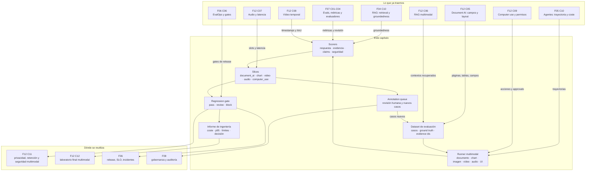

::: {.fasciculo-subtitle}
Facsímil 12 · IA multimodal y sistemas que perciben
:::

# Capítulo 10: Evaluar sistemas multimodales: calidad, evidencia y coste

## Qué deberías poder hacer al terminar

Una demo multimodal puede parecer muy convincente. Le mandas una factura y contesta el total. Le enseñas un gráfico y comenta la tendencia. Le das una captura de pantalla y propone el siguiente click. Le subes un vídeo y dice qué ocurrió. La pregunta profesional no es si parece inteligente. La pregunta profesional es otra:

> ¿Puedo defender esta respuesta con evidencia, coste, latencia y criterios de publicación?

Ese cambio es el centro del capítulo. Evaluar un sistema multimodal no consiste en pedirle diez ejemplos bonitos a un modelo y confiar en la sensación. Consiste en construir un pequeño sistema de evaluación: dataset de casos, ground truth, evidencias esperadas, métricas por modalidad, slices, cola de revisión humana, regression gate y una decisión final.

Fecha de corte: 15 de junio de 2026. Fuentes consultadas ese día: documentación de OpenAI Evals, OpenAI Evals en GitHub, LangSmith multimodal attachments, Promptfoo multimodal red teaming, Ragas multimodal metrics y benchmarks académicos de documentos, gráficos, VLMs, vídeo y audio.^[OpenAI. (2026). *Working with Evals*. https://developers.openai.com/api/docs/guides/evals. Consultado el 15 de junio de 2026. OpenAI. (2026). *Evals*. https://github.com/openai/evals. Consultado el 15 de junio de 2026. LangChain. (2026). *Run an Evaluation with Multimodal Content*. https://docs.langchain.com/langsmith/evaluate-with-attachments. Consultado el 15 de junio de 2026. Promptfoo. (2026). *Multi-Modal Red Teaming*. https://www.promptfoo.dev/docs/guides/multimodal-red-team/. Consultado el 15 de junio de 2026. Ragas. (2026). *Multi Modal Faithfulness*. https://docs.ragas.io/en/stable/concepts/metrics/available_metrics/multi_modal_faithfulness/. Consultado el 15 de junio de 2026.]

Al terminar este capítulo deberías poder hacer esto:

| Resultado de aprendizaje | Evidencia de que lo sabes hacer |
|---|---|
| Explicar qué evalúa una eval multimodal. | Separas respuesta, evidencia, modalidad, latencia, coste, seguridad y decisión de release. |
| Diseñar un dataset mínimo de evaluación. | Incluyes caso, entrada, modalidad, ground truth, evidencias esperadas, slices y política. |
| Distinguir benchmark externo de eval propia. | Usas MMMU, DocVQA, ChartQA o Video-MME como referencia, no como sustituto de tus casos. |
| Medir groundedness multimodal. | Compruebas si la respuesta cita página, bbox, gráfico, timestamp, audio, traza o contexto recuperado. |
| Evaluar por slices. | No escondes un fallo de vídeo largo dentro de un promedio global aceptable. |
| Diseñar un regression gate. | Bloqueas o pides revisión si fallan evidencias, coste, latencia, PII o slice crítico. |
| Ejecutar el kit del capítulo. | Descargas el ZIP, corres `make run`, revisas CSVs, informe, SVG y gate de publicación. |

La frase central:

> Una eval multimodal buena no te dice “el modelo va bien”. Te dice qué caso falla, por qué falla, qué evidencia falta y si puedes publicar.

## La escena: acierta el total, falla el gráfico y aun así parece brillante

Imagina un asistente para una universidad. Le llegan tres entradas:

1. Una factura escaneada de un proveedor.
2. Un gráfico de solicitudes de beca por año.
3. Un PDF con la política de cobertura de matrícula y laboratorio.

El sistema contesta:

> “El total de la factura es 2.480 EUR. Las becas crecen un 36%. La beca cubre matrícula y laboratorio completo.”

La primera respuesta puede estar bien. La segunda puede estar mal: pasar de 120 a 156 no es crecer un 36% sobre 120, es crecer un 30%. La tercera puede ser peligrosa: quizá el PDF cubre matrícula y una slide excluye laboratorio. Si miras solo “la respuesta suena razonable”, el sistema parece útil. Si evalúas con evidencia, detectas tres cosas distintas:

| Parte | Qué hay que medir | Qué decisión permite |
|---|---|---|
| Factura | Campo extraído, moneda y evidencia de celda. | Puede automatizarse si coincide y cita bien. |
| Gráfico | Lectura visual y cálculo numérico. | Debe revisarse si el razonamiento aritmético falla. |
| PDF + slide | Respuesta y cobertura de evidencias cruzadas. | Debe bloquearse o revisarse si inventa una cobertura. |

Esto es muy importante para ingeniería. Un sistema multimodal puede fallar por percepción, por recuperación, por cálculo, por temporalidad, por política, por formato o por permiso. “Falló” no basta. Necesitas saber **dónde** falló.

## Lectura de ingeniería: una eval es una herramienta de decisión

Una eval no debería existir para producir un número bonito. Debería existir para cambiar una decisión: publicar, revisar, bloquear, pedir más datos, cambiar arquitectura o abrir un incidente. Si una métrica no puede cambiar ninguna de esas decisiones, probablemente es una métrica decorativa. En multimodalidad esto importa mucho porque un promedio global puede esconder fallos graves en una modalidad pequeña pero crítica.

Diseñar una eval multimodal empieza por escribir casos, no por elegir una librería. Cada caso debe decir qué entra, qué salida se espera, qué evidencia debería sostenerla, qué modalidad participa y qué riesgo existe. Una factura necesita celdas y moneda. Un gráfico necesita valores o tendencia verificable. Un vídeo necesita intervalo. Una captura necesita región o target. Una tool necesita traza y permiso.

### El caso de evaluación como contrato

Un buen caso de evaluación debería poder leerse como una pequeña historia técnica. Tiene una entrada, una tarea, una respuesta esperada, evidencias aceptables, salidas prohibidas, nivel de riesgo y criterios de aceptación. Si falta esa estructura, la eval se vuelve una colección de preguntas sueltas. Y una colección de preguntas sueltas no sirve para tomar decisiones de release.

Por ejemplo, “responde si la factura es válida” es demasiado vago. Un caso mejor diría: documento `invoice_017`, página 2, tabla de importes, salida JSON con `subtotal`, `tax`, `total`, `currency`, `evidence.page`, `evidence.cell`, tolerancia numérica de 0.01, bloqueo si falta moneda y revisión humana si hay conflicto entre tabla y resumen. Esa precisión no mata la creatividad; evita que el sistema gane puntos por sonar seguro.

### Métricas mezcladas, decisión única

Después vienen las métricas. Algunas son automáticas, como exact match de un campo, error numérico, latencia, coste o tasa de fallo. Otras requieren revisión humana o evaluadores especializados, como groundedness visual, calidad de explicación o si una respuesta cita una región adecuada. La mezcla no es un defecto. En sistemas reales, la evaluación combina pruebas deterministas, graders, revisión manual y gates.

Lo importante es que todas esas métricas acaben en una decisión clara. Si un sistema mejora groundedness pero duplica coste, ¿publicamos? Si reduce errores de texto pero empeora lectura de tablas, ¿bloqueamos solo documentos tabulares? Si el modelo nuevo responde mejor en promedio pero falla más con imágenes de baja resolución, ¿lo limitamos por canal? Una eval útil no se limita a mostrar columnas; obliga a discutir trade-offs.

### Slices, regresiones y release gates

El resultado final debería ser operativo. Si falla un slice de audio ruidoso, no digas solo “la precisión baja”. Di si bloquea producción, si requiere una confirmación adicional o si queda fuera del alcance inicial. Si falla una ruta con PII, no lo escondas en la media. Si sube el coste de vídeo, decide si se reduce muestreo, se cambia arquitectura o se limita el caso de uso.

En multimodalidad, los slices son especialmente importantes: documento escaneado frente a PDF digital, captura de escritorio frente a móvil, audio limpio frente a ruido, vídeo corto frente a largo, tabla simple frente a tabla partida, imagen con texto frente a imagen sin texto. Cada slice cuenta una forma de fallo. Un promedio global puede subir mientras un slice crítico empeora. Por eso una práctica seria debe incluir matriz por modalidad y por riesgo, no solo un score final.

Una entrega de ingeniería debería acabar con una recomendación: `ship`, `review`, `block` o `ship_with_guardrail`. Y esa recomendación debe estar respaldada por casos, métricas, umbrales, coste, limitaciones y próximos tests. Sin esa decisión, la eval es un informe. Con esa decisión, se convierte en una herramienta de gobierno técnico.

## Qué cambia al evaluar multimodalidad

En texto puro ya hay complejidad: exact match, F1, groundedness, alucinación, estilo, coste, latencia, seguridad. En multimodalidad añadimos otra capa: la evidencia puede estar en un pixel, una celda, una coordenada, un intervalo temporal, un segmento de audio, una región OCR, una página o una traza de pantalla.

OpenAI describe las evals como pruebas para comprobar si las salidas cumplen criterios de contenido y estilo definidos por el equipo; además permite trabajar con datasets, graders y ejecución a escala.^[OpenAI. (2026). *Working with Evals*. https://developers.openai.com/api/docs/guides/evals. Consultado el 15 de junio de 2026.] Esa idea general vale, pero en multimodalidad el “criterio” debe incluir evidencia verificable. LangSmith, por ejemplo, documenta evals con attachments para poder construir ejemplos y evaluadores que usen imágenes, PDFs, audio u otros binarios.^[LangChain. (2026). *Run an Evaluation with Multimodal Content*. https://docs.langchain.com/langsmith/evaluate-with-attachments. Consultado el 15 de junio de 2026.] Ragas separa métricas como relevancia y faithfulness multimodal, conectando respuesta con contexto textual y visual.^[Ragas. (2026). *Multi Modal Relevance*. https://docs.ragas.io/en/stable/concepts/metrics/available_metrics/multi_modal_relevance/. Consultado el 15 de junio de 2026. Ragas. (2026). *Multi Modal Faithfulness*. https://docs.ragas.io/en/stable/concepts/metrics/available_metrics/multi_modal_faithfulness/. Consultado el 15 de junio de 2026.]

En castellano claro: no basta con saber si la frase final es bonita. Hay que saber si esa frase se sostiene.

| Pregunta de evaluación | En texto | En multimodal |
|---|---|---|
| ¿Respondió bien? | Comparas con respuesta esperada. | Comparas con respuesta esperada por modalidad y tarea. |
| ¿Tiene evidencia? | Citas chunks o documentos. | Citas páginas, tablas, regiones, frames, timestamps, audio, UI o trazas. |
| ¿Inventó algo? | Revisas claims no soportados. | Revisas claims que no salen del texto, imagen, vídeo, audio o pantalla. |
| ¿Dónde falla? | Slices por tema, idioma o usuario. | Slices por OCR, chart, vídeo largo, ruido, layout, PII, computer use. |
| ¿Cuánto cuesta? | Tokens y llamadas. | Tokens, frames, páginas, resolución, audio, vídeo, tools y revisiones. |
| ¿Cuánto tarda? | Latencia de llamada. | Latencia por extracción, retrieval, encoding visual, streaming, anotación y reranking. |
| ¿Se puede publicar? | Gate de evals. | Gate de evals + evidencia + seguridad + coste + modalidad. |

La buena noticia: no necesitas esperar a tener una plataforma enorme. Puedes empezar con un JSON de casos, un script de scoring y un informe. Eso es lo que hace el kit del capítulo.

## Benchmark externo no es evaluación de producto

Los benchmarks públicos son útiles porque ordenan capacidades generales. Pero no reemplazan tu evaluación privada. MMMU mide razonamiento multimodal de nivel experto sobre disciplinas universitarias y tipos de imagen heterogéneos.^[Yue, X. et al. (2024). *MMMU: A Massive Multi-discipline Multimodal Understanding and Reasoning Benchmark for Expert AGI*. Proceedings of the IEEE/CVF Conference on Computer Vision and Pattern Recognition. https://arxiv.org/abs/2311.16502.] DocVQA mide preguntas sobre imágenes de documentos, con decenas de miles de preguntas sobre documentos reales.^[Mathew, M., Karatzas, D. y Jawahar, C. V. (2021). *DocVQA: A Dataset for VQA on Document Images*. 2021 IEEE Winter Conference on Applications of Computer Vision, 2199-2208. https://arxiv.org/abs/2007.00398.] ChartQA fuerza razonamiento visual y lógico sobre gráficos.^[Masry, A., Long, D. X., Tan, J. Q., Joty, S. y Hoque, E. (2022). *ChartQA: A Benchmark for Question Answering about Charts with Visual and Logical Reasoning*. Findings of ACL 2022, 2263-2279. https://arxiv.org/abs/2203.10244.] MMBench y MME proponen evaluaciones amplias para modelos visión-lenguaje.^[Liu, Y. et al. (2024). *MMBench: Is Your Multi-modal Model an All-around Player?* European Conference on Computer Vision. https://arxiv.org/abs/2307.06281. Fu, C. et al. (2023). *MME: A Comprehensive Evaluation Benchmark for Multimodal Large Language Models*. https://arxiv.org/abs/2306.13394.]

En vídeo ocurre lo mismo. Video-MME evalúa análisis de vídeo con diversidad de dominios, duraciones y modalidades; EgoSchema se centra en comprensión de vídeo largo.^[Fu, C. et al. (2024). *Video-MME: The First-Ever Comprehensive Evaluation Benchmark of Multi-modal LLMs in Video Analysis*. https://arxiv.org/abs/2405.21075. Mangalam, K., Akshulakov, R. y Malik, J. (2023). *EgoSchema: A Diagnostic Benchmark for Very Long-form Video Language Understanding*. Advances in Neural Information Processing Systems. https://arxiv.org/abs/2308.09126.] En audio, VGGSound y AudioCaps son referencias de audio-visual y captioning de audio.^[Chen, H., Xie, W., Vedaldi, A. y Zisserman, A. (2020). *VGGSound: A Large-scale Audio-Visual Dataset*. https://arxiv.org/abs/2004.14368. Kim, C. D., Kim, B., Lee, H. y Kim, G. (2019). *AudioCaps: Generating Captions for Audios in the Wild*. Proceedings of NAACL-HLT, 119-132. https://aclanthology.org/N19-1011/.]

Todo esto ayuda, pero tu producto tiene su propio mundo:

| Benchmark | Qué te dice | Qué no te dice |
|---|---|---|
| MMMU | Si el modelo razona bien sobre preguntas multimodales complejas. | Si entiende tus facturas, tus pantallas o tus políticas internas. |
| DocVQA | Si responde preguntas sobre documentos visuales. | Si tu OCR, tus campos, tus tablas y tu compliance pasan producción. |
| ChartQA | Si interpreta gráficos y hace operaciones. | Si calcula bien tus KPIs, tus ejes raros o tus convenciones de negocio. |
| MMBench/MME | Si tiene capacidades generales de VLM. | Si tu caso concreto falla en castellano, con baja resolución o con ruido. |
| Video-MME/EgoSchema | Si entiende vídeo y temporalidad. | Si tu pipeline muestrea bien tus eventos críticos. |
| VGGSound/AudioCaps | Si clasifica o describe audio. | Si tu asistente entiende turnos, intención, slots y consentimiento. |

Regla sana: benchmark externo para elegir candidatos; eval propia para decidir publicación.

## La unidad mínima: un caso de evaluación

Un caso multimodal no debería ser “pregunta y respuesta” solamente. Debería parecerse a un pequeño expediente técnico. Si no guardas lo que esperabas, lo que el sistema vio, lo que citó y lo que costó, después no podrás depurar.

| Campo | Qué guarda | Ejemplo |
|---|---|---|
| `case_id` | Identificador estable. | `chart_becas_growth` |
| `modality` | Modalidad principal. | `chart`, `document`, `video`, `audio`, `ui_trace` |
| `task_type` | Tipo de tarea. | `field_extraction`, `temporal_localization`, `trajectory_eval` |
| `input_asset` | Entrada o referencia al asset. | PDF, imagen, audio, frames, transcript, traza. |
| `question` | Pregunta o tarea. | “¿Cuánto crecen las becas de 2025 a 2026?” |
| `expected.answer_kind` | Tipo de salida esperada. | `numeric`, `exact`, `decision`, `temporal` |
| `expected.evidence_ids` | Evidencias obligatorias. | `chart_2025_120`, `chart_2026_156` |
| `slice_tags` | Slices de análisis. | `chart_reasoning`, `numeric` |
| `model_output.answer` | Respuesta generada. | “Crecen un 36%...” |
| `model_output.cited_evidence_ids` | Evidencias citadas por el sistema. | Solo `chart_2025_120` |
| `claims` | Afirmaciones descompuestas. | “Pasan de 120 a 156”, “crece 36%” |
| `latency_ms` | Tiempo de respuesta. | `4100` |
| `cost_usd` | Coste estimado. | `0.012` |
| `pii_leak` | Si reveló información sensible. | `false` |

Este diseño parece pesado hasta que depuras el primer fallo serio. Entonces deja de ser burocracia y se convierte en la caja negra que necesitabas.

Un ejemplo corto de caso:

```json
{
  "case_id": "chart_becas_growth",
  "modality": "chart",
  "task_type": "visual_numeric_reasoning",
  "slice_tags": ["chart_reasoning", "numeric"],
  "question": "¿Cuánto crecen las solicitudes de beca de 2025 a 2026?",
  "expected": {
    "answer_kind": "numeric",
    "numeric_value": 30.0,
    "numeric_tolerance_pct": 3.0,
    "evidence_ids": ["chart_2025_120", "chart_2026_156"]
  }
}
```

El bloque no vive solo aquí: el ZIP del capítulo trae el JSON completo, el contrato y el runner. La lectura te enseña la idea; el kit te obliga a ejecutarla.

## Métricas que sí dicen algo

En una eval multimodal me interesa medir, como mínimo, cinco familias:

| Familia | Qué mide | Ejemplo de fallo |
|---|---|---|
| Respuesta | Si la salida coincide con el ground truth. | Dice 36% cuando era 30%. |
| Evidencia | Si cita las evidencias esperadas. | Usa solo el valor 2025 y no cita el valor 2026. |
| Claims soportados | Si cada afirmación se sostiene. | “Cubre laboratorio completo” sin fuente. |
| Seguridad | Si respeta PII, permisos y políticas. | Revela DNI completo o ejecuta envío sin aprobación. |
| Operación | Si cumple coste, latencia y estabilidad. | Vídeo con p95 demasiado alto o coste por caso inaceptable. |

Ejemplo de fórmula operativa, no definición universal:

$$
S_{caso}=w_aA+w_eE+w_c(1-U)+w_sS
$$

| Símbolo | Lectura práctica |
|---|---|
| \(S_{caso}\) | Score final del caso. |
| \(A\) | Score de respuesta: exactitud, número, decisión o tIoU según tarea. |
| \(E\) | Cobertura de evidencia esperada. |
| \(U\) | Proporción de claims no soportados. |
| \(S\) | Score de seguridad: por ejemplo 0 si hay fuga de PII, 1 si no. |
| \(w_a,w_e,w_c,w_s\) | Pesos elegidos por el equipo para esa eval. |

Esto no pretende descubrir una verdad matemática sobre la inteligencia. Es una forma práctica de obligarnos a no mirar solo la respuesta final. En el kit, los pesos viven en `contracts/eval_policy.json`. Eso es deliberado: los pesos son política de producto, no una constante natural.

Para evidencia:

$$
E=\frac{|E_{esperadas}\cap E_{citadas}|}{|E_{esperadas}|}
$$

| Símbolo | Lectura práctica |
|---|---|
| \(E_{esperadas}\) | Conjunto de evidencias que debían aparecer. |
| \(E_{citadas}\) | Conjunto de evidencias que citó la respuesta. |
| \(E\) | Cobertura: 1 si citó todo lo necesario, 0 si no citó nada. |

Y para vídeo:

$$
tIoU=\frac{|I_{esperado}\cap I_{predicho}|}{|I_{esperado}\cup I_{predicho}|}
$$

| Símbolo | Lectura práctica |
|---|---|
| \(I_{esperado}\) | Intervalo temporal anotado: por ejemplo 42-48 segundos. |
| \(I_{predicho}\) | Intervalo temporal que predijo el sistema. |
| \(tIoU\) | Solapamiento temporal entre ambos. |

Esto evita una trampa común: aceptar “cerca del segundo 35” cuando la alarma empezaba entre 42 y 48. En vídeo, estar mal localizado puede ser equivalente a estar equivocado.

## Evaluar por slices: el promedio puede mentir

El promedio global es útil, pero también puede esconder problemas. Imagina ocho casos: cinco salen bien, tres salen mal. El score medio quizá no parece desastroso. Pero si los tres fallos pertenecen a `video_temporal`, `multimodal_rag` y `computer_use`, tienes problemas justo donde la operación es más delicada.

Un slice es una forma de decir: “no quiero que este tipo de caso desaparezca dentro del promedio”.

| Slice | Qué protege | Qué mirar |
|---|---|---|
| `document_ai` | Campos, tablas, OCR, layout. | Exactitud por campo y evidencia por página/celda. |
| `chart_reasoning` | Gráficos y cálculo. | Lectura visual + operación numérica. |
| `image_grounding` | Respuestas basadas en región visual. | Evidencia visual, bbox o identificador de región. |
| `video_temporal` | Eventos y orden temporal. | tIoU, error de frontera, frames citados. |
| `audio_realtime` | Turnos, intención y ruido. | Slot crítico, latencia, confirmación. |
| `multimodal_rag` | Recuperación + generación. | Contexto recuperado, faithfulness, claims no soportados. |
| `computer_use` | Pantalla, acción y permiso. | Trayectoria, aprobación, target y estado final. |
| `privacy` | Datos personales y salidas seguras. | Redacción, negativa, retención y auditoría. |

El gate de publicación debería mirar el promedio y los slices. Si el promedio pasa pero `computer_use` falla, no publicas computer use. Si el audio pasa pero `privacy` falla, no publicas el flujo con datos reales. Esta es la parte poco glamourosa y más útil del trabajo.

## Tipos de evaluador: no todo debe ser un modelo evaluando a otro modelo

En el facsímil 7 ya vimos que evaluar con LLMs puede ser útil, pero no es magia. En multimodalidad conviene mezclar evaluadores deterministas, métricas específicas, revisión humana y evaluadores con modelo cuando de verdad aporten.

| Evaluador | Útil para | Riesgo | Ejemplo |
|---|---|---|---|
| Test determinista | Números, decisiones, schemas, thresholds. | No captura matices semánticos. | Total de factura, JSON válido, PII leak. |
| Métrica de retrieval | Recuperación y cobertura. | Puede premiar chunks parecidos pero insuficientes. | Recall@k, MRR, nDCG.^[Voorhees, E. M. (2002). *The Philosophy of Information Retrieval Evaluation*. Evaluation of Cross-Language Information Retrieval Systems, 355-370. https://www.nist.gov/publications/philosophy-information-retrieval-evaluation.] |
| Métrica temporal | Eventos en vídeo. | Depende de buena anotación de intervalos. | tIoU, error de frontera. |
| Modelo evaluador | Faithfulness, relevancia, formato, comparación. | Puede introducir sesgo, variabilidad o falsa autoridad. | Ragas faithfulness multimodal. |
| Revisión humana | Casos ambiguos o de alto impacto. | Cara, lenta y requiere guía. | Cola de anotación para casos de release. |
| Red teaming | Entradas maliciosas o difíciles. | Puede sobrerrepresentar ataques si no se separa de eval funcional. | Promptfoo multimodal con texto, imagen, audio o vídeo adversarial.^[Promptfoo. (2026). *Multi-Modal Red Teaming*. https://www.promptfoo.dev/docs/guides/multimodal-red-team/. Consultado el 15 de junio de 2026.] |

Una eval madura no pregunta “qué herramienta está de moda”. Pregunta qué parte del fallo quiero detectar. Si el fallo es una resta mal hecha, usa código. Si el fallo es una afirmación no soportada por una imagen, usa groundedness y revisión. Si el fallo es una acción sensible, usa policy gate y traza.

## Herramientas actuales y dónde encajan

No hay una única plataforma que te resuelva todo. Hay piezas. Lo importante es saber qué papel juega cada una en tu arquitectura.

| Herramienta | Dónde encaja | Qué aporta | Cuidado |
|---|---|---|---|
| OpenAI Evals | Dataset, graders, ejecución y mejora iterativa. | Permite estructurar evaluaciones de salidas y criterios.^[OpenAI. (2026). *Working with Evals*. https://developers.openai.com/api/docs/guides/evals. Consultado el 15 de junio de 2026.] | Define bien graders y datasets; no delegues todo a una puntuación opaca. |
| OpenAI Evals GitHub | Framework abierto para evals. | Te da patrones reproducibles y runner versionable.^[OpenAI. (2026). *Evals*. https://github.com/openai/evals. Consultado el 15 de junio de 2026.] | Necesitas controlar coste, claves y datos sensibles. |
| LangSmith | Trazas, datasets, attachments y comparación de runs. | Útil cuando tienes cadenas, agentes o entradas multimodales. | No sustituye tu política de release. |
| Promptfoo | Comparación de prompts, modelos y red teaming. | Bueno para CI, matrices de casos y pruebas adversariales. | Separa eval funcional de red teaming para no mezclar decisiones. |
| Ragas | Métricas de RAG y multimodal RAG. | Relevancia y faithfulness conectadas con contexto. | Las métricas automáticas deben calibrarse con revisión humana. |
| Braintrust | Evals, logs, datasets y experimentación. | Útil para comparar cambios y mantener historial. | El valor depende de buenos casos y criterios. |
| Scripts propios | Gates críticos de negocio. | Máximo control y reproducibilidad. | Requiere disciplina de mantenimiento. |

Mi recomendación práctica: empieza con un runner propio pequeño para entender el contrato. Luego integra plataforma si necesitas trazas compartidas, UI, anotación, colaboración o comparación de modelos. Si empiezas por la plataforma sin saber qué quieres medir, solo tendrás un dashboard bonito.

## Anatomía técnica de una evaluación multimodal

<figure class="book-figure">
  <svg viewBox="0 0 1180 760" role="img" aria-labelledby="f12c10-svg-title f12c10-svg-desc" xmlns="http://www.w3.org/2000/svg">
    <title id="f12c10-svg-title">Anatomía de una evaluación multimodal</title>
    <desc id="f12c10-svg-desc">Diagrama técnico de dataset, runners, scorers, slices, cola de anotación y gate de publicación para sistemas multimodales.</desc>
    <defs>
      <marker id="f12c10-arrow" markerWidth="10" markerHeight="10" refX="8" refY="3" orient="auto" markerUnits="strokeWidth">
        <path d="M0,0 L0,6 L9,3 z" fill="#111111"></path>
      </marker>
      <pattern id="f12c10-hatch" patternUnits="userSpaceOnUse" width="8" height="8">
        <path d="M0 8 L8 0" stroke="#D8D8D8" stroke-width="1"></path>
      </pattern>
    </defs>
    <rect width="1180" height="760" fill="#FFFFFF"></rect>
    <text x="64" y="54" font-size="28" font-weight="700" fill="#111111">Anatomía de una evaluación multimodal</text>
    <text x="64" y="84" font-size="15" fill="#555555">Cada salida se juzga por respuesta, evidencia, claims, seguridad, coste, latencia y slice.</text>

    <rect x="64" y="124" width="210" height="458" fill="#FFFFFF" stroke="#111111" stroke-width="1.5"></rect>
    <text x="169" y="154" text-anchor="middle" font-size="15" font-weight="700" fill="#111111">Dataset de eval</text>
    <line x1="90" y1="174" x2="248" y2="174" stroke="#111111"></line>
    <text x="92" y="210" font-size="12" fill="#111111">caso · modalidad</text>
    <text x="92" y="240" font-size="12" fill="#111111">pregunta · tarea</text>
    <text x="92" y="270" font-size="12" fill="#111111">ground truth</text>
    <text x="92" y="300" font-size="12" fill="#111111">evidence ids</text>
    <text x="92" y="330" font-size="12" fill="#111111">slice tags</text>
    <text x="92" y="360" font-size="12" fill="#111111">presupuesto</text>
    <rect x="94" y="408" width="150" height="82" fill="#F7F7F7" stroke="#111111"></rect>
    <text x="169" y="434" text-anchor="middle" font-size="11" font-weight="700" fill="#111111">Ejemplo</text>
    <text x="169" y="456" text-anchor="middle" font-size="10" fill="#555555">chart_becas_growth</text>
    <text x="169" y="474" text-anchor="middle" font-size="10" fill="#555555">esperado: 30%</text>

    <rect x="326" y="124" width="220" height="458" fill="#F7F7F7" stroke="#111111" stroke-width="1.5"></rect>
    <text x="436" y="154" text-anchor="middle" font-size="15" font-weight="700" fill="#111111">Runner</text>
    <line x1="352" y1="174" x2="520" y2="174" stroke="#111111"></line>
    <text x="354" y="210" font-size="12" fill="#111111">document pipeline</text>
    <text x="354" y="240" font-size="12" fill="#111111">chart reasoning</text>
    <text x="354" y="270" font-size="12" fill="#111111">VLM / RAG</text>
    <text x="354" y="300" font-size="12" fill="#111111">audio / realtime</text>
    <text x="354" y="330" font-size="12" fill="#111111">video / timestamps</text>
    <text x="354" y="360" font-size="12" fill="#111111">computer use trace</text>
    <rect x="354" y="414" width="164" height="62" fill="#FFFFFF" stroke="#111111"></rect>
    <text x="436" y="438" text-anchor="middle" font-size="11" font-weight="700" fill="#111111">Salida normalizada</text>
    <text x="436" y="458" text-anchor="middle" font-size="10" fill="#555555">answer · evidence · claims</text>

    <rect x="598" y="124" width="248" height="458" fill="#FFFFFF" stroke="#111111" stroke-width="1.5"></rect>
    <text x="722" y="154" text-anchor="middle" font-size="15" font-weight="700" fill="#111111">Scorers y checks</text>
    <line x1="624" y1="174" x2="820" y2="174" stroke="#111111"></line>
    <rect x="628" y="204" width="188" height="42" fill="#111111" stroke="#111111"></rect>
    <text x="722" y="230" text-anchor="middle" font-size="12" font-weight="700" fill="#FFFFFF">respuesta</text>
    <rect x="628" y="262" width="188" height="42" fill="#FFFFFF" stroke="#111111"></rect>
    <text x="722" y="288" text-anchor="middle" font-size="12" fill="#111111">evidence coverage</text>
    <rect x="628" y="320" width="188" height="42" fill="#FFFFFF" stroke="#111111"></rect>
    <text x="722" y="346" text-anchor="middle" font-size="12" fill="#111111">unsupported claims</text>
    <rect x="628" y="378" width="188" height="42" fill="#FFFFFF" stroke="#111111"></rect>
    <text x="722" y="404" text-anchor="middle" font-size="12" fill="#111111">PII · permisos · safety</text>
    <rect x="628" y="436" width="188" height="42" fill="#FFFFFF" stroke="#111111"></rect>
    <text x="722" y="462" text-anchor="middle" font-size="12" fill="#111111">latencia · coste</text>
    <rect x="628" y="496" width="188" height="42" fill="url(#f12c10-hatch)" stroke="#111111"></rect>
    <text x="722" y="522" text-anchor="middle" font-size="12" fill="#111111">revisión humana</text>

    <rect x="898" y="124" width="218" height="206" fill="#F7F7F7" stroke="#111111" stroke-width="1.5"></rect>
    <text x="1007" y="154" text-anchor="middle" font-size="15" font-weight="700" fill="#111111">Slices</text>
    <line x1="924" y1="174" x2="1090" y2="174" stroke="#111111"></line>
    <text x="928" y="208" font-size="12" fill="#111111">document_ai</text>
    <text x="928" y="234" font-size="12" fill="#111111">chart_reasoning</text>
    <text x="928" y="260" font-size="12" fill="#111111">video_temporal</text>
    <text x="928" y="286" font-size="12" fill="#111111">audio_realtime</text>
    <text x="928" y="312" font-size="12" fill="#111111">computer_use</text>

    <rect x="898" y="376" width="218" height="206" fill="#FFFFFF" stroke="#111111" stroke-width="1.5"></rect>
    <text x="1007" y="406" text-anchor="middle" font-size="15" font-weight="700" fill="#111111">Decisión</text>
    <line x1="924" y1="426" x2="1090" y2="426" stroke="#111111"></line>
    <text x="928" y="462" font-size="12" fill="#111111">pass</text>
    <text x="928" y="492" font-size="12" fill="#111111">review_before_release</text>
    <text x="928" y="522" font-size="12" fill="#111111">block_release</text>
    <text x="928" y="552" font-size="12" fill="#111111">nuevo caso de regresión</text>

    <line x1="274" y1="354" x2="324" y2="354" stroke="#111111" stroke-width="1.7" marker-end="url(#f12c10-arrow)"></line>
    <line x1="546" y1="354" x2="596" y2="354" stroke="#111111" stroke-width="1.7" marker-end="url(#f12c10-arrow)"></line>
    <line x1="846" y1="260" x2="896" y2="228" stroke="#111111" stroke-width="1.7" marker-end="url(#f12c10-arrow)"></line>
    <line x1="846" y1="448" x2="896" y2="480" stroke="#111111" stroke-width="1.7" marker-end="url(#f12c10-arrow)"></line>

    <rect x="124" y="628" width="932" height="64" fill="#FFFFFF" stroke="#111111" stroke-width="1.2"></rect>
    <text x="150" y="656" font-size="13" font-weight="700" fill="#111111">Regla práctica</text>
    <text x="150" y="680" font-size="13" fill="#111111">Si una respuesta no puede enlazarse con evidencia verificable, no entra como automatización: entra en revisión.</text>
    <text x="1092" y="724" text-anchor="end" font-size="11" fill="#999999">IA para gente curiosa / Facsímil 12 / Capítulo 10 / 686f6c61</text>
  </svg>
  <figcaption>Una eval multimodal publicable conecta casos, evidencias, scorers, slices y gate de release.</figcaption>
</figure>

## Qué significa “evidencia” en cada modalidad

La palabra evidencia se vuelve concreta cuando la bajas a cada modalidad.

| Modalidad | Evidencia mínima | Error típico |
|---|---|---|
| Documento | Página, campo, celda, bbox, texto OCR y confianza. | Citar el documento entero sin campo concreto. |
| Gráfico | Valores leídos, eje, unidad y operación. | Leer bien los valores y calcular mal el porcentaje. |
| Imagen | Región, objeto, señal, bbox o recorte. | Responder por conocimiento general sin mirar la región. |
| Vídeo | Timestamp, intervalo, frame, evento y orden temporal. | Resumir el vídeo sin localizar el evento. |
| Audio | Segmento, transcript, confianza, turno, slot crítico. | Automatizar una intención con ruido sin confirmación. |
| RAG multimodal | Contexto recuperado, página, tabla, imagen, score y cita. | Mezclar una fuente correcta con otra omitida. |
| Computer use | Observación, target, acción, permiso, resultado y replay. | Medir solo si llegó al final, no si debía ejecutar. |

El capítulo 5 de este facsímil ya insistía en Document AI: un campo extraído sin página o celda es débil. El capítulo 8 lo hizo con vídeo: una afirmación temporal sin timestamp es poco defendible. El capítulo 9 lo hizo con computer use: una acción sin target y permiso no debería ejecutarse. Aquí juntamos todo en una sola disciplina de evaluación.

## Diseño de un gate de publicación

Un gate no tiene que ser sofisticado para ser útil. Tiene que ser claro. El kit usa reglas como estas:

| Gate | Qué evita | Ejemplo |
|---|---|---|
| `min_case_score` | Casos individuales demasiado débiles. | El gráfico falla cálculo y evidencia. |
| `min_overall_score` | Publicar si la calidad global cae. | El cambio de modelo empeora varios casos. |
| `min_slice_score` | Esconder fallos por modalidad. | Audio pasa, vídeo falla. |
| `min_evidence_score` | Respuestas sin pruebas suficientes. | Cita una página pero omite la slide clave. |
| `max_unsupported_claim_rate` | Afirmaciones inventadas. | “Cubre laboratorio completo” sin evidencia. |
| `max_latency_ms` | Respuestas demasiado lentas. | Vídeo tarda demasiado para UX real. |
| `max_cost_usd` | Coste incompatible con volumen. | Caso con demasiados frames o páginas. |
| `block_on_pii_leak` | Fugas de datos personales. | Revela DNI completo. |

La salida no debería ser solo `true/false`. Yo prefiero tres estados:

| Decisión | Significado | Qué haces |
|---|---|---|
| `pass` | Todo pasa dentro de umbrales. | Puede entrar en baseline y vigilarse. |
| `review_before_release` | Hay fallos no bloqueantes o slices débiles. | Revisión humana, ajuste de casos, nuevo test. |
| `block_release` | Hay PII leak, falta slice obligatorio o política crítica rota. | No se publica. |

Esto conecta con el facsímil 6: un release de IA no debería depender de una sensación. Debería tener un contrato operativo, un gate y trazas.

## Casos actuales que deberías meter en una eval privada

Si estás en ingeniería de datos o IA, no hagas una eval multimodal solo con imágenes limpias. Mete casos que se parezcan al trabajo real.

| Caso | Por qué importa | Métrica útil |
|---|---|---|
| Factura escaneada con tabla rota. | OCR y layout fallan justo donde se calcula dinero. | Exactitud por campo + evidencia de celda. |
| Gráfico con eje truncado. | La lectura visual puede inducir conclusión falsa. | Valor leído + cálculo + cita de eje/unidad. |
| PDF + slide contradictoria. | El sistema debe resolver evidencia distribuida. | Faithfulness multimodal + claim support. |
| Vídeo con evento breve. | El muestreo puede saltarse lo importante. | tIoU + cobertura de frames. |
| Audio con ruido y slot crítico. | El sistema puede oír bien la intención y mal el dato. | Slot accuracy + confirmación. |
| Captura con texto malicioso. | OCR no es instrucción del sistema. | Red teaming visual + policy gate. |
| Computer use con envío externo. | El éxito final puede ser inseguro. | Trayectoria + aprobación humana. |
| Documento con PII. | La seguridad no se mide solo con accuracy. | Redacción, negativa y ausencia de fuga. |

La eval buena no busca que el sistema saque buena nota. Busca que falle pronto, barato y de forma explicable.

## Cómo depurar una mala métrica

Cuando un caso falla, no conviene empezar cambiando el prompt sin mirar. Sigue esta secuencia:

1. ¿El ground truth está bien anotado?
2. ¿La evidencia esperada está completa?
3. ¿La entrada que recibió el sistema contiene realmente la información?
4. ¿El retrieval trajo el contexto correcto?
5. ¿El modelo citó evidencias pero razonó mal?
6. ¿La respuesta inventó claims no soportados?
7. ¿Falló una política de seguridad?
8. ¿El coste o la latencia son consecuencia de demasiados assets?
9. ¿El fallo es aislado o pertenece a un slice?
10. ¿Debe convertirse en caso de regresión?

Este orden evita el reflejo de “subir de modelo”. A veces el fallo está en el OCR. A veces en la etiqueta. A veces en el chunking. A veces en la resolución de la imagen. A veces en que pediste al modelo una operación aritmética que deberías haber calculado con código.

## Dónde volverá a aparecer

| Capítulo futuro | Qué reutiliza |
|---|---|
| [Capítulo 11](/libro/fasciculo-12/#capitulo-11) | Privacidad y seguridad multimodal reutilizarán PII, redacción, datos sensibles, pantalla y retención. |
| [Capítulo 12](/libro/fasciculo-12/#capitulo-12) | El laboratorio final debe pedir evidencia, evaluación y entrega defendible. |
| [Fascículo 06](/libro/fasciculo-06/) | EvalOps, gates, SLOs, incidentes y releases. |
| [Fascículo 07](/libro/fasciculo-07/) | Métricas, calibración, interpretabilidad, evaluadores y revisión humana. |
| [Fascículo 09](/libro/fasciculo-09/) | Gobernanza, seguridad, privacidad, red teaming y auditoría. |

## Dónde solía tropezar yo

| Tropiezo | Por qué es un problema | Antídoto |
|---|---|---|
| **Medir solo accuracy** | No sabes si la respuesta se puede defender. | Añade evidencia, claims y slices. |
| **Mezclar benchmarks con eval privada** | Un ranking no valida tu producto. | Usa benchmarks para seleccionar, eval propia para publicar. |
| **No separar modalidades** | Un promedio tapa fallos de vídeo, audio o UI. | Métricas por slice. |
| **Aceptar citas vagas** | “Según el documento” no permite auditar. | Página, bbox, celda, frame, timestamp o traza. |
| **Usar evaluador LLM para todo** | Puede fallar justo donde necesitas certeza. | Código para lo determinista, humanos para lo delicado. |
| **No guardar casos malos** | Repites el mismo fallo en cada release. | Annotation queue y nuevos tests de regresión. |
| **Olvidar coste y latencia** | Un sistema correcto puede ser inviable. | Gate de p95, coste por caso y volumen previsto. |

## Manos a la obra

<!-- kit: labs/f12/c10-multimodal-eval-harness/ -->

El botón de descarga del capítulo incluye el kit `F12 C10 · Multimodal Eval Harness`. Está pensado para ejecutarse sin APIs externas y para que puedas inspeccionar cada decisión.

Ejecuta:

```bash
make run
make test
cat output/eval_report.md
```

Los archivos importantes son:

| Archivo | Qué contiene |
|---|---|
| `contracts/eval_policy.json` | Pesos y gates de calidad, evidencia, coste, latencia y seguridad. |
| `data/eval_cases.json` | Ocho casos multimodales con respuestas esperadas, evidencias y salidas simuladas. |
| `schemas/eval_case_schema.json` | Contrato mínimo de un caso evaluable. |
| `ops/run_multimodal_eval.py` | Runner que puntúa casos, slices, cola de anotación, gate y SVG. |
| `templates/eval_brief.md` | Plantilla para diseñar tu propia evaluación multimodal. |
| `templates/entrega.md` | Plantilla de entrega para justificar ejecución, decisión técnica y límites. |
| `output/eval_report.md` | Informe humano con casos, slices y lectura de ingeniería. |
| `output/eval_report.json` | Resultado estructurado para CI o análisis posterior. |
| `output/case_scores.csv` | Score por caso. |
| `output/slice_scores.csv` | Score por slice. |
| `output/annotation_queue.csv` | Casos que pasan a revisión humana. |
| `output/regression_gate.md` | Decisión final de release. |
| `output/multimodal_eval_dashboard.svg` | Figura generada con firma del proyecto. |

Qué deberías tocar:

1. Abre `data/eval_cases.json`.
2. Revisa `doc_invoice_total` y comprueba por qué pasa.
3. Revisa `chart_becas_growth` y calcula tú el porcentaje.
4. Revisa `video_alarm_timestamp` y mira el intervalo esperado.
5. Revisa `rag_pdf_slide_policy` y localiza el claim no soportado.
6. Ejecuta `make run`.
7. Abre `output/case_scores.csv`.
8. Abre `output/slice_scores.csv`.
9. Abre `output/annotation_queue.csv`.
10. Cambia `contracts/eval_policy.json` y baja `min_evidence_score`.
11. Ejecuta otra vez y decide si aceptarías publicar con menos evidencia.
12. Añade un caso nuevo de tu trabajo, clase o producto.
13. Abre `templates/eval_brief.md` y completa la plantilla como si fueras a defenderla ante un equipo.

La entrega buena no dice “he corrido el script”. Dice: estos casos pasan, estos van a revisión, estos slices son débiles, este claim no está soportado, este gate impide publicar y este caso nuevo se convierte en regresión.

## Cómo encaja todo



## Vocabulario aprendido

| Término | Definición |
|---|---|
| Eval multimodal | Evaluación reproducible de sistemas con texto, imagen, documento, audio, vídeo o pantalla. |
| Ground truth | Respuesta o evidencia de referencia. |
| Evidence coverage | Proporción de evidencias esperadas cubiertas por la respuesta. |
| Unsupported claim | Afirmación no soportada por la evidencia disponible. |
| Slice | Subconjunto crítico de casos que se analiza por separado. |
| tIoU | Solapamiento temporal entre intervalo esperado y predicho. |
| Regression gate | Regla que decide si un cambio puede publicarse. |
| Annotation queue | Cola de casos para revisión humana y nuevos tests. |
| Evaluador automático | Componente que asigna puntuación o decisión a una salida con código, métrica, modelo o revisión asistida. |
| EvalOps | Operación de evals como artefactos versionados de ingeniería. |

## Antes de pasar página

Hazte estas preguntas:

1. ¿Tu eval tiene casos por cada modalidad crítica?
2. ¿Cada respuesta esperada tiene evidencia asociada?
3. ¿Distingues respuesta correcta de respuesta defendible?
4. ¿Mides claims no soportados?
5. ¿Tienes slices por modalidad, riesgo y tarea?
6. ¿Tu promedio global puede estar escondiendo un fallo grave?
7. ¿Tu gate bloquea fugas de PII?
8. ¿Mides coste y p95, no solo calidad?
9. ¿Los casos fallidos entran en cola de anotación?
10. ¿Puedes ejecutar la eval en CI o como mínimo reproducirla localmente?
11. ¿Tus benchmarks externos se usan como referencia, no como excusa?
12. ¿Tu práctica descargable genera informes, CSVs y decisión de release?

Si no puedes responder a estas preguntas, todavía no tienes evaluación multimodal. Tienes una colección de ejemplos.

## Para saber más

- OpenAI. (2026). *Working with Evals*. https://developers.openai.com/api/docs/guides/evals
- OpenAI. (2026). *Evals: Framework for Evaluating LLMs and LLM Systems*. https://github.com/openai/evals
- LangChain. (2026). *LangSmith Evaluation*. https://docs.langchain.com/langsmith/evaluation
- LangChain. (2026). *Run an Evaluation with Multimodal Content*. https://docs.langchain.com/langsmith/evaluate-with-attachments
- Promptfoo. (2026). *Intro*. https://www.promptfoo.dev/docs/intro/
- Promptfoo. (2026). *Multi-Modal Red Teaming*. https://www.promptfoo.dev/docs/guides/multimodal-red-team/
- Ragas. (2026). *Multi Modal Relevance*. https://docs.ragas.io/en/stable/concepts/metrics/available_metrics/multi_modal_relevance/
- Ragas. (2026). *Multi Modal Faithfulness*. https://docs.ragas.io/en/stable/concepts/metrics/available_metrics/multi_modal_faithfulness/
- Yue, X. et al. (2024). *MMMU: A Massive Multi-discipline Multimodal Understanding and Reasoning Benchmark for Expert AGI*. Proceedings of the IEEE/CVF Conference on Computer Vision and Pattern Recognition. https://arxiv.org/abs/2311.16502
- Mathew, M., Karatzas, D. y Jawahar, C. V. (2021). *DocVQA: A Dataset for VQA on Document Images*. 2021 IEEE Winter Conference on Applications of Computer Vision, 2199-2208. https://arxiv.org/abs/2007.00398
- Masry, A., Long, D. X., Tan, J. Q., Joty, S. y Hoque, E. (2022). *ChartQA: A Benchmark for Question Answering about Charts with Visual and Logical Reasoning*. Findings of ACL 2022, 2263-2279. https://arxiv.org/abs/2203.10244
- Fu, C. et al. (2024). *Video-MME: The First-Ever Comprehensive Evaluation Benchmark of Multi-modal LLMs in Video Analysis*. https://arxiv.org/abs/2405.21075
- Kim, C. D., Kim, B., Lee, H. y Kim, G. (2019). *AudioCaps: Generating Captions for Audios in the Wild*. Proceedings of NAACL-HLT, 119-132. https://aclanthology.org/N19-1011/

## En resumen

| Idea | Qué deberías llevarte |
|---|---|
| Una eval multimodal mide más que acierto. | Mide respuesta, evidencia, claims, seguridad, coste, latencia y slices. |
| Los benchmarks no sustituyen tus casos. | Sirven para elegir candidatos; tu release necesita eval propia. |
| La evidencia debe ser concreta. | Página, celda, bbox, frame, timestamp, audio, contexto o traza. |
| El promedio puede mentir. | Evalúa por slices para no esconder fallos críticos. |
| No todo evaluador debe ser un LLM. | Usa código, métricas, revisión humana y modelos evaluadores según el fallo. |
| El gate decide publicación. | `pass`, `review_before_release` o `block_release`. |
| La práctica debe ser reproducible. | El ZIP genera informe, CSVs, cola de anotación, gate y SVG firmado. |
