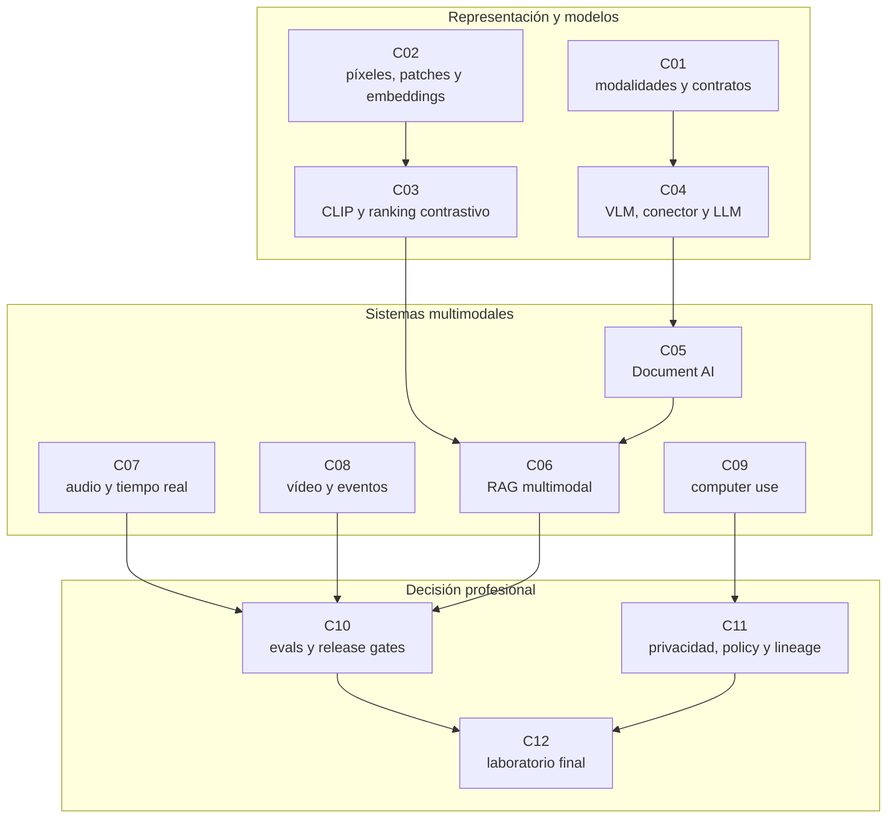

::: {.fasciculo-subtitle}
Facsímil 12 · IA multimodal y sistemas que perciben
:::

# Capítulo 12: Recapitulación y laboratorio multimodal

## Qué deberías poder hacer al terminar

Este capítulo cierra el facsímil. Si has llegado hasta aquí, ya no estamos preguntando “qué es una imagen para un modelo” o “cómo se evalúa un audio”. La pregunta ahora es más profesional:

> ¿Puedo defender un release multimodal con evidencias descargables, métricas, riesgos, controles y una decisión clara?

Un sistema multimodal serio no se valida con una captura bonita. Se valida conectando todo lo aprendido: contrato de entrada, representación, recuperación, grounding, audio, vídeo, acción, evaluación, privacidad, seguridad, coste, latencia y operación.^[La idea de tratar la multimodalidad como integración de señales, representación, alineamiento, traducción, fusión y coaprendizaje está muy bien ordenada en Baltrušaitis, Ahuja y Morency (2019). En este capítulo la bajo a una decisión de ingeniería: qué evidencia conserva el sistema cuando mezcla modalidades.]

Al terminar deberías poder hacer esto:

| Resultado de aprendizaje | Evidencia de que lo sabes hacer |
|---|---|
| Recapitular el facsímil completo. | Conectas capítulos 01-11 con un caso real de release. |
| Diseñar un release gate multimodal. | Combinas calidad, riesgo, evidencias, coste, latencia y fallos. |
| Separar `pass`, `review` y `block`. | No publicas todo porque algunos casos funcionen bien. |
| Identificar evidencias faltantes. | Nombras contrato, golden set, retrieval manifest, slot eval, policy decision o lineage. |
| Proponer una remediación. | Dices qué archivo, control, métrica o prueba cambiarías. |
| Defender la decisión. | Entregas una decision card y un paquete de evidencias. |
| Ejecutar el laboratorio. | Descargas el ZIP, corres `make run`, `make test` y explicas baseline frente a remediación. |
| Convertir una revisión en candidato. | Preparas un change request con SLI/SLO, owner, aprobadores, rollback y versionado. |

La frase central:

> La multimodalidad no termina cuando el modelo responde. Termina cuando puedes explicar por qué esa respuesta puede, o no puede, llegar a producción.

## Lectura de ingeniería: cerrar es saber defender una decisión

Un cierre de facsímil no debería ser solo un resumen. Para un ingeniero de IA, cerrar significa poder mirar un sistema completo y decir qué publicaría, qué dejaría en revisión, qué bloquearía y qué evidencia pediría antes de cambiar de opinión. Esa habilidad es más valiosa que memorizar nombres de arquitecturas, porque los modelos cambian rápido y los criterios de ingeniería permanecen más tiempo.

La práctica final fuerza una incomodidad deliberada: el baseline bloquea, la remediación mejora y el release candidate solo pasa cuando se añaden evidencias, contract tests, SLI/SLO, owner, aprobadores y rollback. Esa secuencia enseña una idea importante: la calidad no es un estado emocional. Es una decisión que debe poder reproducirse, discutirse y auditarse.

### Qué debería saber defender el lector

Al cerrar este facsímil, el lector debería poder defender cinco cosas. La primera: por qué una modalidad entra en el sistema y qué evidencia aporta. La segunda: qué representación se usa y qué se pierde al convertir la señal. La tercera: qué controles separan observación, recuperación, decisión y acción. La cuarta: qué métricas y slices determinan si el sistema se publica. La quinta: qué política protege privacidad, seguridad y operación.

Si alguna de esas piezas falta, el sistema puede parecer avanzado pero queda cojo. Un VLM sin contrato puede inventar campos. Un RAG sin permisos puede filtrar fuentes internas. Un sistema de voz sin confirmación puede ejecutar sobre una transcripción dudosa. Un agente de pantalla sin arnés puede hacer click en el sitio equivocado. Una eval sin slices puede ocultar errores críticos. El laboratorio obliga a juntar esas piezas para que no queden como capítulos aislados.

### Cómo leer el laboratorio como una revisión técnica

Si el laboratorio se usara en un equipo real, no bastaría con enseñar el informe final. Habría que abrir el diff, revisar los casos que cambian, mirar qué métrica sigue cerca del umbral, comprobar que el ZIP ejecuta, entender qué política se aplicó y decidir qué pasaría si cambia el modelo visual, el OCR, el ASR, el índice, el prompt o una tool. Ese hábito es el que quiero que el lector se lleve.

El primer reto enseña diagnóstico: no todo baseline bloqueado es un fracaso; a veces es la señal correcta de que faltan evidencias. El segundo enseña remediación: mejorar no es tocar un prompt, sino añadir campos, umbrales, fuentes y decisiones. El tercero enseña release: publicar exige manifest, tests, SLI/SLO, rollback, owner y límites conocidos. Esa secuencia se parece a una revisión de ingeniería, no a un ejercicio de completar huecos.

### Qué se lleva alguien a su trabajo o a clase

El artefacto final debería poder reutilizarse. Puede convertirse en plantilla de evaluación para un RAG multimodal, en checklist de privacidad para capturas, en gate de release para VLMs, en política de computer use o en rúbrica docente para una práctica. Esa es la vara de medir: si el lector no puede llevarse algo a un proyecto real, el laboratorio no ha hecho suficiente.

Por eso el capítulo no termina diciendo “ya sabes multimodalidad”. Termina con una pregunta más seria: ¿puedes defender una decisión técnica cuando hay varias modalidades, varios riesgos y varias evidencias incompletas? Si puedes, el facsímil ha hecho su trabajo. Si no puedes, no pasa nada: vuelve al capítulo donde se rompió la cadena. Esa es precisamente la utilidad del facsímil.

## El mapa del facsímil

Este facsímil no era una colección de temas sueltos. Tenía una progresión:

| Capítulo | Pregunta que responde | Qué te llevas |
|---|---|---|
| 01 | ¿Qué cambia cuando la IA ve, oye y actúa? | Modalidades, contratos y límites. |
| 02 | ¿Cómo entra una imagen en un modelo? | Píxeles, patches, embeddings y coste de entrada. |
| 03 | ¿Cómo se alinean texto e imagen? | CLIP, contraste, ranking y búsqueda. |
| 04 | ¿Cómo habla un VLM con un LLM? | Encoder visual, conector, tokens visuales y contrato de llamada. |
| 05 | ¿Cómo se leen documentos reales? | OCR, layout, tablas, páginas y evidencias. |
| 06 | ¿Cómo se recupera evidencia multimodal? | Índices, RAG, ACL, grounding y manifest. |
| 07 | ¿Qué implica usar voz? | ASR, turnos, latencia, slots y conversación. |
| 08 | ¿Qué implica usar vídeo? | Frames, eventos, memoria temporal y evaluación temporal. |
| 09 | ¿Qué pasa si el agente mira pantallas y actúa? | Computer use, permisos, approval cards y tool traces. |
| 10 | ¿Cómo se evalúa todo eso? | Golden sets, slices, coste, latencia y gates. |
| 11 | ¿Cómo se opera sin exponer datos? | Privacidad, threat model, policy-as-code, lineage y runbook. |

La parte visual no aparece por estética. ViT ayuda a entender por qué una imagen puede convertirse en secuencia de patches, y CLIP ayuda a entender por qué texto e imagen pueden compartir un espacio de comparación.^[Dosovitskiy et al. (2021) popularizan el tratamiento de la imagen como secuencia de patches en transformers; Radford et al. (2021) muestran cómo alinear texto e imagen mediante entrenamiento contrastivo a gran escala. No son recetas mágicas de producto, pero sí dos piezas conceptuales para no tratar un VLM como una caja negra.]

Si tuviera que resumir el facsímil en una sola idea:

> Multimodalidad es ingeniería de evidencias. La modalidad aporta señal; el sistema debe conservar trazabilidad.

## Lo que no deberías olvidar

Hay varias trampas recurrentes:

| Trampa | Por qué seduce | Por qué rompe producción |
|---|---|---|
| “El modelo ve la imagen, ya está.” | Parece que el VLM resuelve todo. | No sabes qué región, página o frame sostuvo la respuesta. |
| “Hacemos OCR y lo metemos en RAG.” | Es rápido de prototipar. | Pierdes layout, tablas, bboxes, páginas y permisos. |
| “Si el promedio sube, publicamos.” | Simplifica la decisión. | Puede esconder un slice crítico: vídeo largo, audio ruidoso, PII o computer use. |
| “El agente decidirá si puede actuar.” | Suena autónomo. | Permisos, egress y aprobación deben vivir fuera del modelo. |
| “Guardemos todo para depurar.” | Ayuda durante la demo. | Crea un repositorio de capturas, audio, documentos y trazas sensibles. |
| “Ya tenemos un benchmark.” | Da una cifra externa. | No sustituye tus casos, tus fuentes, tus riesgos ni tu producto. |

El laboratorio final existe para practicar justo lo contrario: no quedarse en sensación, sino producir evidencia.^[LayoutLM (Xu et al., 2020) y ColPali (Faysse et al., 2024) son buenos recordatorios de que documento no significa solo texto: la página tiene coordenadas, estructura visual y señales que pueden cambiar la respuesta. En evaluación y riesgo, uso como marco práctico la idea de evidencias, slices y controles que también aparece en guías de Evals, NIST AI RMF y OWASP Top 10 para aplicaciones LLM.]

## Ejemplo de fórmula operativa para release

Ejemplo de fórmula operativa, no estándar académico:

$$
G = 0.34Q + 0.22E + 0.18O + 0.16M - 0.10R
$$

| Símbolo | Lectura |
|---|---|
| \(G\) | Score orientativo de preparación para release. |
| \(Q\) | Calidad: groundedness, extracción, temporalidad y utilidad. |
| \(E\) | Evidencia: contratos, golden set, manifest, traces, lineage. |
| \(O\) | Operación: latencia, coste, tasa de fallo y degradación. |
| \(M\) | Mitigación: controles presentes frente a riesgos activos. |
| \(R\) | Riesgo residual: PII, secreto, contenido no confiable, acción externa. |

No lo uses como una verdad universal. Úsalo como recordatorio: una decisión de publicación no puede depender solo de calidad. Un sistema puede responder muy bien y aun así no poder publicarse porque conserva PII, ejecuta una acción externa sin aprobación o no deja evidencia.

## Anatomía del laboratorio

<figure class="book-figure">
  <svg viewBox="0 0 1280 820" role="img" aria-labelledby="f12c12-svg-title f12c12-svg-desc" xmlns="http://www.w3.org/2000/svg">
    <title id="f12c12-svg-title">Laboratorio final multimodal</title>
    <desc id="f12c12-svg-desc">Diagrama del laboratorio final con baseline, gates, remediación, evidencias y decisión de release.</desc>
    <defs>
      <marker id="f12c12-arrow" markerWidth="10" markerHeight="10" refX="8" refY="3" orient="auto" markerUnits="strokeWidth">
        <path d="M0,0 L0,6 L9,3 z" fill="#111111"></path>
      </marker>
      <pattern id="f12c12-hatch" patternUnits="userSpaceOnUse" width="8" height="8">
        <path d="M0 8 L8 0" stroke="#DDDDDD" stroke-width="1"></path>
      </pattern>
    </defs>
    <rect width="1280" height="820" fill="#FFFFFF"></rect>
    <text x="64" y="58" font-size="30" font-weight="700" fill="#111111">Laboratorio final: release multimodal defendible</text>
    <text x="64" y="90" font-size="15" fill="#555555">No buscamos una demo: buscamos una decisión reproducible con evidencias y condiciones.</text>

    <rect x="72" y="142" width="210" height="190" fill="#FFFFFF" stroke="#111111" stroke-width="1.2"></rect>
    <text x="177" y="176" text-anchor="middle" font-size="15" font-weight="700" fill="#111111">Casos baseline</text>
    <text x="177" y="210" text-anchor="middle" font-size="12" fill="#555555">alt text · facturas</text>
    <text x="177" y="234" text-anchor="middle" font-size="12" fill="#555555">RAG · voz · vídeo</text>
    <text x="177" y="258" text-anchor="middle" font-size="12" fill="#555555">computer use · helpdesk</text>

    <rect x="342" y="142" width="210" height="190" fill="#F7F7F7" stroke="#111111" stroke-width="1.2"></rect>
    <text x="447" y="176" text-anchor="middle" font-size="15" font-weight="700" fill="#111111">Release gate</text>
    <text x="447" y="210" text-anchor="middle" font-size="12" fill="#555555">calidad · riesgo</text>
    <text x="447" y="234" text-anchor="middle" font-size="12" fill="#555555">coste · latencia</text>
    <text x="447" y="258" text-anchor="middle" font-size="12" fill="#555555">evidencias · controles</text>

    <rect x="612" y="142" width="210" height="190" fill="#FFFFFF" stroke="#111111" stroke-width="1.2"></rect>
    <text x="717" y="176" text-anchor="middle" font-size="15" font-weight="700" fill="#111111">Decisión baseline</text>
    <rect x="660" y="210" width="114" height="38" fill="#111111" stroke="#111111"></rect>
    <text x="717" y="235" text-anchor="middle" font-size="12" font-weight="700" fill="#FFFFFF">block release</text>
    <text x="717" y="276" text-anchor="middle" font-size="12" fill="#555555">dos casos bloquean</text>

    <rect x="882" y="142" width="210" height="190" fill="#F7F7F7" stroke="#111111" stroke-width="1.2"></rect>
    <text x="987" y="176" text-anchor="middle" font-size="15" font-weight="700" fill="#111111">Remediación</text>
    <text x="987" y="210" text-anchor="middle" font-size="12" fill="#555555">ACL · policy</text>
    <text x="987" y="234" text-anchor="middle" font-size="12" fill="#555555">lineage · evals</text>
    <text x="987" y="258" text-anchor="middle" font-size="12" fill="#555555">approval · latencia</text>

    <rect x="72" y="430" width="250" height="150" fill="#F7F7F7" stroke="#111111" stroke-width="1.2"></rect>
    <text x="197" y="464" text-anchor="middle" font-size="15" font-weight="700" fill="#111111">Evidencias</text>
    <text x="197" y="498" text-anchor="middle" font-size="12" fill="#555555">release matrix</text>
    <text x="197" y="522" text-anchor="middle" font-size="12" fill="#555555">traceability · coverage</text>
    <text x="197" y="546" text-anchor="middle" font-size="12" fill="#555555">evidence pack</text>

    <rect x="394" y="430" width="250" height="150" fill="#FFFFFF" stroke="#111111" stroke-width="1.2"></rect>
    <text x="519" y="464" text-anchor="middle" font-size="15" font-weight="700" fill="#111111">Decisión remediada</text>
    <rect x="462" y="498" width="114" height="38" fill="#FFFFFF" stroke="#111111"></rect>
    <text x="519" y="523" text-anchor="middle" font-size="12" font-weight="700" fill="#111111">review release</text>
    <text x="519" y="558" text-anchor="middle" font-size="12" fill="#555555">un caso pendiente</text>

    <rect x="716" y="430" width="250" height="150" fill="url(#f12c12-hatch)" stroke="#111111" stroke-width="1.2"></rect>
    <text x="841" y="464" text-anchor="middle" font-size="15" font-weight="700" fill="#111111">Decision card</text>
    <text x="841" y="498" text-anchor="middle" font-size="12" fill="#555555">condiciones</text>
    <text x="841" y="522" text-anchor="middle" font-size="12" fill="#555555">pendientes</text>
    <text x="841" y="546" text-anchor="middle" font-size="12" fill="#555555">criterio de salida</text>

    <line x1="282" y1="237" x2="340" y2="237" stroke="#111111" stroke-width="1.5" marker-end="url(#f12c12-arrow)"></line>
    <line x1="552" y1="237" x2="610" y2="237" stroke="#111111" stroke-width="1.5" marker-end="url(#f12c12-arrow)"></line>
    <line x1="822" y1="237" x2="880" y2="237" stroke="#111111" stroke-width="1.5" marker-end="url(#f12c12-arrow)"></line>
    <line x1="987" y1="332" x2="987" y2="376" stroke="#111111" stroke-width="1.5"></line>
    <line x1="987" y1="376" x2="197" y2="376" stroke="#111111" stroke-width="1.5"></line>
    <line x1="197" y1="376" x2="197" y2="428" stroke="#111111" stroke-width="1.5" marker-end="url(#f12c12-arrow)"></line>
    <line x1="322" y1="505" x2="392" y2="505" stroke="#111111" stroke-width="1.5" marker-end="url(#f12c12-arrow)"></line>
    <line x1="644" y1="505" x2="714" y2="505" stroke="#111111" stroke-width="1.5" marker-end="url(#f12c12-arrow)"></line>

    <rect x="94" y="660" width="1092" height="62" fill="#FFFFFF" stroke="#111111" stroke-width="1.2"></rect>
    <text x="124" y="696" font-size="13" font-weight="700" fill="#111111">Regla del laboratorio</text>
    <text x="286" y="696" font-size="13" fill="#111111">No publicas por sensación: publicas por evidencia, límites y condiciones explícitas.</text>
    <text x="1196" y="774" text-anchor="end" font-size="11" fill="#999999">IA para gente curiosa / Facsímil 12 / Capítulo 12 / 686f6c61</text>
  </svg>
  <figcaption>El laboratorio convierte el facsímil en una revisión de release multimodal.</figcaption>
</figure>

## Cómo encaja todo



Este mapa importa porque el laboratorio mezcla todo. Un caso de helpdesk multimodal no es “un capítulo 07 con voz”. También toca Document AI, RAG, evaluación, privacidad y operación. La vida real hace eso: mezcla capítulos.

## Dónde solía tropezar yo

| Tropiezo | Por qué es un problema | Antídoto |
|---|---|---|
| **Celebrar el caso que pasa y olvidar el que bloquea** | Un release puede fallar por una única ruta crítica. | Decisión global: si hay `block`, el release completo no pasa. |
| **Confundir remediación con maquillaje** | Añadir una frase al informe no arregla un control ausente. | Cambiar datos, evidencias, policy, tests o arquitectura. |
| **No conectar con capítulos anteriores** | La práctica se vuelve un ejercicio aislado. | Matriz de trazabilidad capítulo → caso → evidencia. |
| **Publicar sin decision card** | Nadie sabe qué quedó pendiente. | Decisión final con condiciones y criterio de salida. |
| **No dejar nada descargable** | El alumno no puede repetir ni adaptar la práctica. | ZIP con datos, runner, tests, salidas y solución. |

## Laboratorio

<!-- kit: labs/f12/laboratorio-multimodal/ -->

Un laboratorio, dentro de este libro, es una práctica guiada para convertir teoría en trabajo real. Aquí no queremos que respondas “qué es multimodalidad”. Queremos que actúes como si tuvieras que revisar un sistema antes de publicarlo.

En este laboratorio vas a tocar:

| Tema | Capítulos que reaparecen |
|---|---|
| Contratos de entrada y salida | 01, 04 |
| Imágenes, embeddings y búsqueda visual | 02, 03 |
| Document AI y tablas | 05 |
| RAG multimodal y grounding | 06 |
| Voz y latencia | 07 |
| Vídeo y eventos | 08 |
| Computer use y acciones externas | 09 |
| Evals, coste y release gates | 10 |
| Privacidad, policy y lineage | 11 |

El botón de descarga del capítulo incluye el kit `F12 C12 · Laboratorio multimodal`. Dentro tienes datos, contrato, runner, tests, informes generados y solución de referencia.

Ejecuta:

```bash
make run
make test
```

Archivos importantes:

| Archivo | Qué contiene |
|---|---|
| `contracts/release_policy.json` | Umbrales de calidad, riesgo, coste, latencia, evidencias y trazabilidad. |
| `data/baseline_cases.json` | Ocho casos iniciales. |
| `data/remediated_cases.json` | Los mismos casos tras remediación. |
| `data/candidate_patch.json` | Parche que convierte el caso pendiente en release candidate. |
| `data/invalid_case_examples.json` | Casos incompletos que deben fallar por contrato. |
| `ops/run_multimodal_release_lab.py` | Runner del laboratorio. |
| `output/baseline_release_report.md` | Informe inicial. |
| `output/remediated_release_report.md` | Informe tras remediación. |
| `output/candidate_release_report.md` | Informe del escenario candidato. |
| `output/release_matrix.csv` | Matriz de decisiones. |
| `output/remediation_diff.csv` | Diferencias antes/después. |
| `output/release_candidate_diff.csv` | Diferencias entre remediación y candidato. |
| `output/chapter_traceability.csv` | Conexión capítulo → caso. |
| `output/modality_coverage.csv` | Cobertura por modalidad. |
| `output/sli_slo_matrix.csv` | Métricas operativas por caso: calidad, riesgo, latencia, coste, fallo y evidencias. |
| `output/contract_validation_report.md` | Contract tests para casos válidos e inválidos. |
| `output/evidence_pack.md` | Paquete de evidencias. |
| `output/decision_card.md` | Decisión final. |
| `output/release_change_request.md` | Cambio propuesto como revisión técnica. |
| `output/release_pr_checklist.md` | Checklist de merge del release. |
| `output/version_manifest.json` | Versiones de datos, contratos y política de regresión. |
| `solutions/reference/expected_decision.md` | Solución de referencia. |

### Reto 1: diagnosticar el baseline

Situación: un equipo ha montado un producto multimodal con ocho rutas:

1. Alt text para catálogo.
2. Extracción de facturas.
3. RAG con políticas y slides internas.
4. Voz para cambiar citas.
5. Vídeo para detectar accesos.
6. Computer use para rellenar un formulario externo.
7. Búsqueda visual de documentación.
8. Helpdesk multimodal para alumnado.

Tu trabajo no es decir cuál “parece funcionar”. Tu trabajo es decidir qué puede publicarse, qué queda en revisión y qué bloquea release.

Pasos:

1. Ejecuta `make run`.
2. Abre `output/baseline_release_report.md`.
3. Identifica los casos `block`.
4. Abre `output/release_matrix.csv`.
5. Para cada bloqueo, separa calidad, riesgo, evidencia, control, coste y latencia.
6. Abre `output/chapter_traceability.csv`.
7. Comprueba qué capítulos justifican la decisión.
8. Escribe una decisión breve en `templates/entrega.md`.

Solución guiada:

| Caso | Decisión | Por qué |
|---|---|---|
| `catalog_alt_text` | `pass` | Tiene contrato, golden set, slice eval, riesgo bajo y coste controlado. |
| `invoice_table_extraction` | `review` | Falta evaluación de tabla; no basta con extraer texto. |
| `policy_rag_with_internal_slides` | `block` | Hay secreto/fuente interna, faltan ACL, policy decision y lineage. |
| `voice_appointment_agent` | `review` | Faltan trazas de latencia y la latencia supera el umbral. |
| `parking_video_event_triage` | `review` | Faltan evaluación temporal, policy decision y calidad temporal suficiente. |
| `computer_use_claim_submission` | `block` | Acción externa, PII, secreto y falta approval/egress. |
| `visual_search_catalog` | `pass` | Tiene búsqueda, golden set, retrieval manifest y riesgo controlado. |
| `student_multimodal_helpdesk` | `review` | Mezcla muchas capacidades y faltan evidencias para publicarlo entero. |

La respuesta buena no dice “hay dos bloqueos”. Dice qué bloquearía, qué evidencia pediría y qué capítulo justifica esa exigencia.

### Reto 2: remediar y defender la decisión

Ahora mira la versión remediada. No es una solución mágica. Es una segunda iteración más profesional.

Pasos:

1. Compara `data/baseline_cases.json` con `data/remediated_cases.json`.
2. Abre `output/remediation_diff.csv`.
3. Identifica qué casos pasan de `block` a `pass`.
4. Explica por qué queda un caso en `review`.
5. Abre `output/evidence_pack.md`.
6. Abre `output/decision_card.md`.
7. Completa `templates/entrega.md`.
8. Contrasta con `solutions/reference/expected_decision.md`.

Solución guiada:

| Cambio | Qué arregla |
|---|---|
| Añadir `table_eval` a facturas | Cierra la evidencia que faltaba en Document AI. |
| Añadir `source_acl_check`, `policy_decision` y `artifact_lineage` al RAG | Evita que una fuente interna pase como evidencia pública. |
| Bajar latencia y añadir `latency_trace` en voz | Convierte una promesa de tiempo real en una medición. |
| Añadir `approval_card`, `egress_policy`, `policy_decision` y redacción en computer use | Saca permisos del prompt y los convierte en control. |
| Completar evidencias del helpdesk | Une Document AI, RAG, voz y privacidad en una práctica defendible. |

La decisión final del kit es `review_release`. Eso es deliberado. Queda `parking_video_event_triage` en revisión porque todavía falta `policy_decision` y la calidad temporal no llega al umbral. Un laboratorio serio no fuerza un final feliz. Deja un pendiente real y te pide defenderlo.

### Reto 3: pasar de revisión a release candidate

Este reto es el que más se parece a trabajo de ingeniería. En un equipo real, no basta con decir “ya sé qué falta”. Alguien tiene que proponer un cambio, medir el impacto, pedir revisión y dejar una salida clara si algo sale mal.

El kit incluye `data/candidate_patch.json`. Ese archivo representa un cambio pequeño pero completo sobre `parking_video_event_triage`: añade `policy_decision`, una evaluación de redacción por región en frames, una evaluación temporal más fuerte, owner técnico, aprobadores y rollback. No cambia todos los casos. Cambia el caso que mantenía el release en revisión.

Pasos:

1. Abre `data/candidate_patch.json`.
2. Mira qué evidencias añade sobre `parking_video_event_triage`.
3. Abre `output/release_candidate_diff.csv`.
4. Comprueba qué cambia frente a `remediated`.
5. Abre `output/candidate_release_report.md`.
6. Abre `output/sli_slo_matrix.csv` y filtra `scenario = candidate`.
7. Abre `output/contract_validation_report.md`.
8. Lee `output/release_change_request.md`.
9. Usa `output/release_pr_checklist.md` como checklist de revisión.
10. Comprueba `output/version_manifest.json`.

Lo importante no es que el candidato diga `ship`. Lo importante es por qué puede decirlo.

| Artefacto | Qué te obliga a pensar |
|---|---|
| `output/release_candidate_diff.csv` | Qué cambió de verdad respecto a la remediación. |
| `output/sli_slo_matrix.csv` | Qué métrica pasa o sigue en revisión por caso. |
| `output/contract_validation_report.md` | Qué casos deberían fallar antes de llegar al modelo. |
| `output/release_change_request.md` | Qué cambio revisarías como si fuera una PR. |
| `output/release_pr_checklist.md` | Qué no deberías aprobar por intuición. |
| `output/version_manifest.json` | Qué habría que reevaluar si cambia modelo, OCR, ASR, retrieval, prompt, tool o policy. |

El archivo `contracts/release_gate_policy.rego` es un ejemplo de policy-as-code. No necesitas instalar OPA para hacer el laboratorio, pero sí conviene leerlo: traduce la decisión a reglas que una pipeline podría evaluar. La idea es sencilla: si hay un caso que no está en `pass`, si falta evidencia, si falta control o si un SLI/SLO no cumple, el release no debería pasar por confianza verbal.

Solución guiada:

| Pregunta de revisión | Respuesta esperada |
|---|---|
| ¿Qué desbloquea el candidato? | El caso `parking_video_event_triage`. |
| ¿Qué evidencia faltaba? | `policy_decision` y una evaluación temporal/redacción más fuerte. |
| ¿Qué salida produce? | El escenario `candidate` pasa a `ship`. |
| ¿Qué impide aprobar a ciegas? | SLI/SLO, contract tests, owner, aprobadores y rollback. |
| ¿Qué repetirías si cambia el sistema? | Regresión multimodal completa si cambia modelo, muestreo de frames, redacción, prompt, índice, tool o policy. |

La frase profesional no sería “ahora funciona”. Sería:

> Aceptaría el release candidate porque no quedan evidencias faltantes, todos los SLI/SLO del escenario candidato pasan, los contract tests separan casos válidos de casos incompletos y existe rollback si cae la evaluación temporal o falla la redacción.

### Cierre del laboratorio

Una entrega fuerte debería incluir:

1. Decisión global baseline.
2. Decisión global remediada.
3. Decisión del release candidate.
4. Casos que publicarías.
5. Casos que no publicarías.
6. Evidencia faltante por caso.
7. Control faltante por caso.
8. SLI/SLO que pasan o bloquean.
9. Contract test que evita aceptar un caso incompleto.
10. Capítulos usados para justificar la decisión.
11. Owner, aprobadores y rollback.
12. Siguiente remediación concreta.

## Vocabulario aprendido

| Término | Definición |
|---|---|
| Release multimodal | Decisión de publicar, revisar o bloquear un sistema con varias modalidades. |
| Evidence pack | Paquete de informes y matrices que justifica una decisión. |
| Remediación | Cambio concreto para cerrar una evidencia, control o métrica. |
| Traceability matrix | Matriz que conecta capítulos, casos y decisiones. |
| Release gate | Regla de publicación basada en calidad, riesgo, operación y evidencias. |
| Baseline | Estado inicial contra el que comparas una mejora. |
| Decision card | Resumen de decisión, condiciones y pendientes. |
| Release candidate | Versión candidata a publicarse porque ya pasó gates, pero aún debe revisarse con checklist, owner y rollback. |
| SLI | Indicador medido: latencia, coste, tasa de fallo, calidad o cobertura de evidencias. |
| SLO | Objetivo que debe cumplir un SLI para considerar sano el sistema. |
| Contract test | Prueba que valida que un caso tiene campos, evidencias y controles mínimos antes de evaluarlo con un modelo. |
| Change request | Documento de cambio: qué se modifica, qué mejora, quién aprueba y cómo se revierte. |
| Rollback | Plan para volver atrás si el candidato empeora una métrica, pierde evidencia o incumple policy. |

## Antes de pasar página

Hazte estas preguntas:

1. ¿Sé explicar qué aporta cada modalidad?
2. ¿Cada caso tiene evidencias descargables?
3. ¿Puedo separar calidad de riesgo?
4. ¿Sé qué caso bloquea release y por qué?
5. ¿La remediación cambia datos, controles o tests, no solo texto?
6. ¿La decisión usa capítulos concretos del facsímil?
7. ¿La práctica deja una decision card?
8. ¿El ZIP se puede ejecutar sin depender de APIs externas?
9. ¿Puedo adaptar el patrón a un proyecto real?
10. ¿Sé transformar un caso en revisión en release candidate?
11. ¿Sé qué SLI/SLO bloquearía el release?
12. ¿Sé qué cambio de modelo, OCR, ASR, retrieval, prompt, tool o policy obliga a repetir evals?

Si respondes sí, el facsímil ha cumplido su función: darte un criterio técnico para construir, evaluar y operar sistemas que perciben.

## Para saber más

- Baltrušaitis, T., Ahuja, C. y Morency, L. P. (2019). *Multimodal Machine Learning: A Survey and Taxonomy*. IEEE TPAMI.
- Dosovitskiy, A. et al. (2021). *An Image is Worth 16x16 Words: Transformers for Image Recognition at Scale*. ICLR.
- Radford, A. et al. (2021). *Learning Transferable Visual Models From Natural Language Supervision*. ICML.
- Xu, Y. et al. (2020). *LayoutLM: Pre-training of Text and Layout for Document Image Understanding*. KDD.
- Faysse, M. et al. (2024). *ColPali: Efficient Document Retrieval with Vision Language Models*. arXiv.
- Radford, A. et al. (2023). *Robust Speech Recognition via Large-Scale Weak Supervision*. ICML.
- OpenAI. (2026). *Working with Evals*. https://developers.openai.com/api/docs/guides/evals
- OWASP Foundation. (2025). *OWASP Top 10 for LLM and Generative AI Applications 2025*. https://genai.owasp.org/resource/owasp-top-10-for-llm-applications-2025/
- NIST. (2024). *AI RMF Generative AI Profile*. https://www.nist.gov/publications/artificial-intelligence-risk-management-framework-generative-artificial-intelligence

## En resumen

| Idea | Qué deberías llevarte |
|---|---|
| La multimodalidad es ingeniería de evidencias. | No basta con que el modelo “vea”. Hay que conservar fuente, región, página, timestamp o traza. |
| Cada modalidad cambia el contrato. | Imagen, PDF, audio, vídeo y pantalla fallan de formas distintas. |
| RAG multimodal exige trazabilidad. | Recuperar no es copiar contexto: es construir evidencia con permisos. |
| Computer use exige permisos externos al modelo. | El agente puede pedir, pero la policy decide. |
| Evaluar es decidir. | Las métricas sirven si bloquean, revisan o permiten una acción. |
| Privacidad y seguridad viven en la arquitectura. | Redacción, egress, retention, lineage y runbook no son apéndices. |
| El laboratorio junta todo. | El resultado profesional es una decisión de release defendible. |
| Un candidato exige ingeniería. | No basta con subir una métrica: necesitas diff, contract tests, SLI/SLO, owner, aprobadores, rollback y versionado. |
